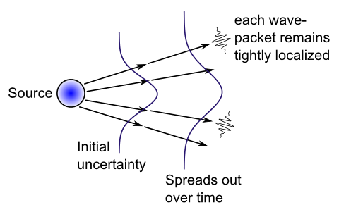

# Chapter 1: Introduction and Overview

This work-in-progress online "textbook" represents a long-term effort to use computational models to simulate fundamental physics, first and foremost as a way of better understanding what exactly is going on, but also with the ultimate hope of perhaps finding a solution to some of notorious paradoxes and conceptual challenges that lie at the heart of quantum mechanics (QM).  There is an easy-to-use GUI-based simulation software package (note: currently under development) that allows one to interactively explore various physics models, providing a concrete and hands-on level of understanding.  This provides a different and potentially valuable set of tools for someone trying to learn more about how quantum physics actually works, which may result in quicker and deeper understanding than staring at equations :)

From an _ontological_ perspective (i.e., in terms of what we think is _actually real_), there are two seemingly-conflicting entities at the heart of QM: _waves_ and _particles_ (i.e., the "wave-particle duality").  Much of the confusion and paradox in QM is tied up with this duality.  The overall approach here follows the _de Broglie-Bohm pilot-wave_ framework in embracing the simultaneous and interacting reality of both particles and waves, and we spend a lot of time and effort understanding the seemingly "magical" properties of waves in particular.  At one point, I was hopeful that somehow one could do away with particles entirely, given that wave equations can account for so much of the known phenomena in physics, including the mind-bending space-time distortions of special relativity, and the complex dynamics of electricity and magnetism (EM).

However, pure waves end up being just a bit too "squishy" and tend to ooze out all over the place.  Particles provide a kind of hard "skeleton" that is particularly important for maintaining the strict conservation laws that are so central in physics: Nature is above all a meticulous accountant, it seems.  For example, there are strong conservation laws for charge, spin, and particle numbers of various sorts, along with the ubiquitous conservation of total energy.

Furthermore, the _Pauli exclusion principle_ prevents there from being two of the same _fermions_ (spin 1/2 particles like electrons and quarks) in the same place at the same time with the same spin: this suggests from our computational perspective that there is some kind of underlying constraint like "slots" in a lattice for holding at most one of each type of particle.  This is both a welcome simplification for our models of these particles, and a tantalyzing suggestion that this computational perspective might provide some unique insights into the underlying nature of the physical world.

This computational perspective also provides an interesting motivation for the need for waves.  If you just have a simple discrete point-like particle sitting in some kind of lattice-like grid, it is very difficult to implement realistic force-field interactions among such particles, especially when using other discrete particles like "photons" to mediate these interactions.  The purely particle picture of an electron constantly spewing baseball-like photons out in all directions to hit other electrons is very difficult to sustain.  How does such a scheme ever achieve any kind of smooth field-like coverage of space using discrete point-like entities?  How many balls per femtosecond does it have to spew?  How do they manage to spread out uniformly over space and time, while properly conveying the dynamic interactions among the magnetic and electric aspects of the wave functions?

Instead, it is far more straightforward to use EM wave equations to model the force field interactions among electrons.  However, the ability of a discrete localized electron to "sense" such a force field as a distributed wave remains problematic: EM waves that influence electrons are widely distributed things, and small discrete samples at one point of a wave would not provide the proper net influence that the physical laws require. Thus, it works much better for the electron to also have its own wave field that is directly coupled with the EM wave field.  In effect, the electron's wave field acts like a kind of antenna that senses and responds to the EM forces, and then conveys the results to shape the unfolding trajectory of the discrete particle through space and time, as captured in the pilot-wave model.

We will ultimately implement this wave-particle model through coupled Dirac wave functions for the electron and Maxwell's equations for EM, with the Dirac wave providing the guiding pilot-wave for a discrete electron particle localized within a cubic lattice grid.  We call this **Wave Electrodynamics** or **WELD**, which attempts to explain the same phenomena as _quantum electrodynamics (QED)_.

The waves in this model are all implemented using the same cubic lattice grid that the discrete electron particles live on, where local neighborhood interactions among the lattice cells implement a highly spatially symmetric form of the _Laplacian_ spatial gradient function at the core of the wave function.  In short, the entire model is essentially an elaborate form of _cellular automaton_ (CA), which has many appealing properties as the simplest-possible framework for a physical system, as advocated by a number of theorists over the years, including John Von Neumann, Stanislaw Ulam, Zuse, 1970; Fredkin & Toffoli, 1982; Fredkin, 1990; t'Hooft (?); Wolfram (?).

One of the primary challenges of this CA framework is reconciling the local interactions among neighboring cells, which so naturally produces a relativistic speed-of-light limit (one time step update per lattice cell), with the now irrefutable evidence for some kind of non-locality in quantum physics.  Recent work within the pilot-wave framework has helped to significantly clarify the nature of these non-local interactions, and the broader conflict that they actually pose for all of QM, despite many attempts to downplay these issues from within the standard QM frameworks (Durr et al., 2014).

Without having any definitive results at this point, the approach taken here is to push the current WELD framework along as far as possible, addressing the many significant outstanding problems, and use the resulting computational models to further understand the nature of these non-local interactions.  Given that electron particles are strongly interacting with distributed wave functions in this framework, it is not inconceivable that the necessary non-local interactions may emerge from these distributed wave interactions in a way that remains compatible with observed data.  For example, it is already clear that the time step needed for updating the wave function computations is actually at least twice the speed-of-light rate in a simple CA, raising the possibility of supra-luminal interactions at the lattice level, while still maintaining fully relativistic dynamics in the EM wave function propagation.

In summary, the WELD approach represents an exploratory computational-modeling approach that at the least should afford important insights into the otherwise puzzling nature of the quantum world.  We can already see from the above intuitive arguments that the central wave-particle duality of the quantum world actually makes good sense from the lens of trying to implement these systems in a computational model.  In the remainder of this introductory chapter, we review some of the key phenomenology of quantum physics with a brief historical account, situating the pilot-wave framework within the broader field.

Subsequent chapters introduce wave equations in their basic form in [Chapter 2](ch02_waves.md), for EM in [Chapter 3](ch03_em.md), and for massive particles (matter) in [Chapter 4](ch04_matter.md).  Finally, [Chapter 5](ch05_dirac.md) develops the second order Dirac wave equation that represents the full relativistic matter wave function for an electron, which can be directly coupled with the EM waves.  Here we see how the otherwise puzzling property of _spin_ plays a critical role in this coupling, perhaps providing a deeper understanding for its role in quantum phenomena.

# History and Phenomenology of the Quantum World

**Figure 1.1:** The double-slit experiment -- narrow openings in the slits cause the wave to spread through diffraction, and because of the different distances traveled in the path from the two different slits to a given point on the far screen P, the waves will experience either constructive or destructive interference, resulting in the wavy bands of light and dark as shown.  The quantum paradox here is that this pattern obtains even when a _single particle_ is emitted at a time -- the particle only ever goes through one slit or the other, but somehow the wave goes through both.  Figure from wikimedia commons by Lacatosias.

**Figure 1.2:** Results of a double-slit experiment using electrons, with increasing numbers of electrons recorded (11, 200, 6000, 40000, and 140000).  The interference pattern emerges over time, even though only single electrons are detected on each trial.  Figure from by Dr. Tonomura via wikimedia commons.

The _double-slit_ experiment (also known as Young's experiment) (Figure 1.1), is said to illustrate the full mystery of quantum mechanics, and nicely demonstrates some puzzling aspects of wave-particle duality.  Interestingly, the double slit experiment was around long before quantum mechanics, as a way of generating interference patterns with waves, but it "just got weird" when the intensity of the light, or beam of electrons or other particles, is reduced to the point where there is only a _single particle_ passing through the apparatus at a time.

Surprisingly, one still observes the interference effect in this case (Figure 1.2).  How can a single "hard little particle", all by itself, produce this wave-like interference effect?  There are _many_ other results that all add up to the strong conclusion that, somehow, elementary particles like electrons have _both_ wave and particle properties.

Historically, the early development of this wave-like property of particles was focused on understanding the nature of simple atoms like hydrogen, which has a single electron orbiting a nucleus.  The dominant classical physical model of the atomic system in the early 1900's was the Rutherford model of 1911, with electrons as tiny points of charge and mass, orbiting a nucleus, much like planets orbiting the sun. This model had important failings, which the full development of quantum mechanics resolved, thus cementing the demise of the classical worldview, and solidly establishing quantum mechanics.

The major problem with the classical atom was that it is fundamentally unstable: the electron should emit electromagnetic radiation as it orbits around the nucleus, and thus lose energy. As it loses energy, the orbit must get tighter, and eventually the electron should just collapse into the nucleus, just like one of those quarters you roll around in a gravity well at a science museum.  Furthermore, as its orbit gets tighter, it should emit higher frequency radiation, predicting a continuous and increasingly high frequency emission spectrum. Instead, it was known that atoms emit consistent, discrete frequencies of radiation.

In 1913, Niels Bohr provided an apparent solution to the problem, leveraging the emerging ideas of Planck and Einstein that were derived from the _photoelectric effect_ and the properties of _blackbody radiation_: the energy of "photons" (particle-like elements of EM radiation) is proportional to their frequency (and thus inversely proportional to wavelength), times a mysterious new physical constant named after Planck, $h$:

- **Energy = h times frequency:** $E = h \nu$

Bohr postulated that electrons can only have orbits where the angular momentum (i.e., the effective period of the orbit) is restricted to an integer multiple $n$ of Planck's constant:

- **Bohr wavelength = integer multiple of h:** $L = n \hbar = n \frac{h}{2\pi}$

Although the reason for this restriction was not clear, it immediately made sense of a great deal of data, including the Rydberg formula for hydrogen emission spectra.  The justification for Bohr's restriction on atomic orbits came in 1924, when Louis de Broglie proposed that electrons have a wave-like nature, and thus the only frequencies of electron wave vibration that are stable are standing waves. Standing waves must have an integer number of wavelengths, such that within the orbiting electron model, the electron orbits are constrained to have an integer number of such waves per orbit. Shortly thereafter, in 1926, Erwin Schrödinger developed his famous wave equation, which then gave a complete mathematical description of the behavior of bound electrons in atomic systems, which made sense of even more data than Bohr's original model.

The experimental confirmation of de Broglie's matter wave hypothesis came in 1927 in an experiment by Davisson and Germer, who found that electrons moving through a crystal exhibit a diffraction pattern, consistent with a wave-like property.  Calculations showed that the de Broglie wavelength predicted for the electrons fit the observed diffraction pattern quite well:

- **Momentum = h / de Broglie wavelength:** $p = \frac{h}{\lambda}$
- **de Broglie wavelength = h / momentum:** $\lambda = \frac{h}{p}$

This wavelength is about .165 nanometers for the electrons in the Davisson-Germer experiment (very tiny, but enough to produce a measurable diffraction pattern through the crystal).

Both de Broglie and Schrödinger thought that these "matter waves" were real physical things, like light waves. Furthermore, de Broglie suggested that the wave acted to _guide_ the point particle electron around, in his **pilot wave** theory.  Schrödinger initially had an even more radical view, which abandoned the point electron entirely: he thought his wave equation described a wave of _charge density_ that _is_ the actual electron, without any need for a dual particle-like entity.

However, both of these attempts to provide a "physically realistic" perspective on the phenomena were quickly abandoned in the face of further evidence suggesting that the wave function fundamentally describes the _probability_ that a particle might appear at a given point in space when measured.  As such, the wave is somehow "non physical",  and yet exerts physically-measurable effects.

This movement away from a physical model was furthered by Heisenberg and his _uncertainty principle_, and the broader principle of _complementarity_: there is a minimum, irreducible amount of ambiguity or uncertainty in the quantum world, and you can _either_ push things more toward one perspective (e.g., the wave-like aspect) _or_ the other (the particle-like aspect), but not both at the same time.  This philosophical stance was based initially on the simple fact that the uncertainty in the position ($x$) or momentum ($p$) of a particle has a minimum bound of a factor of Planck's constant:

- **Uncertainty in position * momentum:** $\sigma_x \sigma_p \geq \frac{\hbar}{2}$

Thus, any attempt to decrease the uncertainty in location $\sigma_x$ necessarily increases the uncertainty in momentum $\sigma_p$.  We will see in [Chapter 4](ch04_matter.md) that this property is a natural consequence of matter waves.

From this complementarity principle, Bohr and Heisenberg developed the _Copenhagen Interpretation_ of QM in the late 1920's, and this is still dominant today.  Central to this interpretation is the notion that the physical world operates in two complementary modes: you are _either_ making a _measurement_, which causes the wave function to _collapse_ down to a single discrete particle-like point, _or_ physics is otherwise evolving according to the wave function.  During this wave-function mode, the mathematical picture suggests that there is no definitive underlying state of the world: everything is in some kind of probabilistic superposition of possible states.  Only once you measure something does it actually exist in any kind of definite way, leading to the mantra that "the world only exists when you measure it".

This strong discretization of the laws of physics is at the root of many seeming paradoxes and puzzles in understanding the quantum world: what exactly defines a "measurement" at a fundamental level?  How can the wave function, which could conceivably spread out over large macroscopic spaces over time, instantaneously collapse down to a single point within that entire space?  Despite these conceptual difficulties, the mathematics of the framework allow straightforward calculations that match the outcomes of actual experiments, leading to a general attitude of "shut up and calculate": don't bother with unnecessary considerations of the actual underlying physical ontology, just do the math!

However, in the 1950's, David Bohm revisited the original _pilot-wave_ model of de Broglie, and showed that in fact it can fully explain the same phenomena as the standard Copenhagen QM framework.  Critically, in this _de Broglie-Bohm pilot-wave_ framework, _particles always have a definite well-defined location_.  There is no longer a complementary discretization of the world into measurement vs. wave-function evolution phases: the two are _always_ operating hand-in-glove, all the time.  Figure 1.3 shows what the underlying trajectories of particles under the pilot-wave framework look like in a double-slit experiment, and Figure 1.4 shows some recent data from an experiment where _weak measurements_ that minimally disturb the system allow one to infer particle trajectories, which look remarkably similar to those predicted by the pilot-wave model.

**Figure 1.3:** Trajectories for particles in the double-slit experiment computed according to the de Broglie-Bohm pilot wave model.  The interference effects can be seen as relatively localized bumps in the trajectories, corresponding to steep gradients in the Schrödinger wave equation.  Critically, the underlying trajectories are considered to exist at all points even if you don't happen to observe them.

**Figure 1.4:** Reconstructed trajectories of photons in a double-slit experiment using a weak measurement technique that allows aggregate trajectory information to be reconstructed over many repeated samples that are post-sorted according to a weak additional modulation of the system -- these are not individual particle trajectories. There is a striking correspondence to the predictions of the de Broglie-Bohm model.  Figure from Kocsis et al, 2011.

# Calculational Tools vs. Physical Models

The differences between the standard Copenhagen interpretation vs. the pilot-wave model nicely exemplify the broader distinctions between **calculational tools** vs. **physical models**.  Both of these frameworks produce the same end results, and more generally, it is almost always the case that there are multiple different ways of framing a problem that end up producing the same results.  From a purely pragmatic, "shut up and calculate" perspective, one should just pick the one that is simplest or otherwise most effective to use for a given situation, and be done with it.  If all you care about is getting the right answer, why should you care about the particular "aesthetic" details of a given model?  For this reason, the pilot-wave model is generally ignored by most "working physicists", because it is more complicated than the standard framework.

However, problems arise when people mistake their calculational tools for physical models.  Many (most?) people somehow regard the Copenhagen measurement and wave collapse processes as a real physical model, and thus get hung up on how strikingly non-physical its core mechanisms are.  From the perspective of someone who really understands the physical appeal of the pilot-wave framework, it is almost comical that otherwise obviously intelligent people could make this kind of mistake.  And don't even get me started about the _many worlds_ interpretation that attempts to avoid the measurement problem entirely by forking off _an entire new Universe_ at each possible point of measurement!  A shockingly large number of "working physicists" endorse this perspective, and this collective breakdown in common sense unfortunately gives licence to all manner of "crazy" science fiction fantasies among the broader public (and especially Hollywood it seems).

If there truly were no other good physically-plausible model for how this all could work, maybe you would indeed be forced to throw up your hands and just accept that nature is irrevocably incomprehensible.  And when you did so, you might be tempted to laugh at all those other poor "unsophisticated" people who haven't yet achieved your supreme level of existential cynicism.  But this is simply not the case here.  The pilot-wave model does have some important remaining issues to be resolved (and important progress has been made relatively recently as reviewed below), but it is difficult to understand why anyone would continue to adhere to any other framework as a physical model, given the obvious advantages of this framework in terms of providing a coherent "real" ontology for how physics could actually work, without fantastical or arbitrary, massively under-specified processes like "measurement" or "instantaneous universe spawning".  I mean seriously folks, get a grip.

There are many other clear examples of calculational tools vs. physical models throughout physics.  For example, Newton's theory of gravitation (still widely used in practice) is a calculational tool that enables gravitational effects to be conveniently computed in terms of the respective masses ($m_1$, $m_2$) and distance *r* between the centers of mass of two bodies:

- **Newton's gravitation law:** $ F = G \frac{m_1 m_2}{r^2}$

But this is not a plausible physical model because the math requires the use of the distances between relevant objects (typically many millions of miles in the usual astronomical applications), and their respective aggregate masses.  Not only is this a (highly) nonlocal computation, Nature would presumably have to run this computation for all other bodies within some relevant radius, which could get a bit hairy.  By contrast, a plausible physical model should compute gravitational forces directly from the collective effects of each individual atom within all the different celestial bodies in the universe, and propagate these forces via local mechanisms at the speed of light.  Indeed, Einstein's _general relativity_ provides exactly this kind of satisfying physical model.

There is a similar contrast for Coulomb's law for the strength of the electric field as a function of distances between charged particles, which is of the same form as Newton's gravitational formula (and likewise represents a useful calculational tool), compared to the Lorenz gauge formulation of Maxwell's EM equations, which describes purely local, light-speed wave propagation dynamics.  Even within Maxwell's wave equations, there is a Coulomb gauge version that implies immediate action-at-a-distance for the electrical potential, which is clearly incompatible with special relativity. It turns out that some nonlocalities in this framework actually enable the observed EM fields to propagate at the speed of light, but one can still get into trouble using this gauge incorrectly (Brill & Goodman, 1967; Jackson, 2002; Onoochin, 2002).

In these and many other cases, people still use Newton's gravitational equation instead of Einstein's equations, and prefer the Coulomb gauge over the Lorenz gauge, because it makes the calculations simpler for relevant practical applications.  But rarely do you find people being confused over which best describes the actual underlying physical processes involved in these domains (although until Einstein came up with his gravitational framework, people did fret about the action-at-a-distance property of Newton's laws).

Why is it that there is such a massive collective inability to recognize the same kind of logical distinctions between calculational tools and physical models in the case of the different formulations of QM?  Have people just been so deeply confused for so long, and so ridiculed by everyone telling them to shut up and calculate, and to "grow up" and give up on their naive physical intuitions?  Of course, even Einstein was so ridiculed, and relegated to the fringes for his steadfast refusal to believe in the new quantum world, so I guess that sets a pretty bad precedent for anyone to follow.  To be fair, there are legitimate concerns about the pilot-wave framework, and only relatively recently has significant additional clarity been established about several critical aspects of the framework, so perhaps many reasonable physicists have prematurely discounted it.  In the next section, we review some of these issues within a broader discussion of various aspects of the calculational tools and frameworks used in QM.

# Varieties and Meanings of Quantum Wave Functions and Frameworks

## Matrix Mechanics in Hilbert Space

By far the most widely-used calculational framework in standard QM is the algebraic _matrix mechanics_ approach, pioneered by Heisbenberg, Dirac, Hilbert, von Neumann and others in the mid 1920s.  It involves _state vector_ representations of the state of a system, encoded via complex-valued vectors representing _probability amptlitudes_ (i.e., a Hilbert space).  This state vector evolves under _unitary_ transformations (rotations in the complex vector space), which preserve the overall magnitudes of the vectors, even as they rotate around in the space. Then, at the end, a "measurement" is made by collapsing the probability space down to a single discrete outcome (i.e., along an eigenvector of the resulting state).  The unitary nature of the rotation transformations represents the behavior of the system when it is being governed by the Schrödinger wave dynamics under the Copenhagen dualistic framework, which perfectly preserves the overall underlying probability space as long as nobody "looks at it the wrong way" (i.e., makes a measurement). 

Recent work has shown that this is equivalent to a self-consistent form of probability theory, which can be derived from abstract axioms having nothing to do with quantum physics (cites).  Indeed, this framework is so general that its only real physical commitment is that quantum physics obeys strict conservation laws: if you start with X amount of spin distributed however uncertainly across some state variables, then you have to end up with the same total uncertainty in spin distribution at the end, prior to the final measurement step, when everything collapses. Thus, the claim that standard QM is such a successful framework must be understood within this context: yes, it is accurate in capturing this basic fact of conservation, but it really isn't going very far out on a limb here: nothing wagered, nothing lost; but also not so much gained perhaps.

## Schrödinger Waves in Configuration Space

Compared to the matrix approach, the explicit use of the Schrödinger wave equation represents an increased level of commitment to the details involved in the dynamics of the wave updating, its frequency and phase characteristics, and how it spreads out over time.  As we will see in [Chapter 4](ch04_matter.md), Schrödinger's wave equation captures basic non-relativistic Newtonian physics in a simple linear, first-order framework, and can be derived from a Hamiltonian representing the total energy of the system, which is strictly conserved over time.  It captures the fundamental relationships between momentum and wave frequency described earlier.

However, it has a rather simplistic treatment for how forces affect charged particles in terms of overall scalar potentials, and says nothing in detail about how electric charge generates the EM wave field (or photons for that matter), or the detailed way in which different particles might interact with each other.  Indeed, because the Schrödinger wave equation is linear, it is incapable of capturing particle interactions, because the waves simply superpose (additively combine) past each other, without impacting each other at all.

Thus, in order to capture relevant interactions, the Schrödinger wave equation is applied to a multi-dimensional  _configuration space_ representation that is essentially equivalent to the state space representation in matrix mechanics.  For example, if there are two interacting particles, then they each get their own set of 3D dimensional coordinates within this configuration space, and the entire wave function evolves over time so as to conserve the overall energy / probability represented in the configuration space.  This configuration space is entirely _nonlocal_ by its very construction, representing at each instant of time the entire configuration of the system, regardless of how far apart any of the particles might be.  In this way, it strongly resembles a Coulomb-like calculational model for EM calculations, which again nobody would mistake for a plausible physical model within the EM domain.

In summary, the high-dimensional nonlocal configuration space is very different from anything anyone would recognize as actual 3D physical space.  It should be obvious to everyone that using such a representation is strictly a calculational tool, and any consideration of how the results might actually emerge through real physical processes must be done within a more realistic physical model.  Nevertheless, one of the most striking and challenging results from these standard QM models is that the nonlocal effects that they predict actually do appear to be empirically validated.  Thus, a significant challenge remains to understand the underlying physical nature of these effects, and how they can occur without violating everything else we have come to regard as strict physical laws, specifically the speed-of-light constraints of special relativity.

Also, while the dimensionality of configuration space increases linearly in the number of particles involved, the underlying computational complexity of the space grows exponentially, and quickly becomes computationally intractable for even relatively moderately-sized such spaces.  Thus, it remains unclear how Nature might get around such prohibitive exponential scaling problems, in whatever computation it is performing.

## Pilot-Wave Models

When David Bohm picked up the then-neglected pilot-wave framework of de Broglie, he naturally applied it within the prevalent framework of the time, namely the Schrödinger wave equation operating within nonlocal, high-dimensional configuration space.  He was able to show that you can use the gradient of the Schrödinger wave to guide the motion of discrete particles through 3D space, without ever requiring a final wave collapse event.  Instead, the final positions of these particles represent the predicted outcome of an experiment, and, critically, you have to run many different "runs" of the experiment with the particles starting in different locations that would be consistent with the actual experimental uncertainty in starting state, as captured in the initial configuration of the Schrödinger wave function.  You can simply include the "measurement apparatus" as one of the elements in your configuration space, to get specific predictions about the position of a needle or other readout device.

On the one hand, this is a startling result from the Copenhagen perspective: all that crazy stuff about reality not existing until you measure it, and the non-physical nature of wave function collapse can just be dispensed with entirely.  However, many scientists, including Einstein, rejected Bohm's new pilot-wave theory _specifically because of its use of the high-dimensional configuration space_ (Norsen et al., 2015). Why did they not similarly complain about the exclusive use of this same objectionable device in standard QM frameworks?  The answer is apparently because the pilot-wave framework requires that the wave function actually influence the real trajectories of particles as they move through space, and thus it must actually be something real itself.  And if it is real, then the requirement that it be this strange high-dimensional, nonlocal beast is just as (if not more) unsatisfying as all the bizarre aspects of the standard framework.

But wait a second.  If this very same objectionable configuration space is being used in the standard framework, and it is somehow determining the probabilities for where things end up in actual real experiments, then _why isn't it just as real for the standard framework as well_?  This seems like a serious double standard if there ever was one.

## Epistemic vs. Ontic (Aleatoric) Uncertainty

In addition to whatever sociological forces are at work in propagating this double standard, there is another critical distinction at play, having to do with what the wave function is thought to represent in the different frameworks.  To clarify this, it is useful to distinguish between two sources of the uncertainty represented in the quantum state / wave function: _epistemic_ vs. _ontic_ (also known as _aleatoric_ in other contexts).  Epistemic uncertainty reflects our own lack of knowledge about the true underlying state of the system, but, critically, excludes any actual "true randomness" arising from the stochastic behavior of the system itself, that would obtain even if we had (counterfactually) perfect knowledge of the underlying state of the system.  This latter type of uncertainty is the ontic ("ontologically real") or aleatoric (derived from the latin word for dice) variety.

If the quantum wave function is largely (or even partially) reflecting epistemic uncertainty, then it seriously challenges the pilot-wave framework in a way that does not affect the purely probabilistic Copenhagen approach.  Why would it make sense for an epistemic wave of uncertainty to be guiding the real physical positions of particles as they move about the world?  By contrast, the Copenhagen interpretation already takes a laissez-faire epistemic-level approach to the wave function in the first place: it is all just a big untouchable ball of mystery until you do a measurement anyway, so it might as well be epistemic or whatever!

Furthermore, there is very good evidence from within the pilot-wave approach itself that a significant portion of the pilot wave actually does represent epistemic uncertainty, precisely because many different possible initial starting states must be modeled to capture our very real uncertainty about the precise starting state of any actual experimental configuration.  The Heisenberg uncertainty principle dictates that there is a fundamental limit to which we can simultaneously determine all of the relevant degrees of freedom about a physical system, and in practice we almost certainly have well less than this lower limit, because it is very difficult to make any kind of precise measurement of microscopic quantum-scale systems.

This quote from E. T. Jaynes is particularly apropos here:
  
> "But our present QM formalism is not purely epistemological; it is a peculiar mixture describing in part realities of Nature, in part incomplete human information about Nature -- all scrambled up by Heisenberg and Bohr into an omelette that nobody has seen how to unscramble. Yet we think that the unscrambling is a prerequisite for any further advance in basic physical theory. For, if we cannot separate the subjective and objective aspects of the formalism, we cannot know what we are talking about; it is just that simple." (Jaynes, 1990).

From this perspective, one could make the following reasonable claim about the pilot-wave approach:  it provides a very powerful _demonstration in principle_ that QM is compatible with a "realistic" underlying world where particles always have definite positions.  Nevertheless the specific formulation in terms of the Schrödinger wave function operating in configuration space is very likely conflating epistemic and ontic uncertainty, and a more realistic wave function that only reflects whatever "real" aspect of the wave function remains after the epistemic part is subtracted away should be used instead.  Furthermore, we should do away with the configuration space, and see what kinds of actual inter-particle interactions lead to the observed behavior that is otherwise being captured in the configuration space framework.

Fortunately, important progress along this latter line has been undertaken by Norsen and colleagues, where they have used only separate realistic 3D spatial dimensions for each particle's wave function, and computed the remaining inter-particle interaction terms directly instead of through configuration space (Norsen et al., 2015).  They concluded that indeed the configuration space contains a large amount of "redundant" information, and that even the simplest approximation for the inter-particle interaction terms does a reasonable (yet imperfect) job of capturing the behavior of the full configuration-space model.  

As for the use of more physically realistic wave functions, some work has been done deriving pilot-wave models for the relativistic Dirac equation (Durr et al, 2014), but I am not aware of a more directed approach at factoring out the epistemic contributions.

In this context, the precise motivation for the current WELD approach is to develop a fully physically-realistic pilot-wave model using the coupled Dirac / Maxwell equations to mediate all inter-particle interactions, and compare this with real experimental data and the predictions of existing more standard pilot-wave models.

Also, a recent paper has attempted to disentangle the epistemic vs. ontic contributions to the wave function using a novel analytical technique, and concluded that different quantum behavior can be associated with each of these contributions (Budiyono & Rohrlich, 2017).  Predictably, they reject the pilot-wave approach because of its incorrect use of an epistemic uncertainty wave to guide real particle trajectories.

## Quantum Field Theory and QED

* second quantization, fourier space, calculational tools etc.

## Semiclassical Models

Thus, to make a physically real wave model work, we need to unscramble this omelette that nobody has yet been able to unscramble. Fortunately, Jaynes and several other pioneers did a lot of unscrambling, by establishing the **semiclassical** model of electrodynamics, which features a classical electromagnetic field evolving according to Maxwell's differential equations, interacting with an atomic system that has quantum mechanical properties. This contrasts with the standard QM model of electrodynamics (QED), which treats the electromagnetic field in terms of discrete **photon** particles, instead of the classical differential equations. Thus, by beating back one purported particle (the photon) and retaining the continuous electromagnetic field, we gain a toe-hold into the fully field-based wave model. The confusion surrounding the existence or non-existence of the photon is analogous to a common magic trick, where the magician draws attention to one obvious system (e.g., the rabbit that seems to disappear), when in fact there is a less obvious system that is actually responsible (e.g., an extra pocket in the magician's hat, that holds the rabbit hidden from view). In this case, the rabbit is the electromagnetic field and its purported particle-like properties, *which instead can be attributed entirely to the properties of the atomic system with which the EM field interacts* (the hidden pocket in the hat).

For any given specific event, the particle has a specific trajectory through space, and the measurement process simply reveals the particle where it ends up, thus avoiding many of the mysteries and conceptual problems associated with the notion of wave function collapse in the standard QM model. This framework unscrambles two key contributions of the wave function: (a) the wave specifies the *initial uncertainty* in the location and momentum of the particles at the start of an experiment, and the way that this uncertainty inevitably compounds and thus spreads out over time; and (b) the *gradient* (local slope) of the wave nudges the particles as they move along their trajectory, producing the wave interference effects that are the unique signature of the wave-like nature of electrons and other particles. The first contribution is clearly purely epistemological -- it reflects our fundamental inability to know and control the states of tiny elemental particles. The second contribution is clearly physical -- it absolutely requires a physical wave propagating through space and influencing the particle trajectory. Thus, the pilot wave model unscrambles these physical and epistemological components of the overall Schrödinger wave function.

# The Cellular Automaton Model of Space and Time, and Local Deterministic Interactions

**Figure 1.1:** Illustration of a simple 2-dimensional cellular automaton: space is divided into regular square cells (a uniform, regular tiling of space), and neighboring states interact by influencing the state update.  Time updates synchronously, setting the fastest rate of propagation as cell width / time update.

**Figure 1.2:** Neighborhood interactions in regular cubic tiling of space in three-dimensions -- these interactions are used to compute the wave equation locally.

A cellular automaton (CA) consists of a regular, uniform division of space into discrete *cells*, each of which has one or more *state* values, and each cell interacts only with its nearest neighbors (i.e., locally) to update its state value over time (Figure 1, 2).

Such a system was first described by Stanislaw Ulam in 1950, and has been popularized in its two-dimensional form in "the game of Life" by John Conway (described by Gardner, 1970). In this CA (widely available as a screensaver), there is a two-dimensional grid of square cells, with each cell having a single binary state value (0 = "dead" and 1 = "alive"). This state value updates in discrete, simultaneous steps as a function of the state values in the 8 neighbors of each cell. If the sum of the neighbors' states is \> 3 or \< 2, then the cell is dead (0) on the next time step (from "overcrowding" or "loneliness", respectively). Otherwise if it has exactly 3 live neighbors and is currently dead, then it is "born" and goes to 1, and if it was already "alive" then it remains so if it has 2-3 living neighbors. As anyone who has seen this system in operation knows, it is capable of producing remarkable complexity from such simple, local, deterministic rules.

The CA framework provides the simplest kinds of answers to fundamental questions about space, time, and the basic nature of physical laws (Zuse, 1970; Fredkin & Toffoli, 1982; Fredkin, 1990). Space is *real* and fundamental in the form of the underlying cells -- it isn't just an empty vacuum or a mathematical continuum. Instead, space is a discretized field. The discretization of space, as contrasted with a true continuum, can be motivated by the levels of infinities associated with the Cantor sets -- a discrete space corresponds to the lowest level of infinity associated with the integer number line, and thus represents the simplest way of representing space. One still has an infinity to deal with, and this is plenty mind-blowing all by itself -- space and time continuing infinitely in all directions, forever -- but at least the further difficulty of an infinity of space or time *within* any given segment can be avoided. And one can reasonably argue that the infinity of space and time is more plausible than the notion of an edge -- like the old flat Earth models and the end of the world, it is just an inconceivable notion to imagine such a junction between existence and nonexistence.

Time emerges naturally in its unique unidirectionality within the CA framework, simply as a discrete rate of change in the state values. And furthermore, the ratio of discrete spatial cell width to discrete rate of state update provides a natural upper limit to the rate at which anything can propagate within this system: i.e., the speed of light in a vacuum. Thus, this principal postulate of special relativity that light has a fixed upper speed limit emerges as a necessary consequence of more fundamental assumptions about the nature of space and time in the CA framework. Furthermore, as we will see in the subsequent chapters, the basic wave equation can be computed using a simple, intuitive, local neighborhood interaction among cells in a CA-like system, and Maxwell's equations for the electromagnetic field can be computed using primarily this basic wave equation. We discuss the more detailed features of special relativity in relationship to the CA framework next, after first introducing the relevant concepts, but the main conclusion is that this framework predicts all of the features of special relativity, from first principles based on the discretization of space and time, together with wave dynamics.

In summary, the CA framework is simple, elegant, and consistent with the most basic facts of physics. To reiterate, *if* one could develop a viable physical theory within the general confines of this framework, it would provide a preemptively simple and satisfying model of how nature works. It is hard to imagine how anyone could dispute the physical plausibility of such a model. Thus, no effort should be spared in attempting to develop such a physical model. The arguments against attempts to develop such a physical model should be treated with skepticism and subjected to extensive scrutiny. Alas, this appears to be a significantly minority view, not surprisingly so as we address the historical trajectory of quantum physics below.

In the classical worldview, people believed that electromagnetic (EM) radiation, described by Maxwell's equations (which represent one of the crowning achievements of the classical epoch), propagated throughout space via the **luminiferous aether** -- some kind of mysterious, all-pervasive substance that provided a *physical model* for the phenomena described by Maxwell's equations. The classical worldview was thus dominated by the intuitively satisfying notion that local, deterministic physical laws, operating autonomously through some kind of real physical medium, could produce the observed behavior of nature. This is essentially identical to the CA framework described above.

One harbinger of the end of the classical field model was the famous Michelson-Morley experiment of 1887, which is widely regarded as disproving the existence of the aether. This experiment used patterns of interference from light beams traveling in different directions to test for any differences in the speed of light as a function of the relative motion of the Earth to the aether. The idea was that if the aether is a fixed medium for light, the Earth must be moving in some direction relative to this fixed medium (as a result of its orbit around the Sun, and the Sun through the galaxy, etc), and this difference should thus be measurable in terms of the differential speed of light in different directions. The experiment revealed no such differences -- light always travels at the same speed in every direction $(c \approx 3.0x10^8)$, and by "us" sitting in a stopped train (on a siding presumably).

All the measurements in black are what we observe in this stopped reference frame, while those in red are what the speeding train guy observes. If we wait 100 nanoseconds (ns) ($1x10^{-7}$ seconds -- 100 times slower than the clock rate on a 1Ghz computer chip), then this light ray will have moved 30 meters. However, from our stopped perspective, the speeding train will be partially keeping up with the light ray, so that it will appear to have traveled only 4m relative to the moving train. Thus, in this stopped reference frame, where 100ns have passed for this light to appear to have traveled 4m, we might naively assume that someone on the speeding train would measure the speed of light as only $4x10^{7} m/s$ -- oops! But the Lorentz transformations of length and time exactly compensate. The length of the train in the direction of motion shrinks in half, so that people on the train measure the 4m in the stopped reference frame as 8m in the moving reference frame -- twice as long. Furthermore, time moves more slowly for the speeding train, such that the 100ns in our reference frame is measured as only 50ns in the speeding train reference frame (at a static reference point in the speeding train, which is the very back of the coal tender in this example). The measurement of time is very strange in special relativity, because what is observed as occurring at the same time (simultaneity) across different reference frames depends on both time *and location*. Thus, when the light ray is measured at 8m ahead of the back of the coal tender, this registers as only 26.8ns of elapsed time! If you divide this 8m by that amount of time, it comes out to exactly the same speed of light as in the stopped frame. The time transformation equation is: $t' = \gamma (t-vx/c^2)$ and the position transformation is: $x' = \gamma (x-vt)$, where t' and x' are as measured on the speeding train and t, x are on the stopped one, and $\gamma = 1/\sqrt{1-v^2/c^2}$.}}

However, it remains remarkably under-appreciated to this day that special relativity is *entirely compatible* with the notion of a luminiferous aether, and indeed provides exactly the right explanation for why the Michelson-Morley experiment failed to detect it: because the speed of light is a constant, the lengths of objects must actually contract in their direction of relative motion, and time dilates, so that even if you are racing very close to the speed of light, almost keeping up with a speeding light ray, you measure the speed of this light to be the same as someone standing still . Specifically, because your measuring devices (rulers) have all shrunk in the direction of motion, distances appear longer, and time dilation causes measured time intervals to appear shorter, with the net result that a moving observer obtains the same measured distance per unit time (i.e., speed) that someone standing still would measure. This **Lorentz transformation** was already well established prior to Einstein's 1905 paper, based on measurements of electromagnetic phenomena.

Thus, we only need to modify our understanding of the properties of the aether, in accordance with the Lorentz transformation, to reconcile the appealing classical world view with the observed facts. But there are two obvious problems with such an approach. First, the aether becomes essentially unmeasurable, and thus a belief in its existence would seem to be outside the scope of objective science. Second, the framework of special relativity has no need for such a thing, and relativity provides such a nice compelling and self-contained world view, that there is no motivation to retain this clunky, outdated notion of the aether. And thus, the notion of the aether drifted away like, well, so much aether.

It turns out that the CA framework with waves that represent massive particles naturally produces the Lorentz transformation, and thus specifically predicts all of special relativity. As we will see in the next chapter, the simplest form of wave equation always propagates at a fixed speed (like light), but there is a very straightforward extension of that equation, involving the introduction of a *mass* term, that results in waves that can travel at any velocity below the speed of light, in proportion to the wavelength of the wave. This relationship between wavelength and speed is *exactly* as required by the Lorentz contraction, and thus we see fundamentally why the aether is invisible to us -- it emerges directly from the nature of wave dynamics. Therefore, instead of thinking of the Lorentz transformation as an *ad-hoc* way of reconciling the notion of an aether with the null results of the Michelson-Morley experiment, we can see that it is a necessary consequence of wave-based physics. Historically, unfortunately, the matter wave equations were not developed until the 1920's, long after the aether had been relegated to a historical artifact, so this point was likely not very salient at that time. The historical trajectory of science does seem to be important.

In summary, the CA framework provides a very different perspective on special relativity, showing how its essential features emerge from mechanistic considerations of how to most fundamentally perform physical interactions in space and time. Although the mathematical results are entirely equivalent, the appealing mechanistic physical model provided by the CA framework makes it arguably more fundamental than the abstract principle of relativity.

## The Importance of Locality for Autonomous Physical Models

There is a clear pattern in the examples of autonomous physical models, as contrasted with calculational tools. *All* of the autonomous physical models leverage *local* propagation of signals according to simple laws, whereas all of the calculational tools employ nonlocal equations. This is directly tied to their fundamental tradeoffs -- the calculational tools need nonlocality to enable single-step calculations, whereas the physical models use local dynamics to enable iterative, autonomous calculations to work in the general case. It is difficult to imagine how an autonomous model could be nonlocal -- unless every entity interacts with every other one (complete nonlocality, which is computationally intractable), then it seems that there must be some kind of decision made to determine which nonlocal interactions should take place in a given situation. How can this decision be made in a completely autonomous manner? These problems with nonlocality will recur as we continue to examine more physical domains, and seems like a sufficiently general problem that it strongly motivates skepticism of nonlocal frameworks. We can provisionally state that any nonlocal model must be a calculational tool, and there should be a corresponding physical model that leverages local iterative computations to produce the same overall results. Again, WELD is intended to be this local physical model.

One can account for all the relevant phenomena using the classical EM field, interacting with a quantized atomic system (i.e., the **semiclassical** model of electrodynamics; Jaynes & Cummings, 1963; Jaynes, 1973; Mandel, 1976; Grandy, 1991; Marshall & Santos, 1997; Gerry & Knight, 2005).

Einstein's model borrowed some key ideas from Planck's 1901 paper on blackbody radiation, which introduced Planck's constant *h*, and arguably represents the very first paper on quantum mechanics. In this paper, Planck was able to accurately characterize the spectrum of thermal black-body radiation in terms of quantized oscillators whose energy was proportional to their frequency, but he made no particular commitment to the physical nature of these discrete oscillators, and regarded them initially as merely mathematical contrivances. Einstein in turn postulated discrete particle-like entities that carry energy in proportion to their frequency $\nu$ times Planck's constant:

$$
E = h \nu
$$

In particular, *the photon model ascribes properties to EM radiation that are actually properties of the atomic system.* If one instead recognizes that the atomic system, not the EM radiation itself, can have this discrete frequency-based behavior in its interaction with the continuous, classical EM field, then the quandaries and paradoxes start to disappear. As noted earlier, the situation is analogous to a common magic trick, where the magician draws attention to one obvious system (e.g., the rabbit that seems to disappear), when in fact there is a less obvious system that is actually responsible (e.g., an extra pocket in the magician's hat, that holds the rabbit hidden from view). As we elaborate below, this sleight-of-hand that Einstein pulled out of his hat just over a hundred years ago snowballed into the full strangeness of the standard theory of quantum mechanics.

In contrast to the photon model, the *semiclassical* explanation of the photoelectric effect is based on a purely classical (Maxwell's equations) model of the EM field, which interacts with a quantized atomic system to produce the observed frequency dependence on absorption (Jaynes & Cummings, 1963; Jaynes, 1973; Mandel, 1976; Grandy, 1991; Marshall & Santos, 1997; Gerry & Knight, 2005). The basic intuition behind these semiclassical models is that electrons are locked into bound states in the atomic system, and a minimum resonant frequency is required to wedge them out of these states () -- any wave that is below this minimum frequency just doesn't resonate properly with the electron, and it just passes right through. These bound electrons have discrete, quantized energy levels because they obey wave equations, and essentially these waves must vibrate like drums or guitar strings, with an integral number of wavelengths fitting within the overall space available in an atom.

By now, this standing wave model of atomic electrons is very well established, and is clearly responsible for the quantized overall behavior of atoms. The frequency dependence and quantized nature of the atomic system would hold if it interacted with *anything* -- it would be impossible for the EM field to behave other than in this discretized manner in its interactions with atoms. Thus, the notion of attributing the discreteness to this novel "photon" particle would seem to be quite an extra ("quantum" if you will ;) leap. However, Einstein's photon model of 1905 predated any understanding of the wave nature of electrons in atomic systems by roughly 20 years -- just another example of how the trajectory unfolded in an unfortunate way.

Another clue that there is something fundamentally misplaced in the photon model is the presence of planck's constant *h* -- we will see that this constant arises directly from adding mass to the wave equations, where the waves travel at speeds less than the speed of light (i.e., the Klein-Gordon and Dirac equations). Because light (electromagnetic radiation) has no mass, there is no reason for there to be such a constant associated with it, and the classical EM equations have no place for this constant. On this basis alone, it seems clear that the photon energy is based on the atomic sources and sinks of EM waves, not the EM field itself. But again, this association of *h* with matter waves came later -- in 1905, it was just this mysterious brand-new constant that seemed to be solving mysteries right and left.

Although the photoelectric effect has a fairly compelling semiclassical explanation, there are other phenomena that are harder to explain within this framework. For example, it is possible to have a system that emits a single "photon" of EM energy at a time, and this photon can then be detected later. Advocates of the photon model argue that it is only detected in one specific location, which seems like evidence for a localized little particle, and not a more broadly distributed wave. However, we must appreciate that the source of the EM field with sufficient energy to excite an atom is typically the spontaneous emission of photons from other atomic systems. This means that these photons were "created" by a kind of mirror image of the very same discrete process involved in detecting the photons -- this should impart a temporal, spatial, and energy-level discreteness to the EM radiation in the first place. It is essentially impossible to record the specific profile of these EM waves, but in some cases it is likely that they have a spatiotemporal concentration that is in effect somewhat particle-like (we'll discuss this more below in terms of a wave packet).

At the present time, it seems that the strongest defense of the photon model comes from statistical properties of photon emission (e.g., anticorrelations; Grainger et al., 1986; and antibunching; Hong et al., 1987). Semiclassical accounts of these phenomena have been provided, by leveraging an additional stochastic process associated with the hypothesized zero point field (Marshall & Santos, 1988, 1997), but this work has failed to overturn the status quo belief in photons, perhaps in part because of various important outstanding issues associated with this zero point field construct. We discuss these issues in greater detail later in the book.

However, Schrödinger quickly realized that his wave equation, when applied to a free electron outside of the atomic system, tends to spread out over time, which would seem to imply that electrons would quickly become a broad smear of charge. But this is incompatible with the observed phenomenology: whenever measured, electrons always show up well localized in some discrete location, always with the same mass and charge. For example, it had recently become possible in the early 1900's to observe the tracks of electrons in cloud chambers, and they always retain their point-like nature, following a clear particle-like track.

Indeed, this probability calculus can be derived from several basic assumptions that have nothing to do with physics at all (Hardy, 2001; Chiribella, D'Ariano, Perinotti, 2011). In sum, the standard matrix QM is a superb calculational tool -- highly efficient and accurate for many situations, but it completely obscures any underlying physical mechanism that might be going on.

**Figure 1.11:** Spread in the probability wave function due to uncertainty in initial conditions for identically prepared states (each arrow indicates a different actual trajectory from a different repetition of the experiment) -- this form of wave function spreading, captured by the Schrödinger wave equation, is perfectly sensible.  However, the individual particles or wave packets on each run need not exhibit this same kind of spreading -- they can remain tightly localized.  This distinction is captured by the de Broglie-Bohm pilot wave model, and it indicates that Schrödinger's wave equation is a composite of multiple different factors, one of which is purely epistemological, reflecting a basic lack of knowledge about the initial conditions, and the compounding of the effects of this ignorance over time.

This is a purely *epistemological* component to the quantum wave function, reflecting the limits on our knowledge, not an actual physical process. Furthermore, it provides a nice explanation for why the wave function must inexorably spread out over time -- uncertainty always increases the longer you go without measuring something, assuming there is some initial uncertainty to begin with. Thus, wave function spreading is also epistemological in this case, not physical, consistent with our idea that the physical wave packets can remain localized. Lastly, this understanding of what a portion of the wave function represents helps to clear up some of the mystery regarding the wave function collapse process: whenever you get around to making a measurement, you'll be able to reduce a lot of the uncertainty that had been building up since you last measured the system -- again, this is not a physical collapse but just an epistemological one.

### The Zero Point Field and Stochastic Electrodynamics

But there is also reason to believe that the EM field is flooded with a level of background noise that could play an important role in many physical processes. In the QED framework, the vacuum is not actually treated as empty space, but is rather the province of the *zero point field* (ZPF), which has a non-zero level of energy. This can be derived from the uncertainty principle: if a system had zero energy sitting in a confined space (i.e., the bottom of an EM potential well), it would have a definite momentum and position at the same time, which is forbidden. Empirical evidence for this ZPF comes potentially from the Casimir effect, which is a tiny force measured between two parallel neutral metal plates brought very close together -- the region between these plates should exclude longer wavelengths of the ZPF, and thus have lower energy than the outside region, producing a net force. However, it is also possible that this force reflects a radiation reaction effect, as it can be derived from QED on that basis alone (Jaffe, 2005).

The stochastic electrodynamics (SED) and stochastic optics models (Marshall & Santos, 1988; Marshall & Santos, 1997; de la Pena & Cetto, 1996) incorporate the ZPF as actual random oscillations in the classical EM field (described by Maxwell's equations), and show how such a field could produce various phenomena such as photon antibunching statistics, which have been taken as one of the last elements of definitive support of the quantum photon model over the semiclassical approach (a classical EM field interacting with a quantized atomic system).

The major problem associated with all of these ZPF models is that the amount of energy in the ZPF would be astronomically huge. Also, it would seem to predict a higher level of spurious photon detection events than is actually observed, although there may be a reasonable solution to this latter problem (Marshall & Santos, 1997). The semiclassical theorist Jaynes suggested that instead of imagining that this ZPF fills all of space, it may just reflect noise emitted by atomic and molecular systems, which will be most intense in the immediate vicinity of these sources, and fall off dramatically outside of them -- this could potentially eliminate the problem of the huge energy level -- it would just be a small additional contribution to the observed mass values of atomic systems. In this context, the oscillations in the EM field proposed as the physical component of the quantum potential function (described above) may play an important role in the stochastic processes described by the SED model.

**Figure 1.14:** Demonstration that polarization actually rotates the &quot;photons&quot; in light -- the polarized lens closest to the camera is oriented perpendicular to the polarization of the LCD screen, and thus blocks nearly all of that light.  However, the other lens interposed between it and the screen rotates the light so that it can then make it through the lens, as seen in their overlapping region.

In this case of two sequential measurements, it is trivial to conduct this experiment yourself and see the results (Figure 14). Just take two polarized sunglasses and rotate them relative to each other while looking at a polarized light source (e.g., LED screen). The critical test is to put the first (M1) filter at a 45 degree angle relative to the polarization of the source, and then put the second (M2) filter exactly perpendicular to the source's polarization. If you hold them in a partially overlapping manner, you can see that no light coming directly from the source gets through the second lens, but the light coming through the first M1 filter "rescues" (rotates) it and allows light to pass through.

From this experiment, it is obvious that the "measurement process", at least for light waves, does not immaculately reveal the "true" polarization state, but rather reflects an interaction between the incoming light wave properties and the properties of the measuring device. The measuring device imposes a good bit of its own "reality" onto the state of the light wave. In QM terminology, this means that the measurement is *contextual* (Shimony, 1984; Gudder, 1970; Khrennikov, 2001; Rovelli, 1996). As noted above, it is difficult to imagine any measurement taking place on a wave that would *not* be contextual in this way. This means that we cannot adopt a strong realist perspective: if we didn't already know the polarization of the initial source, and it was random, there is no way we can know what the state was prior to the measurement, because the measurement destroys that information. We only know it was highly unlikely to have been 90 degrees orthogonal to the orientation of our polarization filter (not actually impossible, because no filter actually achieves 100% blockage).

## Experimental Tests of Bell-type Inequalities and the Loopholes

A number of experiments using entangled photon sources with separate measurements of polarization (as described earlier) have been conducted, and their results appear to confirm the QM entanglement predictions (Aspect, Dalibard, & Roger, 1982; Aspect, Grainger, & Roger, 1982,Tittel et al, 1998). In one case, the two measurements were separated by 10km (Tittel et al., 1998)! The major "loophole" for the experiments based on photons is known as the detection/fair sampling loophole, which basically states that the QM predictions depend on the detectors reporting a fair sample of the photons that are generated from the source, and enough of them to make sure that all the relevant statistics are being counted. Well, it turns out that even the best current photodetectors can only detect up to 30% of the photons, and furthermore, there are strong physical reasons to believe that the polarization angle strongly influences the detection probability, violating the fair sampling assumption. Detailed models of this sort can reproduce the observed data quite accurately, for a variety of experimental configurations (Marshall, Santos, & Selleri, 1983; Marshall & Santos, 1985; Thompson, 1996; Adenier & Khrennikov, 2003; Santos, 2005; Aschwanden et al., 2006; Adenier & Khrennikov, 2007). Interestingly, one of these analyses (Adenier & Khrennikov, 2007) shows that accepting the fair sampling assumption produces results that violate the "no signaling" property of the standard QM prediction, strongly implicating that fair sampling has been violated.

As for the other major loophole, called the "locality" loophole, it pertains to experiments on massive particles, which are apparently the only ones that can practically close the detection loophole (with rates \> 90%; Rowe et al., 2001). First, if locality is considered a loophole, it does suggest that perhaps the field is using this term a bit too broadly. And the distinction between massive and massless (photons) that determines which "loophole" applies is anything but arbitrary, counter to the implication often suggested in discussions of the loopholes. Two massive entangled particles would have to be traveling a significant fraction of the speed of light to prevent communication via light-speed interactions (e.g., EM waves), by virtue of the Lorentz contraction effects of special relativity, and most of the actual experiments involve much lower speeds. Indeed, in the Rowe et al (2001) experiment, the two atoms in question were strongly interacting via a Coulomb (EM) force, over a very short distance. Furthermore, there are other problems associated with these experiments related to errors in the measurement angles (Santos, 2009).

In conclusion, it seems that the existing experiments provide highly ambiguous support for the standard QM model of entanglement, and indeed could be seen as providing increasingly strong support *against* the standard view, given the increasing passage of time without a more definitive experiment that overcomes the "loopholes" (Santos, 2005).

###

TODO: integrate below:

We define an **autonomous physical model** as a theoretical and mathematical framework for representing physical processes that can iteratively produce observed physical phenomena in a very general way, without requiring special configuration or tuning for particular types of problems that need to be solved. In contrast, a **calculational tool** is a theoretical and mathematical framework that enables specific results to be calculated, often in one analytical step, typically requiring careful configuration of the equations tailored to the specific case in question. Each of these two different kinds of theoretical frameworks in physics has different advantages and disadvantages for different applications, and a failure to distinguish between them can lead to myriad confusions, while keeping these categories in mind clarifies many issues. Special relativity is an example of a calculational tool -- it is a systematic set of equations that enable one to calculate the results of experiments. This tool requires a person to configure and use it properly -- it does not just crank away autonomously in the way that we imagine nature operating independent of our own descriptions of it. In contrast, the cellular automaton is a paradigmatic example of a physical model -- it provides a way of understanding how nature might actually operate, independently and autonomously cranking out the phenomena we observe.

The notion of autonomy provides a critical distinction between the two kinds of frameworks: whereas calculational tools typically require lots of expert knowledge of how to represent a given physical situation, a physical model can just iteratively crank away without any expert intervention, and accurately reproduce the known physics. Calculational tools can typically produce results in one step, whereas physical models require integration over many steps, because they accurately reflect an underlying iterative physical process, and are thus typically more difficult to analyze mathematically.

One This distinction between fully general, **autonomous physical models** and analytical solution of specific problems using various **calculational tools** seems to be generally under-appreciated in the field, and there are many cases where calculational tools are mistakenly treated as physical models, leading to considerable confusion. We attempt to clarify this distinction with numerous examples, so that we can easily classify the various theoretical frameworks we encounter as either physical models or calculational tools, and thus have appropriate expectations about how they help us understand nature. Each has important and unique strengths and weaknesses, so we need both, even though our overall goal is to develop a physical model.

