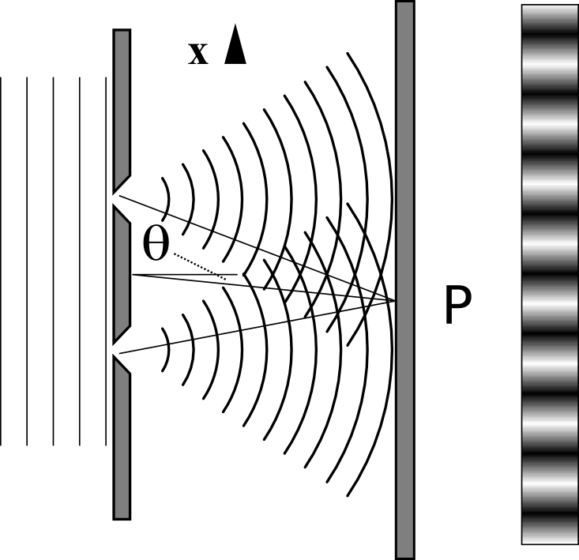
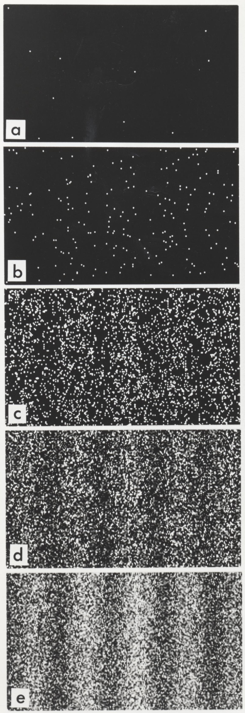
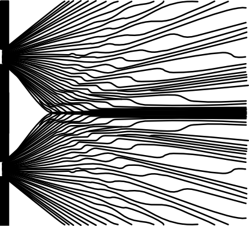
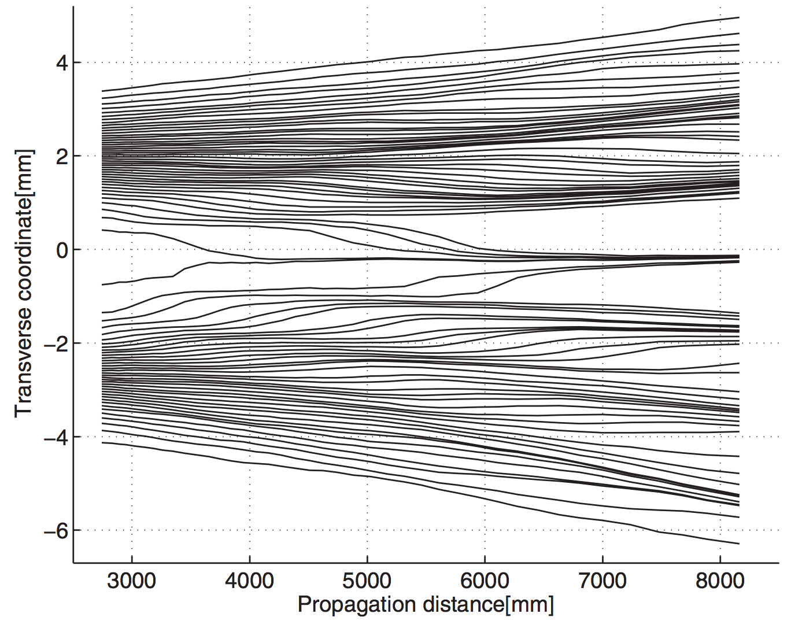
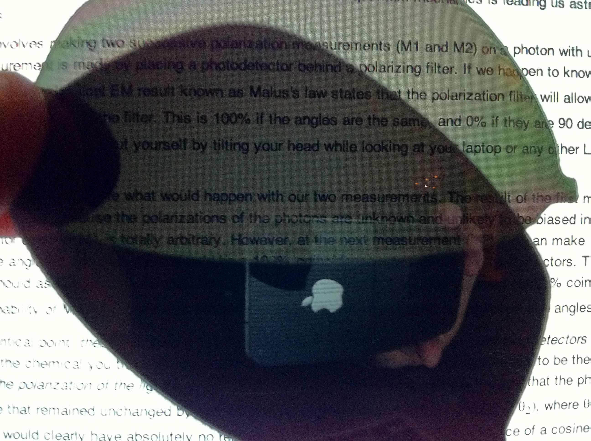
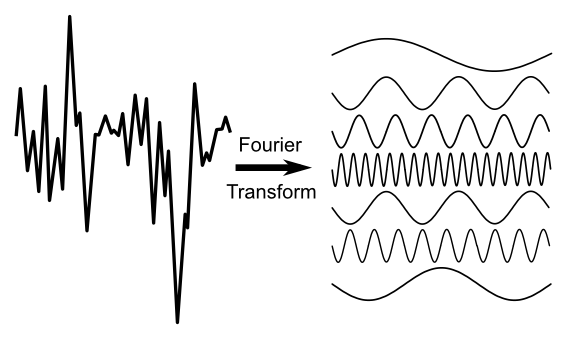
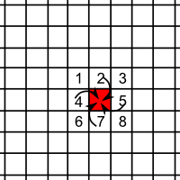
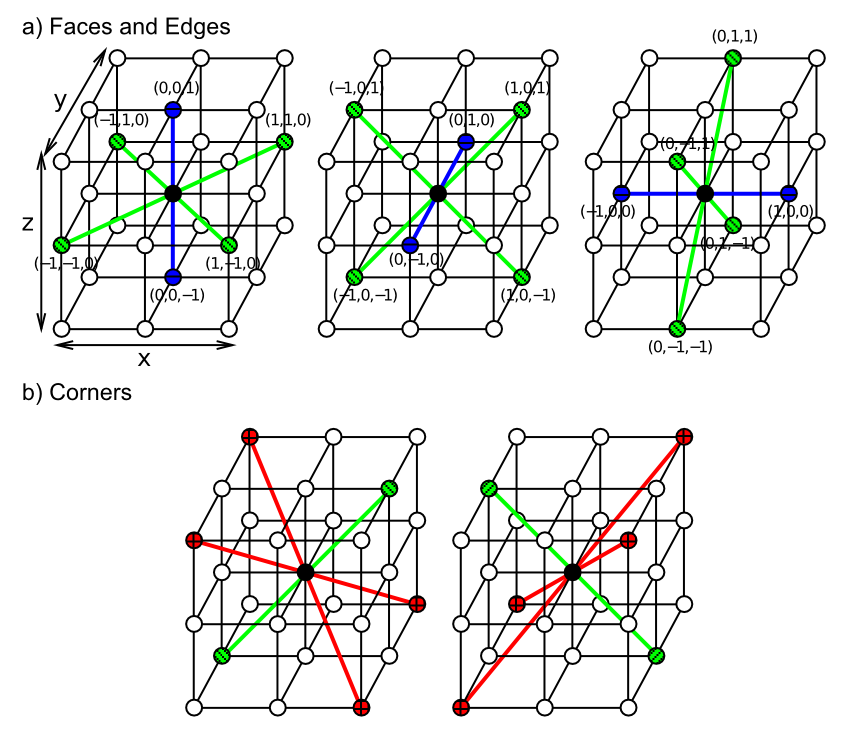

# Chapter 1: Introduction and Overview

This work-in-progress online "textbook" represents a long-term effort to use computational models to simulate fundamental physics, first and foremost as a way of better understanding what exactly is going on, but also with the ultimate hope of perhaps finding a solution to some of notorious paradoxes and conceptual challenges that lie at the heart of quantum mechanics (QM).  There is an easy-to-use GUI-based simulation software package (note: currently under development) that allows one to interactively explore various physics models, providing a concrete and hands-on level of understanding.  This provides a different and potentially valuable set of tools for someone trying to learn more about how quantum physics actually works, which may result in quicker and deeper understanding than staring at equations :)

From an _ontological_ perspective (i.e., in terms of what we think is _actually real_), there are two seemingly-conflicting entities at the heart of QM: _waves_ and _particles_ (i.e., the "wave-particle duality").  Much of the confusion and paradox in QM is tied up with this duality.  The overall approach here follows the _de Broglie-Bohm pilot-wave_ framework in embracing the simultaneous and interacting reality of both particles and waves, and we spend a lot of time and effort understanding the seemingly "magical" properties of waves in particular.  At one point, I was hopeful that somehow one could do away with particles entirely, given that wave equations can account for so much of the known phenomena in physics, including the mind-bending space-time distortions of special relativity, and the complex dynamics of electricity and magnetism (EM).

However, pure waves end up being just a bit too "squishy" and tend to ooze out all over the place.  Particles provide a kind of hard "skeleton" that is particularly important for maintaining the strict conservation laws that are so central in physics: Nature is above all a meticulous accountant, it seems.  For example, there are strong conservation laws for charge, spin, and particle numbers of various sorts, along with the ubiquitous conservation of total energy.

Furthermore, the _Pauli exclusion principle_ prevents there from being two of the same _fermions_ (spin 1/2 particles like electrons and quarks) in the same place at the same time with the same spin: this suggests from our computational perspective that there is some kind of underlying constraint like "slots" in a lattice for holding at most one of each type of particle.  This is both a welcome simplification for our models of these particles, and a tantalyzing suggestion that this computational perspective might provide some unique insights into the underlying nature of the physical world.

This computational perspective also provides an interesting motivation for the need for waves.  If you just have a simple discrete point-like particle sitting in some kind of lattice-like grid, it is very difficult to implement realistic force-field interactions among such particles, especially when using other discrete particles like "photons" to mediate these interactions.  The purely particle picture of an electron constantly spewing baseball-like photons out in all directions to hit other electrons is very difficult to sustain.  How does such a scheme ever achieve any kind of smooth field-like coverage of space using discrete point-like entities?  How many balls per femtosecond does it have to spew?  How do they manage to spread out uniformly over space and time, while properly conveying the dynamic interactions among the magnetic and electric aspects of the wave functions?

Instead, it is far more straightforward to use EM wave equations to model the force field interactions among electrons.  However, the ability of a discrete localized electron to "sense" such a force field as a distributed wave remains problematic: EM waves that influence electrons are widely distributed things, and small discrete samples at one point of a wave would not provide the proper net influence that the physical laws require. Thus, it works much better for the electron to also have its own wave field that is directly coupled with the EM wave field.  In effect, the electron's wave field acts like a kind of antenna that senses and responds to the EM forces, and then conveys the results to shape the unfolding trajectory of the discrete particle through space and time, as captured in the pilot-wave model.

We will ultimately implement this wave-particle model through coupled Dirac wave functions for the electron and Maxwell's equations for EM, with the Dirac wave providing the guiding pilot-wave for a discrete electron particle localized within a cubic lattice grid.  We call this **Wave Electrodynamics** or **WELD**, which attempts to explain the same phenomena as _quantum electrodynamics (QED)_.

The waves in this model are all implemented using the same cubic lattice grid that the discrete electron particles live on, where local neighborhood interactions among the lattice cells implement a highly spatially symmetric form of the _Laplacian_ spatial gradient function at the core of the wave function.  In short, the entire model is essentially an elaborate form of _cellular automaton_ (CA), which has many appealing properties as the simplest-possible framework for a physical system, as advocated by a number of theorists over the years, including John Von Neumann, Stanislaw Ulam, Zuse, 1970; Fredkin & Toffoli, 1982; Fredkin, 1990; t'Hooft (?); Wolfram (?).

One of the primary challenges of this CA framework is reconciling the local interactions among neighboring cells, which so naturally produces a relativistic speed-of-light limit (one time step update per lattice cell), with the now irrefutable evidence for some kind of non-locality in quantum physics.  Recent work within the pilot-wave framework has helped to significantly clarify the nature of these non-local interactions, and the broader conflict that they actually pose for all of QM, despite many attempts to downplay these issues from within the standard QM frameworks (Durr et al., 2014).

Without having any definitive results at this point, the approach taken here is to push the current WELD framework along as far as possible, addressing the many significant outstanding problems, and use the resulting computational models to further understand the nature of these non-local interactions.  Given that electron particles are strongly interacting with distributed wave functions in this framework, it is not inconceivable that the necessary non-local interactions may emerge from these distributed wave interactions in a way that remains compatible with observed data.  For example, it is already clear that the time step needed for updating the wave function computations is actually at least twice the speed-of-light rate in a simple CA, raising the possibility of supra-luminal interactions at the lattice level, while still maintaining fully relativistic dynamics in the EM wave function propagation.

In summary, the WELD approach represents an exploratory computational-modeling approach that could afford important insights into the otherwise puzzling nature of the quantum world.  We can already see from the above intuitive arguments that the central wave-particle duality of the quantum world actually makes good sense from the lens of trying to implement these systems in a computational model.  One advantage of the computational modeling approach is that it allows one to explore more complex, nonlinear interactions that can be difficult to analyze mathematically.  

Indeed, we will also see many cases where the simplified mathematical frameworks that have been developed to perform useful quantum calculations have been mistaken for physical models of the underlying processes, giving rise to most (if not all) of the apparent paradoxes in the quantum world.  By extrapolating from clear examples in other domains, and the considerable progress by a number of researchers in developing a plausible quantum physical models, it is not unreasonable to be optimistic that a fully sensible, intuitively comprehensible physical model of the quantum world is within reach.

In the remainder of this introductory chapter, we review some of the key phenomenology of quantum physics with a brief historical account, situating the pilot-wave framework within the broader field.  Subsequent chapters introduce wave equations in their basic form in [Chapter 2](ch02_waves.md), for EM in [Chapter 3](ch03_em.md), and for massive particles (matter) in [Chapter 4](ch04_matter.md).  Finally, [Chapter 5](ch05_dirac.md) develops the second order Dirac wave equation that represents the full relativistic matter wave function for an electron, which can be directly coupled with the EM waves.  Here we see how the otherwise puzzling property of _spin_ plays a critical role in this coupling, perhaps providing a deeper understanding for its role in quantum phenomena.

# History and Phenomenology of the Quantum World

**Figure 1.1:** The double-slit experiment -- narrow openings in the slits cause the wave to spread through diffraction, and because of the different distances traveled in the path from the two different slits to a given point on the far screen P, the waves will experience either constructive or destructive interference, resulting in the wavy bands of light and dark as shown.  The quantum paradox here is that this pattern obtains even when a _single particle_ is emitted at a time -- the particle only ever goes through one slit or the other, but somehow the wave goes through both.  Figure from wikimedia commons by Lacatosias.

**Figure 1.2:** Results of a double-slit experiment using electrons, with increasing numbers of electrons recorded (11, 200, 6000, 40000, and 140000).  The interference pattern emerges over time, even though only single electrons are detected on each trial.  Figure from by Dr. Tonomura via wikimedia commons.

The _double-slit_ experiment (also known as Young's experiment) (Figure 1.1), is said to illustrate the full mystery of quantum mechanics, and nicely demonstrates some puzzling aspects of wave-particle duality.  Interestingly, the double slit experiment was around long before quantum mechanics, as a way of generating interference patterns with waves, but it "just got weird" when the intensity of the light, or beam of electrons or other particles, is reduced to the point where there is only a _single particle_ passing through the apparatus at a time.

Surprisingly, one still observes the interference effect in this case (Figure 1.2).  How can a single "hard little particle", all by itself, produce this wave-like interference effect?  There are _many_ other results that all add up to the strong conclusion that, somehow, elementary particles like electrons have _both_ wave and particle properties.

Historically, the early development of this wave-like property of particles was focused on understanding the nature of simple atoms like hydrogen, which has a single electron orbiting a nucleus.  The dominant classical physical model of the atomic system in the early 1900's was the Rutherford model of 1911, with electrons as tiny points of charge and mass, orbiting a nucleus, much like planets orbiting the sun. This model had important failings, which the full development of quantum mechanics resolved, thus cementing the demise of the classical worldview, and solidly establishing quantum mechanics.

The major problem with the classical atom was that it is fundamentally unstable: the electron should emit electromagnetic radiation as it orbits around the nucleus, and thus lose energy. As it loses energy, the orbit must get tighter, and eventually the electron should just collapse into the nucleus, just like one of those quarters you roll around in a gravity well at a science museum.  Furthermore, as its orbit gets tighter, it should emit higher frequency radiation, predicting a continuous and increasingly high frequency emission spectrum. Instead, it was known that atoms emit consistent, discrete frequencies of radiation.

In 1913, Niels Bohr provided an apparent solution to the problem, leveraging the emerging ideas of Planck and Einstein that were derived from the _photoelectric effect_ and the properties of _blackbody radiation_: the energy of "photons" (particle-like elements of EM radiation) is proportional to their frequency (and thus inversely proportional to wavelength), times a mysterious new physical constant named after Planck, $h$:

- **Energy = h times frequency:** $E = h \nu$

Bohr postulated that electrons can only have orbits where the angular momentum (i.e., the effective period of the orbit) is restricted to an integer multiple $n$ of Planck's constant:

- **Bohr wavelength = integer multiple of h:** $L = n \hbar = n \frac{h}{2\pi}$

Although the reason for this restriction was not clear, it immediately made sense of a great deal of data, including the Rydberg formula for hydrogen emission spectra.  The justification for Bohr's restriction on atomic orbits came in 1924, when Louis de Broglie proposed that electrons have a wave-like nature, and thus the only frequencies of electron wave vibration that are stable are standing waves. Standing waves must have an integer number of wavelengths, such that within the orbiting electron model, the electron orbits are constrained to have an integer number of such waves per orbit. Shortly thereafter, in 1926, Erwin Schrödinger developed his famous wave equation, which then gave a complete mathematical description of the behavior of bound electrons in atomic systems, which made sense of even more data than Bohr's original model.

The experimental confirmation of de Broglie's matter wave hypothesis came in 1927 in an experiment by Davisson and Germer, who found that electrons moving through a crystal exhibit a diffraction pattern, consistent with a wave-like property.  Calculations showed that the de Broglie wavelength predicted for the electrons fit the observed diffraction pattern quite well:

- **Momentum = h / de Broglie wavelength:** $p = \frac{h}{\lambda}$
- **de Broglie wavelength = h / momentum:** $\lambda = \frac{h}{p}$

This wavelength is about .165 nanometers for the electrons in the Davisson-Germer experiment (very tiny, but enough to produce a measurable diffraction pattern through the crystal).

Both de Broglie and Schrödinger thought that these "matter waves" were real physical things, like light waves. Furthermore, de Broglie suggested that the wave acted to _guide_ the point particle electron around, in his **pilot wave** theory.  Schrödinger initially had an even more radical view, which abandoned the point electron entirely: he thought his wave equation described a wave of _charge density_ that _is_ the actual electron, without any need for a dual particle-like entity.

However, both of these attempts to provide a "physically realistic" perspective on the phenomena were quickly abandoned in the face of further evidence suggesting that the wave function fundamentally describes the _probability_ that a particle might appear at a given point in space when measured.  As such, the wave is somehow "non physical",  and yet exerts physically-measurable effects.

This movement away from a physical model was furthered by Heisenberg and his _uncertainty principle_, and the broader principle of _complementarity_: there is a minimum, irreducible amount of ambiguity or uncertainty in the quantum world, and you can _either_ push things more toward one perspective (e.g., the wave-like aspect) _or_ the other (the particle-like aspect), but not both at the same time.  This philosophical stance was based initially on the simple fact that the uncertainty in the position ($x$) or momentum ($p$) of a particle has a minimum bound of a factor of Planck's constant:

- **Uncertainty in position * momentum:** $\sigma_x \sigma_p \geq \frac{\hbar}{2}$

Thus, any attempt to decrease the uncertainty in location $\sigma_x$ necessarily increases the uncertainty in momentum $\sigma_p$.  We will see in [Chapter 4](ch04_matter.md) that this property is a natural consequence of matter waves.

From this complementarity principle, Bohr and Heisenberg developed the _Copenhagen Interpretation_ of QM in the late 1920's, and this is still dominant today.  Central to this interpretation is the notion that the physical world operates in two complementary modes: you are _either_ making a _measurement_, which causes the wave function to _collapse_ down to a single discrete particle-like point, _or_ physics is otherwise evolving according to the wave function.  During this wave-function mode, the mathematical picture suggests that there is no definitive underlying state of the world: everything is in some kind of probabilistic superposition of possible states.  Only once you measure something does it actually exist in any kind of definite way, leading to the mantra that "the world only exists when you measure it".

This strong discretization of the laws of physics is at the root of many seeming paradoxes and puzzles in understanding the quantum world: what exactly defines a "measurement" at a fundamental level?  How can the wave function, which could conceivably spread out over large macroscopic spaces over time, instantaneously collapse down to a single point within that entire space?  Despite these conceptual difficulties, the mathematics of the framework allow straightforward calculations that match the outcomes of actual experiments, leading to a general attitude of "shut up and calculate": don't bother with unnecessary considerations of the actual underlying physical ontology, just do the math!

However, in the 1950's, David Bohm reinvented the original _pilot-wave_ model of de Broglie, and showed that in fact it can fully explain the same phenomena as the standard Copenhagen QM framework.  Critically, in this _de Broglie-Bohm pilot-wave_ framework, _particles always have a definite well-defined location_.  There is no longer a complementary discretization of the world into measurement vs. wave-function evolution phases: the two are _always_ operating hand-in-glove, all the time.  Figure 1.3 shows what the underlying trajectories of particles under the pilot-wave framework look like in a double-slit experiment, and Figure 1.4 shows some recent data from an experiment where _weak measurements_ that minimally disturb the system allow one to infer particle trajectories, which look remarkably similar to those predicted by the pilot-wave model.

**Figure 1.3:** Trajectories for particles in the double-slit experiment computed according to the de Broglie-Bohm pilot wave model.  The interference effects can be seen as relatively localized bumps in the trajectories, corresponding to steep gradients in the Schrödinger wave equation.  Critically, the underlying trajectories are considered to exist at all points even if you don't happen to observe them.

**Figure 1.4:** Reconstructed trajectories of photons in a double-slit experiment using a weak measurement technique that allows aggregate trajectory information to be reconstructed over many repeated samples that are post-sorted according to a weak additional modulation of the system -- these are not individual particle trajectories. There is a striking correspondence to the predictions of the de Broglie-Bohm model.  Figure from Kocsis et al, 2011.

# Calculational Tools vs. Physical Models

The differences between the standard Copenhagen interpretation vs. the pilot-wave model nicely exemplify the broader distinctions between **calculational tools** vs. **physical models**.  A calculational tool is a mathematical framework that makes it easy to compute relevant results, but the underlying processes implied by the nature of the calculations have no direct mapping onto underlying "real" physical properties of the system.  For example, Newton's theory of gravitation (still widely used in practice) is a calculational tool that enables gravitational effects to be conveniently computed in terms of the respective masses ($m_1$, $m_2$) and distance *r* between the centers of mass of two bodies:

- **Newton's gravitation law:** $ F = G \frac{m_1 m_2}{r^2}$

But this is not a plausible physical model because the math requires the use of the distances between relevant objects (typically many millions of miles in the usual astronomical applications), and their respective aggregate masses.  Not only is this a (highly) nonlocal computation ("action at a distance"), Nature would presumably have to run this computation for all other bodies within some relevant radius, which could get a bit hairy.  By contrast, a plausible physical model should compute gravitational forces directly from the collective effects of each individual atom within all the different celestial bodies in the universe, and propagate these forces via local mechanisms at the speed of light.  Indeed, Einstein's _general relativity_ provides exactly this kind of satisfying physical model, and it would be hard to find a serious physicist who did not recognize and appreciate these distinctions between the Newtonian and Einstein versions of gravitation.  In particular, nobody would argue that nature actually implements the Newtonian model, while it is very easy to see how general relativity could happen "naturally".

In the case of Copenhagen vs. pilot-wave frameworks, both produce the same end results, and more generally, it is almost always the case that there are multiple different ways of framing a problem that end up producing the same results.  From a purely pragmatic, "shut up and calculate" perspective, one should just pick the one that is simplest or otherwise most effective to use for a given situation, and be done with it.  If all you care about is getting the right answer, why should you care about the particular "aesthetic" details of a given model?  For this reason, the pilot-wave model is generally ignored by most "working physicists", because it is more complicated than the standard framework.

However, problems arise when people mistake their calculational tools for physical models.  Many (most?) people somehow regard the Copenhagen measurement and wave collapse processes as a real physical model, and thus get hung up on how strikingly non-physical its core mechanisms are.  From the perspective of someone who appreciates the physical appeal of the pilot-wave framework, it is almost comical that otherwise obviously intelligent people could make this kind of mistake.  And don't even get me started about the _many worlds_ interpretation that attempts to avoid the measurement problem entirely by forking off _an entire new Universe_ at each possible point of measurement!  A shockingly large number of "working physicists" endorse this perspective, and this collective breakdown in common sense unfortunately gives licence to all manner of "crazy" science fiction fantasies among the broader public (and especially Hollywood it seems).

If there truly were no other good physically-plausible model for how this all could work, maybe you would indeed be forced to throw up your hands and just accept that nature is irrevocably incomprehensible.  And when you did so, you might be tempted to laugh at all those other poor "unsophisticated" people who haven't yet achieved your supreme level of existential cynicism.  But this is simply not the case here.  The pilot-wave model does have some important remaining issues to be resolved (and important progress has been made relatively recently as reviewed below), but it is difficult to understand why anyone would continue to adhere to any other framework as a physical model, given the obvious advantages of this framework in terms of providing a coherent "real" ontology for how physics could actually work, without fantastical or arbitrary, massively under-specified processes like "measurement" or "instantaneous universe spawning".

There are many other clear examples of calculational tools vs. physical models throughout physics.  For example, there is a similar case as the gravitational example above, for Coulomb's law for the strength of the electric field as a function of distances between charged particles, compared to the Lorenz gauge formulation of Maxwell's EM equations.  Coulomb's law is of the same form as Newton's gravitational formula (and likewise represents a useful calculational tool), while the Lorenz gauge formulation of Maxwell's equations describes purely local, light-speed wave propagation dynamics.  Even within Maxwell's wave equations, there is a Coulomb gauge version that implies immediate action-at-a-distance for the electrical potential, which is clearly incompatible with special relativity. It turns out that some nonlocalities in this framework actually enable the observed EM fields to propagate at the speed of light, but one can still get into trouble using this gauge incorrectly (Brill & Goodman, 1967; Jackson, 2002; Onoochin, 2002).

In these and many other cases, people still use Newton's gravitational equation instead of Einstein's equations, and prefer the Coulomb gauge over the Lorenz gauge, because it makes the calculations simpler for relevant practical applications.  But rarely do you find people being confused over which best describes the actual underlying physical processes involved in these domains.  However, until Einstein came up with his gravitational framework, people did fret about the action-at-a-distance property of Newton's laws.  Somehow, until we actually have the correct physical model for a given domain, people just can't imagine that such a thing might actually exist, and they get all confused by trying to interpret the existing mathematical models incorrectly.

In short, here's a useful mantra: **Don't confuse the math for the physics!**  Math can represent anything, and there are many ways of solving the same problem.  Nature presumably operates in only one specific way, which may not be the most convenient for solving our specific problems of interest.

In summary, perhaps the biggest mystery in quantum physics is why there is such a massive collective inability to recognize the difference between the calculational tools and physical models in this domain, when they are perfectly capable of doing so in others.  Have people just been so deeply confused for so long, and so ridiculed by everyone telling them to shut up and calculate, and to "grow up" and give up on their naive physical intuitions?  Of course, even Einstein was so ridiculed, and relegated to the fringes for his steadfast refusal to believe in the new quantum world, so I guess that sets a pretty bad precedent for anyone to follow.  To be fair, there are legitimate concerns about the pilot-wave framework, and only relatively recently has significant additional clarity been established about several critical aspects of the framework, so perhaps many reasonable physicists have prematurely discounted it.  In the next section, we review some of these issues within a broader discussion of various aspects of the calculational tools and frameworks used in QM.

# Varieties and Meanings of Quantum Wave Functions and Frameworks

## Matrix Mechanics in Hilbert Space

By far the most widely-used calculational framework in standard QM is the algebraic _matrix mechanics_ approach, pioneered by Heisbenberg, Dirac, Hilbert, von Neumann and others in the mid 1920s.  It involves _state vector_ representations of the state of a system, encoded via complex-valued vectors representing _probability amptlitudes_ (i.e., a Hilbert space).  This state vector evolves under _unitary_ transformations (rotations in the complex vector space), which preserve the overall magnitudes of the vectors, even as they rotate around in the space. Then, at the end, a "measurement" is made by collapsing the probability space down to a single discrete outcome (i.e., along an eigenvector of the resulting state).  The unitary nature of the rotation transformations represents the behavior of the system when it is being governed by the Schrödinger wave dynamics under the Copenhagen dualistic framework, which perfectly preserves the overall underlying probability space as long as nobody "looks at it the wrong way" (i.e., makes a measurement). 

This matrix formalism is equivalent to a self-consistent form of probability theory, which can be derived from abstract axioms having nothing to do with quantum physics (Gleason, 1957; Jaynes, 1990; Caves et al., 2002; Fuchs et al., 2014; Mermin, 2018).  Indeed, this framework is so general that its only real physical commitment is that quantum physics obeys strict conservation laws: if you start with X amount of spin distributed however uncertainly across some state variables, then you have to end up with the same total uncertainty in spin distribution at the end, prior to the final measurement step, when everything collapses. Thus, the claim that standard QM is such a successful framework must be understood within this context: yes, it is accurate in capturing this basic fact of conservation, but it really isn't going very far out on a limb here: nothing wagered, nothing lost; but also not so much gained perhaps.

## Schrödinger Waves in Configuration Space

Compared to the matrix approach, the explicit use of the Schrödinger wave equation represents an increased level of commitment to the details involved in the dynamics of the wave updating, its frequency and phase characteristics, and how it spreads out over time.  As we will see in [Chapter 4](ch04_matter.md), Schrödinger's wave equation captures basic non-relativistic Newtonian physics in a simple linear, first-order framework, and can be derived from a Hamiltonian representing the total energy of the system, which is strictly conserved over time.  It captures the fundamental relationships between momentum and wave frequency described earlier.

However, it has a rather simplistic treatment for how forces affect charged particles in terms of overall scalar potentials, and says nothing in detail about how electric charge generates the EM wave field (or photons for that matter), or the detailed way in which different particles might interact with each other.  Indeed, because the Schrödinger wave equation is linear, it is incapable of capturing particle interactions, because the waves simply superpose (additively combine) past each other, without impacting each other at all.

Thus, in order to capture relevant interactions, the Schrödinger wave equation is applied to a multi-dimensional  _configuration space_ representation that is essentially equivalent to the state space representation in matrix mechanics.  For example, if there are two interacting particles, then they each get their own set of 3D dimensional coordinates within this configuration space, and the entire wave function evolves over time so as to conserve the overall energy / probability represented in the configuration space.  This configuration space is entirely _nonlocal_ by its very construction, representing at each instant of time the entire configuration of the system, regardless of how far apart any of the particles might be.  In this way, it strongly resembles a Coulomb-like calculational tool for EM, which again nobody would mistake for a plausible physical model within the EM domain.  Furthermore, exactly such a configuration space model is used in _classical_ applications of the Hamiltonian framwork, and nobody has a second thought about that just being a calculational tool.

In summary, the high-dimensional nonlocal configuration space is very different from anything anyone would recognize as actual 3D physical space.  It should be obvious to everyone that using such a representation is strictly a calculational tool, and any consideration of how the results might actually emerge through real physical processes must be done within a more realistic physical model.  Nevertheless, one of the most striking and challenging results from these standard QM models is that the nonlocal effects that they predict actually do appear to be empirically validated.  Thus, a significant challenge remains to understand the underlying physical nature of these effects, and how they can occur without violating everything else we have come to regard as strict physical laws, specifically the speed-of-light constraints of special relativity (Durr et al., 2014).

Also, while the dimensionality of configuration space increases linearly in the number of particles involved, the underlying computational complexity of the space grows exponentially, and quickly becomes computationally intractable for even relatively moderately-sized such spaces.  Thus, it remains unclear how Nature might get around such prohibitive exponential scaling problems, in whatever computation it is performing.

## Pilot-Wave Models

When David Bohm reinvented the then-neglected pilot-wave framework of de Broglie, he naturally applied it within the prevalent framework of the time, namely the Schrödinger wave equation operating within nonlocal, high-dimensional configuration space.  He was able to show that you can use the gradient of the Schrödinger wave to guide the motion of discrete particles through 3D space, without ever requiring a final wave collapse event.  Instead, the final positions of these particles represent the predicted outcome of an experiment, and, critically, you have to perform many different "runs" of the experiment with the particles starting in different locations that would be consistent with the actual experimental uncertainty in starting state, as captured in the initial configuration of the Schrödinger wave function.  Furthermore, you can simply include the "measurement apparatus" as one of the elements in your configuration space, to get specific predictions about the position of a needle or other readout device.

On the one hand, this is a startling result from the Copenhagen perspective: all that crazy stuff about reality not existing until you measure it, and the non-physical nature of wave function collapse can just be dispensed with entirely.  However, many scientists, including Einstein, rejected Bohm's new pilot-wave theory _specifically because of its use of the high-dimensional configuration space_ (Norsen et al., 2015). Why did they not similarly complain about the exclusive use of this same objectionable device in standard QM frameworks?  Or in standard classical Hamiltonian applications?

The answer is evidently that, unlike these other applications, the pilot-wave framework strongly requires that the wave function is somehow a _real_ thing!  It must actually influence the real trajectories of particles as they move through space, and thus it must actually be something real itself.  And if it is real, then the requirement that it be this strange high-dimensional, nonlocal beast is just as (if not more) unsatisfying as all the bizarre aspects of the standard framework.

But wait a second.  If this very same objectionable configuration space is being used in the standard framework, and it is somehow determining the probabilities for where things end up in actual real experiments, then _why isn't it just as real for the standard framework as well_?  This seems like a serious double standard if there ever was one.

## Epistemic vs. Ontic (Aleatoric) Uncertainty

In addition to whatever sociological forces are at work in propagating this double standard, there is another critical distinction at play, having to do with what the wave function is thought to represent in the different frameworks.  To clarify this, it is useful to distinguish between two sources of the uncertainty represented in the quantum state / wave function: _epistemic_ vs. _ontic_ (also known as _aleatoric_ in other contexts).  Epistemic uncertainty reflects our own lack of knowledge about the true underlying state of the system, but, critically, excludes any actual "true randomness" arising from the stochastic behavior of the system itself, that would obtain even if we had (counterfactually) perfect knowledge of the underlying state of the system.  This latter type of uncertainty is the ontic ("ontologically real") or aleatoric (derived from the latin word for dice) variety.

If the quantum wave function is largely (or even partially) reflecting epistemic uncertainty, then it seriously challenges the pilot-wave framework in a way that does not affect the purely probabilistic Copenhagen approach.  How would it make any sense for an _epistemic_ wave of uncertainty to be guiding the _real_ physical positions of particles as they move about the world?  By contrast, the Copenhagen interpretation already takes a laissez-faire epistemic-level approach to the wave function in the first place: it is all just a big untouchable ball of mystery until you do a measurement anyway, so it might as well be epistemic or whatever!  The Quantum Bayesianism (QBism) approach takes this to its logical extreme, with an entirely subjective epistemic treatment of the wave function (Fuchs et al., 2014; Mermin, 2018).

Critically, there is clear evidence from _within the pilot-wave approach itself_ that a not-insignificant portion of the pilot wave actually does represent epistemic uncertainty, because many different possible initial starting states must be modeled to capture our very real uncertainty about the precise starting state of any actual experimental configuration.  The Heisenberg uncertainty principle dictates that there is a fundamental limit to which we can simultaneously determine all of the relevant degrees of freedom about a physical system, and in practice we almost certainly have well less certainty than this lower limit, because it is very difficult to make any kind of precise measurement of microscopic quantum-scale systems.

The incorrect incorporation of epistemic uncertainty in the standard Schrödinger pilot-wave framework is also evident in the inevitable spreading out of the wave function over time.  In the epistemic case, this spread represents a very sensible increase in uncertainty about where something might be located, given more time since the last time its position was known.  But given that the pilot-wave model maintains exact locations of each particle over time, it really doesn't seem to make sense for the wave function to spread out in this manner, at least for variables associated with particle positions.

In summary, this quote from E. T. Jaynes is particularly apropos here:
  
> "But our present QM formalism is not purely epistemological; it is a peculiar mixture describing in part realities of Nature, in part incomplete human information about Nature -- all scrambled up by Heisenberg and Bohr into an omelette that nobody has seen how to unscramble. Yet we think that the unscrambling is a prerequisite for any further advance in basic physical theory. For, if we cannot separate the subjective and objective aspects of the formalism, we cannot know what we are talking about; it is just that simple." (Jaynes, 1990).

From this perspective, one could make the following reasonable claim about the pilot-wave approach:  it provides a very powerful _demonstration in principle_ that QM is compatible with a "realistic" underlying world where particles always have definite positions.  Nevertheless the specific formulation in terms of the Schrödinger wave function operating in configuration space is very likely conflating epistemic and ontic uncertainty, and a more realistic wave function that only reflects whatever "real" aspect of the wave function remains after the epistemic part is subtracted away should be used instead.  Furthermore, we should do away with the configuration space, and see what kinds of actual inter-particle interactions lead to the observed behavior that is otherwise being captured in the configuration space framework.

Fortunately, important progress along this latter line has been undertaken by Norsen and colleagues, where they have used only separate realistic 3D spatial dimensions for each particle's wave function, and computed the remaining inter-particle interaction terms directly instead of through configuration space (Norsen et al., 2015).  They concluded that indeed the configuration space contains a large amount of "redundant" information, and that even the simplest approximation for the inter-particle interaction terms does a reasonable (yet imperfect) job of capturing the behavior of the full configuration-space model.  Exploration of higher-order terms in this approximation are ongoing (Norsen, 2022), but perhaps a more direct physically-based approach is necessary?

As for the use of more physically realistic wave functions, some work has been done deriving pilot-wave models for the relativistic Dirac equation (Durr et al, 2014), but I am not aware of a more directed approach at factoring out the epistemic contributions.  In this context, the motivation for the current WELD approach is precisely to develop a fully physically-realistic pilot-wave model using the coupled Dirac / Maxwell equations to mediate all inter-particle interactions, and compare this with real experimental data and the predictions of existing more standard pilot-wave models.

Also, a recent paper has attempted to disentangle the epistemic vs. ontic contributions to the wave function using a novel analytical technique, and concluded that different quantum behavior can be associated with each of these contributions (Budiyono & Rohrlich, 2017).  Predictably, they reject the pilot-wave approach because of its incorrect use of an epistemic uncertainty wave to guide real particle trajectories.

## Contextual vs "real" variables

In addition to the issues of epistemic vs. ontic uncertainty, there is a another generally confusing distinction between _contextual_ vs. "real" variables that must be clarified (Shimony, 1984; Gudder, 1970; Khrennikov, 2001; Rovelli, 1996).  A contextual variable is effectively something that cannot be discretely localized and quantified -- its value depends in some necessary way on the surrounding _context_, which is usually taken to mean the state of the measurement apparatus.  In the standard Copenhagen interpretation, _everything_ could be described as being contextual, given that _nothing_ is thought to exist in any localized, definite way prior to the measurement process.

However, in the pilot-wave framework, the positions of the particles (and _only_ these variables) are given a privileged status as being _real_, non-contextual variables, and _everything else_ about the quantum state is relegated to the usual _contextual_ status.  Another way of stating this is that everything that must be computed from the wave function itself is contextual, and only the position values are excluded from this status.  For example, Norsen (2014) analyzed a pilot-wave model of _spin_, and showed very clearly that it is contextual in nature.  There are no predefined, definite spin values for any particles (indeed this is mathematically impossible as discussed in a moment), and the interaction with a spin-detecting Stern-Gerlach magnetic field apparatus is responsible for _creating_ a definite spin value along a given axis, where none existed previously.  The same logic applies to the momentum and energy of the particles, which also depend on the wave function, as elaborated in Norsen (2017).

Is there something fundamental within quantum theory that promotes position variables to this privileged status that they have in the pilot-wave framework?  In general, the answer appears to be "no", although there is ongoing philosophical debate on this topic (Schoeren, 2022; Wallace, 2020; North, 2012; Ney & Albert, 2013).  In the standard matrix mechanics approaches, the quantum state is chosen to be whatever is most convenient, and this could be a momentum basis instead of position, for example.  However, if it turns out that the position variables somehow do provide a uniquely useful basis for "real" variables, as in the pilot-wave model, that would be an intriguing result.

There is a further quantum property that is critical to appreciate in the context of contextuality, which is whether different quantum variables _commute_ with each other or not.  Mathematically, two variables $A$ and $B$ commute if their order of application (multiplication) doesn't affect the result:

- **Commuting variables:** $A B = B A$  or $AB + BA = 0$

In the mathematics of matrix mechanics, these variables are actually "operators", that are like a measurement operation that extracts the value of a given variable.  In any case, the key physical meaning of commuting variables is that _the order in which you apply the measurements_ doesn't matter.  For example, if you measure the position of a particle in the X axis, that does not affect your measurement of the position in the Y axis, so these position operators commute.  However, measuring the position of a particle specifically does _not_ commute with measuring its momentum, which is the key point of the Heisenberg uncertainty principle: the more accurately you measure position, the more that destroys your ability to measure momentum, and vice-versa.

Critically, the different components of _spin_ do not commute with each other, which is why it is impossible for any quantum state to have a definite value for each of these different spin components (Kochen & Specker, 1990; Spekkens, 2005).  Thus, spin _must_ be a contextual value (as shown in Norsen, 2014), where the measurement process effectively rotates the spin axis onto one dimension, which at the same time makes the other axes indeterminant.

**Figure 1.5:** Demonstration that polarization actually rotates the "photons" in light -- the polarized lens closest to the camera is oriented perpendicular to the polarization of the LCD screen, and thus blocks nearly all of that light.  However, the other lens interposed between it and the screen rotates the light by roughly 45 degrees, so that it can then make it through the lens, as seen in their overlapping region.

This contextual property of spin can also be easily demonstrated for polarization of light, as shown in Figure 1.5.  The first pass through a polarizing sunglass lens effectively rotates polarized light onto that axis, such that it can then pass through a second lens, whereas it isn't able to pass through that second lens directly.

## Semiclassical Models

Another important category of quantum models are _semiclassical_ models of electrodynamics, which feature a classical electromagnetic field evolving according to Maxwell's differential equations, interacting with an atomic system that has quantum mechanical properties (Jaynes & Cummings, 1963; Jaynes, 1973; Mandel, 1976; Grandy, 1991; Marshall & Santos, 1997; Gerry & Knight, 2005). This contrasts with the standard QM model of electrodynamics (QED), which treats the electromagnetic field in terms of discrete _photon_ particles, instead of the classical differential equations.  We will discuss the significant issues with the QED model in the next section.  

The basic intuition behind these semiclassical models is that electrons are locked into bound states in the atomic system, and a minimum resonant frequency is required to wedge them out of these states -- any wave that is below this minimum frequency just doesn't resonate properly with the wave field of the electron, and passes right through. These bound electrons have discrete, quantized energy levels because they obey wave equations, and essentially these waves must vibrate like drums or guitar strings, with an integral number of wavelengths fitting within the overall space available in an atom.  The frequency dependence and quantized nature of the atomic system would hold if it interacted with *anything* -- it would be impossible for the EM field to behave other than in this discretized manner in its interactions with atoms.

Another clue that there may be something fundamentally misplaced in the photon model is the presence of Planck's constant *h*, which arises directly from adding mass to the wave equations, where the waves travel at speeds less than the speed of light (i.e., the Klein-Gordon and Dirac equations).  Because light (electromagnetic radiation) has no mass, there is no reason for there to be such a constant associated with it, and the classical EM equations have no place for this constant.

Although the photoelectric effect has a fairly compelling semiclassical explanation, there are other phenomena that are harder to explain within this framework. For example, it is possible to have a system that emits a single "photon" of EM energy at a time, and this photon can then be detected later. Advocates of the photon model argue that it is only detected in one specific location, which seems like evidence for a localized little particle, and not a more broadly distributed wave. However, we must appreciate that the source of the EM field with sufficient energy to excite an atom is typically the spontaneous emission of photons from other atomic systems. This means that these photons were "created" by a kind of mirror image of the very same discrete process involved in detecting the photons. This should impart a temporal, spatial, and energy-level discreteness to the EM radiation in the first place.

There are other statistical properties of photon emission (e.g., anticorrelations; Grainger et al., 1986; and antibunching; Hong et al., 1987) that have been proposed to be inconsistent with the semiclassical approach. Nevertheless, semiclassical accounts of these phenomena have been provided, by leveraging an additional stochastic process associated with the hypothesized zero point field (Marshall & Santos, 1988, 1997), but this work has failed to overturn the status quo belief in photons, perhaps in part because of various important outstanding issues associated with this zero point field construct.  Overall, this semiclassical physical model requires much more complex calculations and conceptual frameworks than the simple ideas and math associated with the photon model. 

## Quantum Field Theory and QED

Finally, we briefly discuss the most successful quantum model, quantum electrodynamics (QED), which introduces significantly different conceptual and mathematical frameworks compared to the relatively simple matrix mechanics and Schrödinger wave functions.  There are two key conceptual elements to QED: the path integral and quantum field theory, which enable it to accurately represent the detailed interactions between an electron and the EM field.

The _path integral_ method of Richard Feynmann (originated by Dirac) works by iteratively enumerating all the possible events that might take place in an interaction between electron and photon, and computing the total probability of different outcomes by integrating across all these paths.  This method is intuitively illustrated by the famous _Feynmann diagrams_ showing the different possible scenarios in each path.  Critically, at this level, the key elements of the theory are the coupled Dirac equation for the electron and Maxwell's equations for the EM field.

A central problem with this path integral framework is that the path integral sums diverge into infinity.  A kind of mathematical "hack" (according to Feymann and others) called _renormalization_ was finally able to resolve this divergence.  Despite its seemingly arbitrary "pragmatic" basis, renormalization proved successful and allowed the framework to be extended to other domains, involving the weak and strong forces.  Clearly, a mathematical framework based on divergent infinite integrals is not a particularly promising basis for a plausible physical model.

**Figure 1.6:** The Fourier transform, which is the basis of the photon model in QED.  A fourier transform converts a function from normal physical space into an orthogonal basis space of sine waves parameterized according to their amplitude, phase and frequency.  No position parameter is retained in Fourier space, as the sine waves are infinite in extent.  The QED model of the photon is, implausibly, one of these Fourier sine waves, similarly infinite in extent, without any physical localization.

At higher energy levels, the possible paths include the spontaneous creation of new particles out of raw energy (i.e., _pair production_).  Dealing with these kinds of events in an efficient way mathematically required an entirely new framework called _quantum field theory_ (QFT), which does away with the configuration-space representation based on a specific number of particles, and instead considers an entire spatially-extended field where particles can more easily be created and destroyed as "excitations of the field".  The mathematics of this field are based on a _Fourier space_ representation (Figure 1.6), where each "particle" is associated with a specific Fourier component, which is a sine wave having a specific frequency and phase.  Adding or removing a particle amounts to just adding or removing a corresponding Fourier component.

Fourier space is the _momentum space_ representation complementary to _position space_: it is defined in terms of frequency and phase coordinates, where the frequency is proportional to the momentum of a particle as we saw in the discussion of the original motivation for matter waves by de Broglie.  This Fourier representation is particularly convenient for keeping track of total energy, which is proportional to momentum and frequency, and allows one to more easily represent different types of particles splitting up some total amount of energy in different ways.

As captured in the Heisenberg uncertainty principle, momentum and position are "conjugate" (complementary) variables, so when you represent everything in precisely in Fourier space, the position information is completely lost.  Thus, "particles" in Fourier space have no positions: they spread across the entire space.  Position information only arises in Fourier space in terms of the constructive and destructive interference effects of different phases and frequencies.  Thus, representing a particle with some specificity of spatial position requires many different sine waves "working together" to add up in one part of space and cancel out in other parts of space.  Representing something with a fully precise spatial position requires an _infinite_ number of such sine waves, in the same way that representing a fully precise momentum (i.e, frequency) requires a continuum infinity of particle positions oscillating according to a specific precise frequency.  This is again the Heisenberg uncertainty principle, and it is a basic property of waves as we will see in subsequent chapters.

Under the primary postulate of the pilot-wave framework that particles have a specific position at all times, it is clear that this QFT Fourier space representation is exactly the wrong one for describing a physically accurate model.  But, as usual, people have a difficult time recognizing that this QFT framework is just another calculational tool that is convenient for computing certain kinds of problems, and they end up thinking of the QFT particle representation as a physical model.  Specifically, QFT provides the only mathematically tractable model of a photon as some kind of discrete particle-like entity, but for all of the reasons explained above, such a photon is nothing like any other kind of particle we would recognize in the real world.  It has infinite spatial extent, and is defined only in terms of its frequency and phase.

In summary, QED and QFT are amazing calculational tools that have been used to make some of the most accurate predictions in all of physics.  But they have a number of obvious problems as physical models for how nature actually operates, especially relative to the assumptions of the pilot-wave framework.  Nevertheless, the coupled Dirac and Maxwell fields at the heart of this theory are clearly the key basic ingredients, and it is possible that a more computationally-based approach, with the strong constraint of discrete electron particles in specific spatial locations, could provide the basis for an accurate physical model.

## The Zero Point Field and Stochastic Electrodynamics

In the QED framework, the vacuum is not actually treated as empty space, but is rather the province of the _zero point field_ (ZPF), which has a non-zero level of energy. This can be derived from the uncertainty principle: if a system had zero energy sitting in a confined space (i.e., the bottom of an EM potential well), it would have a definite momentum and position at the same time, which is forbidden. Empirical evidence for this ZPF comes potentially from the Casimir effect, which is a tiny force measured between two parallel neutral metal plates brought very close together -- the region between these plates should exclude longer wavelengths of the ZPF, and thus have lower energy than the outside region, producing a net force. However, it is also possible that this force reflects a radiation reaction effect, as it can be derived from QED on that basis alone (Jaffe, 2005).

The stochastic electrodynamics (SED) and stochastic optics models (Marshall & Santos, 1988; Marshall & Santos, 1997; de la Pena & Cetto, 1996) incorporate the ZPF as actual random oscillations in the classical EM field (described by Maxwell's equations), and show how such a field could produce various phenomena such as photon antibunching statistics, which have been taken as one of the last elements of definitive support of the quantum photon model over the semiclassical approach (a classical EM field interacting with a quantized atomic system).

A major problem associated with all of these ZPF models is that the amount of energy in the ZPF would be astronomically huge. Also, it would seem to predict a higher level of spurious photon detection events than is actually observed, although there may be a reasonable solution to this latter problem (Marshall & Santos, 1997). The semiclassical theorist Jaynes suggested that instead of imagining that this ZPF fills all of space, it may just reflect noise emitted by atomic and molecular systems, which will be most intense in the immediate vicinity of these sources, and fall off dramatically outside of them.  This could potentially eliminate the problem of the huge energy level, as it would just be a small additional contribution to the observed mass values of atomic systems.

In any case, we will be on the lookout for these issues in developing the WELD models.  The interaction between a discrete electron point particle and the Maxwell EM field will undoubtedly produce a lot of "ripples" of EM signals as it moves about, hopefully consistent with the spectrum of blackbody thermal radiation.  However, there may be additional sources of noise, and additional elements of stochasticity that may need to be added.  For example, there is a long history of work on the connection between stochastic (brownian) motion and QM wave equations, which was developed by Nelson (1966) building on original ideas from Feynmann (see Sciarretta, 2018 for a historical overview and recent developments).  It may be that we need to make particle movement stochastic, to avoid strong aliasing effects of the cubic lattice.

# The Cellular Automaton Model of Space and Time, and Local Interactions

**Figure 1.6:** Illustration of a simple 2-dimensional cellular automaton: space is divided into regular square cells (a uniform, regular tiling of space), and neighboring states interact by influencing the state update.  Time updates synchronously, setting the fastest rate of propagation as cell width / time update.

**Figure 1.7:** Neighborhood interactions in regular cubic tiling of space in three-dimensions -- these interactions are used to compute the wave equation locally.

As noted earlier, the computational modeling approach here is essentially a complex version of a cellular automaton (CA), which has been investigated as a basis for fundamental physics modeling since the 1950s.  A CA consists of a regular, uniform division of space into discrete *cells*, each of which has one or more *state* values, and each cell interacts only with its nearest neighbors (i.e., locally) to update its state value over time (Figures 1.6, 1.7).

Such a system was first described by Stanislaw Ulam in 1950, and has been popularized in its two-dimensional form in "the game of Life" by John Conway (described by Gardner, 1970). In this CA (widely available as a screensaver), there is a two-dimensional grid of square cells, with each cell having a single binary state value (0 = "dead" and 1 = "alive"). This state value updates in discrete, simultaneous steps as a function of the state values in the 8 neighbors of each cell. If the sum of the neighbors' states is > 3 or < 2, then the cell is dead (0) on the next time step (from "overcrowding" or "loneliness", respectively). Otherwise if it has exactly 3 live neighbors and is currently dead, then it is "born" and goes to 1, and if it was already "alive" then it remains so if it has 2-3 living neighbors. As anyone who has seen this system in operation knows, it is capable of producing remarkable complexity from such simple, local, deterministic rules.

The CA framework provides the simplest kinds of answers to fundamental questions about space, time, and the basic nature of physical laws (Zuse, 1970; Fredkin & Toffoli, 1982; Fredkin, 1990). Space is *real* and fundamental in the form of the underlying cells -- it isn't just an empty vacuum or a mathematical continuum.  The discretization of space, as contrasted with a true continuum, can be motivated by the levels of infinities associated with the Cantor sets: a discrete space corresponds to the lowest level of infinity associated with the integer number line, and thus represents the simplest way of representing space. One still has an infinity to deal with, and this is plenty mind-blowing all by itself: space and time continuing infinitely in all directions, forever.  But at least the further difficulty of an infinity of space or time _within_ any given segment, which is required for a truly continuous dimension, can be avoided.  One could reasonably argue that the infinity of space and time is more plausible than the notion of an edge, as in the old flat Earth models and the end of the world.

Time emerges naturally in its unique unidirectionality within the CA framework, simply as a discrete rate of change in the state values.  Furthermore, the ratio of discrete spatial cell width to discrete rate of state update provides a natural upper limit to the rate at which anything can propagate within this system: i.e., the _speed of light_ in a vacuum. Thus, this principal postulate of special relativity that light has a fixed upper speed limit emerges as a necessary consequence of more fundamental assumptions about the nature of space and time in the CA framework. 

Furthermore, as we will see in the subsequent chapters, the basic wave equation can be computed using a simple local neighborhood interaction among cells in a CA-like system, and Maxwell's equations for the electromagnetic field and Dirac's equation for the quantum wave function of an electron can be computed using primarily this basic wave equation. We discuss the more detailed features of special relativity in relationship to the CA framework next, but the main conclusion is that this framework predicts all of the features of special relativity, from first principles based on the discretization of space and time, together with wave dynamics.  

Note that these wave-based equations do require real-valued state variables, which is a departure from the simplest form of CA that only employs simple discrete state values.  Thus, the CA framework provides a potential answer to a central question for the pilot-wave model: what is the ontological basis for the quantum wave function?  It is just another set of state variables updating according to local wave equations, just like the EM field.  In addition, we may require stochastic processes such as randomly choosing the next location for a discrete particle to move based on the local wave field gradients.  Ultimately, the model needs to _work_ to explain the available data, and our intuitions about "mechanistic" level plausibility are secondary concerns: if these intuitions align with reality in a way that makes everything work, it is obviously great, but you cannot let them stand in the way of making progress.

Another affordance of the CA framework is that it unambiguously establishes the position basis as primary for representing discrete massive particles, consistent with the pilot-wave framework.  In addition, the _Pauli exclusion principle_ is strongly suggestive of a discrete CA-like state.  This principle posits that only one _fermion_ (electron, quark, etc, with a quantum spin of 1/2) can occupy the same quantum state, including position, at a time.  Thus, the underlying CA state representation only needs to be able to hold one of each particle type, which eliminates the difficult problem of having to represent a variable number of such particles at each location.  In other words, the "memory allocation" for each cell is constant.  Note that this is not the case for _boson_ particles which obey no such exclusion principle, and would thus require an indefinite number of memory slots to represent (along with all the other difficulties involved in the particle picture for force fields, mentioned earlier).

The notion of _autonomy_ in a CA is also particularly important as a physical model: the CA is entirely self-contained and can just plug away forever, running the same exact local laws every time step.  By contrast, most calculational tools used in physics require a specific setup and different computational steps depending on exactly what situation is being modeled: they are far from "autonomous" in the sense of a CA.  When you look at the examples of plausible physical models discussed earlier, they all have this same autonomous character: e.g., general relativity and Maxwell's equations in the Lorenz gauge can just be configured with a starting state and then everything can evolve autonomously from there.

In summary, the CA framework is simple, elegant, and consistent with the most basic facts of physics.  If one could develop a viable physical theory within the general confines of this framework, it would provide a uniquely simple and satisfying model of how nature works.  However, two important objections are typically raised about such a framework: isn't it just like the _aether_ that was so famously rejected by the Michelson-Morley experiment; and if it has purely local interactions, how could it possibly account for the apparent nonlocality of QM?  We briefly address these issues here, and in greater detail in the subsequent chapters.

## The Aether and Relativity

In the classical worldview, people believed that electromagnetic (EM) radiation, described by Maxwell's equations (which represent one of the crowning achievements of the classical era), propagated throughout space via the _luminiferous aether_ -- some kind of mysterious, all-pervasive substance that provided a _physical model_ for the phenomena described by Maxwell's equations. The classical worldview was thus dominated by the intuitively satisfying notion that local, deterministic physical laws, operating autonomously through some kind of real physical medium, could produce the observed behavior of nature. This is essentially identical to the CA framework described above.

One harbinger of the end of the classical field model was the famous Michelson-Morley experiment of 1887, which is widely regarded as disproving the existence of the aether. This experiment used patterns of interference from light beams traveling in different directions to test for any differences in the speed of light as a function of the relative motion of the Earth through the aether. The idea was that if the aether is a fixed medium for light, the Earth must be moving in some direction relative to this fixed medium (as a result of its orbit around the Sun, and the Sun through the galaxy, etc), and this difference should thus be measurable in terms of the differential speed of light in different directions. The experiment revealed no such differences -- light always travels at the same speed in every direction $(c \approx 3.0x10^8)$.

However, it remains remarkably under-appreciated to this day that special relativity is _entirely compatible_ with the notion of a luminiferous aether, and indeed provides exactly the right explanation for why the Michelson-Morley experiment failed to detect it: because the speed of light is a constant, the lengths of objects must actually contract in their direction of relative motion, and time dilates, so that even if you are racing very close to the speed of light, almost keeping up with a speeding light ray, you measure the speed of this light to be the same as someone standing still.  Specifically, because your measuring devices (rulers) have all shrunk in the direction of motion, distances appear longer, and time dilation causes measured time intervals to appear shorter, with the net result that a moving observer obtains the same measured distance per unit time (i.e., speed) that someone standing still would measure.  This _Lorentz transformation_ was already well established prior to Einstein's 1905 paper on special relativity, based on measurements of electromagnetic phenomena.

As we see in subsequent chapters, a simple wave equation with a mass term results in waves that can travel at any velocity below the speed of light, in proportion to the wavelength of the wave. This relationship between wavelength and speed is exactly as required by the Lorentz contraction (and the core quantum relationship between momentum and frequency), where distances would be measured as a function of these contracting wavelengths.

Thus, we only need to modify our understanding of the properties of the aether, in accordance with the Lorentz transformation, to reconcile the appealing classical world view with the observed facts. But there are two obvious problems with such an approach. First, the aether becomes essentially unmeasurable, and thus a belief in its existence would seem to be outside the scope of objective science. Second, the framework of special relativity has no need for such a thing, and relativity provides such a nice compelling and self-contained world view, that there is no motivation to retain this clunky, outdated notion of the aether.

However, if we can develop a compelling and accurate physical model of electrodynamics based on the CA framework, with the central property that the discrete CA state cells provide the basis for the discrete massive particles in the pilot-wave framework, then at least there would be no basis to reject such a framework outright.

## Nonlocal Effects from Local Interactions?

There is a clear pattern in the examples of the plausible physical models vs. calculational tools discussed earlier. All of the physical models are based on _local_ propagation of signals according to simple laws, whereas the calculational tools tend to employ nonlocal equations.  This difference is directly tied to the fundamental tradeoffs at work: the calculational tools need nonlocality to enable simple single-step calculations, whereas the physical models use local dynamics to enable iterative, autonomous calculations to work in the general case.  Indeed, it is difficult to imagine how an autonomous model could be strongly nonlocal: the amount of computation and communication required per step would become prohibitive.

We have also seen that standard QM calculational tools including configuration space, matrix mechanics state vectors, and Fourier space quantum field theory are all fully nonlocal state representations, and thus cannot help but to produce nonlocal results.  Again, this is analogous to using Newton's gravitational law or the Coulomb equations for EM: it is baked right into the model.  Nevertheless, there are strong empirical results suggesting that at least some of these nonlocal effects are real (Aspect, Dalibard, & Roger, 1982; Aspect, Grainger, & Roger, 1982, Tittel et al, 1998).  Furthermore, in many cases they make good physical sense, in reflecting the strict conservation of some property such as spin.

Thus, the challenge here is to try to better understand how the underlying physical processes of quantum wave field interactions, unfolding over time through strictly local propagation mechanisms, can end up producing nonlocal effects consistent with the empirical data.  An important available degree of freedom here is that while the speed of light is strictly obeyed by the Maxwell wave equations, it is unclear if such a constraint actually applies to the quantum wave fields.  Furthermore, our initial implementations of coupled Dirac -- Maxwell equations in the CA framework demonstrate that a faster rate of updating, with smaller incremental update steps, is needed for numerical stability, relative to the simple CA one-cell-per-unit-time speed of light value.

Thus, we are already necessarily in a "superluminal" space.  For example, it seems logical that if the quantum wave fields updated at twice the speed of light (in the EM field), then they would always be able to "keep in touch" with each other, even for particles moving apart at near light speed, and this could mediate observed nonlocal effects.  Again, we need to be flexible here and explore whatever mechanisms might actually work to capture the established empirical data.  In my estimation, requiring 2x light speed quantum wave function propagation is far more reasonable than the completely nonlocal interaction assumed by the standard QM calculational models.

### Entanglement and Nonlocality

The phenomenology of quantum nonlocality is fascinating and confusing, and provides some insights into the relevant physical properties of the quantum realm.  The primary line of investigation traces back to a paper that Einstein wrote with Podolsky and Rosen in 1935, known as the EPR paper, about the strange implications of quantum _entanglement_.  In the standard formalisms, entanglement occurs whenever the aggregate quantum state of a system is not a simple product of its constituents: i.e., there is some kind of interdependency between the elements. This is closely related to the issue of _contextuality_ as discussed earlier, and is particularly clear in the case of quantum _spin_, which is represented by state variables that do _not commute_ with each other, meaning that their states are irrevocably intertwined with each other, and it is impossible to simultaneously specify all of them.

Furthermore, there is a conservation law associated with spin, so that the total spin of a system must remain conserved over time.  Thus, if a spin zero particle splits into two spin 1/2 particles, these two particles must maintain opposite spin states (+1/2 and -1/2) to conserve overall spin, and this represents a strong form of entanglement.  Thus, if you were to measure the spin state of one particle, you should be able to predict that the other's spin state is the opposite.  The extra challenge here is that, because spin is necessarily contextual, the measurement process actually _creates_ a specific spin state in a particle.  Therefore, logically, it seems as though the measurement process operating on one particle must somehow "inform" a measurement process operating on the other particle, so that it produces the opposite result.  In practice, these two measurements could be (and have been) performed on particles moving away from each other at or close to the speed of light, with sufficient spatial separation that it would be impossible for any actual light-speed communication between the measuring devices.

However, there is a _no-signaling_ proof, based on the standard QM formalism, that shows that it would be impossible for the measurement process in one location to actually communicate information to the other process.  Specifically, if "Alice" is conducting measurements in one location on particle A, and "Bob" is doing the same on B, there is no way for Alice to send some kind of message to Bob.  In other words, there is no way for Bob to know, _just by looking at the outcomes of his own measurement device_, what Alice is doing.

Intuitively, this makes sense because neither knows the initial state of the particles, nor the state of the other's measuring device, so they just record a bunch of seemingly-random spin measurements that would be indistinguishable from any other such experiment.  It is only when Alice and Bob get together later and compare their results, that they can then discover the presence of _correlations_ in the outcomes of their different measurements.  It is these correlations that the famous "Bell's inequalities" (Bell, 1964) are based on, which form the basis for the various empirical tests of quantum nonlocality.  Critically, these correlations are "preordained" in the laws of QM, and thus do not represent an _additional_ degree of freedom that could be used to send new information.  That is all that the no-signaling proof shows.

The above argument serves to satisfy many people that somehow standard QM formalisms are not violating the speed-of-light constraints of special relativity.  But this really does not square with the original intuition that somehow the two "measurement contexts" of Alice and Bob must be doing _something_ physical to establish these correlations, especially given the strong constraint that spin measurements are necessarily contextual.  Furthermore, the pilot-wave framework unambiguously shows that entanglement phenomena directly require nonlocal interactions between the two particles (Norsen, 2014; Norsen et al., 2015).  Specifically, by replacing the standard configuration space formalism with separate wave functions for each particle, Norsen and colleagues can isolate the direct particle-particle interactions necessary to replicate the predictions that are otherwise obtained by the full configuration-space model.  When the quantum state is not at all entangled, then no such particle interactions are necessary.  However, with any amount of entanglement, these interactions are necessary, and, especially in the case of spin, would require some kind of effective nonlocal communication to replicate the observed results.

Thus, consistent with the original concerns of Einstein and colleagues, it really does seem as though quantum physics requires "spooky action-at-a-distance" in a way that is incompatible with simple local speed-of-light dynamics.  The no-signaling proof does not actually eliminate this problem.  Most people, adopting the standard QM formalisms that are inherently nonlocal, are not particularly bothered by this, and have already swallowed the "red pill" of physical ignorance anyway.

However, in our current attempt to provide a complete physical picture of how the quantum world operates, we must somehow account for these results, within a CA-like framework employing only local interactions among cells.  Therefore, it seems as though some kind of superluminal quantum wave dynamics are likely to be required.  Furthermore, it is critical to appreciate that the only localized elements of the quantum state are the positions of the particles, and everything else (momentum, energy, spin) is directly tied up with the wave interactions between the Dirac and Maxwell fields, which are widely physically distributed over space, and continuously mutually interacting with the fields generated by other particles.  It does not seem implausible that the necessary quantum correlations could emerge from such a system, and by simulating and analyzing this system in detail, and exploring different rates of wave function updating and ways in which the quantum fields from different particles interact, we should be able to better understand the otherwise mysterious nature of quantum nonlocality.

