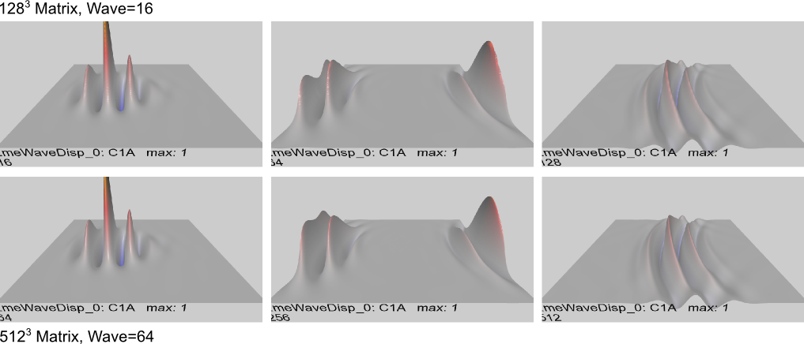

**Figure 2.1:** Terminology for wave properties: wavelength is the distance between repeating elements of the wave, amplitude is the height of the wave, and frequency (not shown) is how many oscillations of the wave take place per unit time.

Waves are the foundation of the wave electrodynamics (WELD) model, so we start here by exploring the basic properties of the simplest kind of waves, produced by a **second-order wave equation**. This is an idealization of the kinds of waves that are familiar to you in everyday life: water waves, sound waves, guitar strings and drum surfaces vibrating, etc. There are a few key physical properties of these systems that produce wave behavior:

- Stuff in one location can move in some way relative to stuff in neighboring locations, creating a **disturbance**: water molecules, guitar string, and drum skin can move up and down.
- When stuff in one location does move relative to its neighbors, it experiences a **restoring force** pulling it back in line with the neighbors: the guitar string or drum skin stretches from the disturbance, and pulls back against this stretch.
- The stuff also has **inertia** that keeps it moving *past* the point of equality with the neighbors, creating a new disturbance in the opposite direction, which is then subject to a new restoring force, causing the process to repeat again.

We can capture these properties in a simple linear equation, which constitutes the standard second-order wave equation. It is "second order" in order to capture the inertia property.

Aside from looking completely mesmerizing, these simple waves can exhibit some important properties. At the most basic level, we can measure things like **frequency**, **wavelength**, and **phase** of the wave vibrations (Figure 1). And critically for understanding quantum mechanics, waves exhibit the amazing property of **superposition** (Figure 2) -- two different waves can pass right through each other and come out the other side unscathed, due to the linearity of the wave equation. This ability to encode many different things all added up together into one complex wave disturbance is leveraged in QM to capture a combination of different uncertain possibilities all wrapped up in one inscrutable package.

# The Wave Equation: Newtonian Version


**Figure 2.2:** Key elements of the basic wave equation, in a discretized space and time system, where each discrete location (across the horizontal axis, indexed by coordinate ''x'') has a discrete state value ''y'' at a given time step ''t'', indicated as $y^t_x$.  The restoring force ''f'' pulling back on a given point is the total disturbance of that point relative to its two neighbors on either side, which is the sum of the differences between the state value at that point compared to the each of the two neighbors ($f = f_l + f_r$).  This force ''f'' creates an acceleration $a=f/m$, which in turn updates the velocity, which in turn drives a change in the state value for the next time step.  That's all there is to it.  This system has a built-in inertia (due to the basic Newtonian physics of force, acceleration and velocity), so it will end up overshooting the average of its neighbors (who meanwhile are on the move themselves) -- this all creates the fascinating wave dynamics.}}

The restoring force *f* pulling back on a given point is the total disturbance of that point relative to its two neighbors on either side, which is the sum of the differences between the state value at that point compared to the each of the two neighbors ($f = f_l + f_r$). This force *f* creates an acceleration $a=f/m$, which in turn updates the velocity, which in turn drives a change in the state value for the next time step. That's all there is to it. This system has a built-in inertia (due to the basic Newtonian physics of force, acceleration and velocity), so it will end up overshooting the average of its neighbors (who meanwhile are on the move themselves) -- this all creates the fascinating wave dynamics.}}

We start by deriving the second order wave equation from basic Newtonian physical principles, in a simple one-dimensional case with discrete uniform cells each having a "state value" that represents the "stuff" that moves around in the wave (e.g., the height of water) (). Time is also discretized, with everything computed in discrete time steps, consistent with the **cellular automaton (CA)** framework discussed in the [Introductory Chapter](ch01_intro.md). In the notation of the figure, we label the location of each cell using the index *x*, and each time step with the index *t*, and the current state value of a given cell as $y^t_x$. The restoring force is proportional to the difference in state values between a given point and its two neighbors on either side:

- **restoring force:** $f = f_l + f_r = \left( y^t\_{x-1} - y^t_x \right) + \left( y^t\_{x+1} - y^t_x \right)
  = \left( y^t\_{x-1} + y^t\_{x+1} \right) - 2 y^t_x
$

Using the standard equations of Newtonian physics, e.g., $f=ma$, this force then drives an acceleration *a*:

- **acceleration:** $a = \frac{f}{m}$

In the discrete time framework, we can simply increment a new *velocity* term *v* by this acceleration:

- **new velocity:** $v^{t+1}\_x = v^t_x + a^t_x$

where the time index for this new velocity is given by *t+1*, which is the next step in time, to distinguish it from the current velocity value, designated at time *t*. One could just as well refer to *t* as the new value and *t-1* as the previous value -- it is just a matter of taste or convention as to what is used. The notation used here emphasizes the process of computing a new value by putting it into the future relative to the present values that drive the calculation of this new value. We also provide the full time and space indices of the acceleration just for clarity.

Next, this new velocity is used to update the state value, completing a given time step of updating for a given location:

- **new state:** $y^{t+1}\_x = y^t_x + v^{t+1}\_x$

In the **synchronous update** mode used in the CA framework, each state location is updated at the same time (synchronously), and the new states then all become the current states for the next iteration, and so on. In a computer program, one typically has to actually iterate sequentially through all the states one at a time, and the "current" and "next" states must both be maintained for each location to achieve the proper synchronous computation without order of update effects.

In simplified computer programming notation, using semantically-labeled temporary variables, the wave equation is: 

```
foreach time t {

 foreach state x {  
   // first get meaningful temporary variables for key values  
   neigh_l = state(x-1,t);                // neighbor to the left, current  
   neigh_r = state(x+1,t);                // neighbor to the right, current  
   cur_state = state(x, t);               // current state  
   cur_vel = state(x, t) - state(x, t-1); // current velocity -- could store this separately

   // next compute new values from current ones: this is the key set of equations  
   neigh_sum = neigh_l + neigh_r;         // sum of neighbor values to left and right  
   force = neigh_sum - 2.0 * cur_state;   // restoring force = neighbors vs. my current state  
   acc = force / mass;                    // acceleration = force / mass  
   new_vel = cur_vel + acc;               // new velocity = current velocity + new acceleration  
   new_state = cur_state + new_vel;       // new state = current state + new velocity

   state(x,t+1) = new_state;              // store new state  
 }
}
```

It is important to be clear about the so-called **unique degrees of freedom** of this system at each point in space: what is the truly minimal number of variables one would need to maintain at each point in space? It is *two* for this system: either the current state and velocity, or the current and prior state values (from which velocity can be computed as in the above example) must be stored. A given computer implementation may store more than this minimal number to manage the synchronous updating, and for display and analysis purposes, etc. Because there are two unique degrees of freedom per point, a full specification of the initial state of the system requires specifying these two values for each state.

# Mass and Speed of Light

The mass term showing up in the basic wave equation arises because we need to translate the restoring force into an acceleration, and the basic laws of physics dictate that mass is what mediates this translation: informally, it is how much resistance or inertia the system has in the face of forces acting upon it. Intuitively, it makes sense that this mass would determine how fast waves will propagate in the system: with a higher mass, waves will move more slowly because they will resist the neighborhood forces more strongly. Indeed, it turns out that the speed of wave propagation is inversely proportional to this mass, but with a squared term:

- **speed of wave propagation, squared:** $c^2 = \frac{1}{m}$
- **mass in terms of c squared:** $m = \frac{1}{c^2}$

where we are using *c* to represent the **speed of light** in the system. Waves using this simple second-order wave equation always travel at the same speed, and this speed is effectively the speed of light if these waves are electromagnetic waves (which we'll see in the next chapter can indeed be computed using this simple wave equation).

Thus, we can re-write our basic equations using this speed-of-light factor, and while we're at it, we'll also introduce the "dot" and "double-dot" notation for the velocity and acceleration terms, reflecting the fact that the velocity is the first temporal derivative (one dot), and acceleration is the second temporal derivative (two dots). As we discuss in greater detail in the next section, the velocity is the slope or rate of change in the state value, while acceleration is the slope or rate of change of the velocity -- a double-slope or double-rate-of-change of the state value.

- **acceleration:** $a^t_x = \ddot y^t_x = c^2 \left( y^t\_{x-1} + y^t\_{x+1} - 2 y^t_x \right)$
- **velocity:** $v^{t+1}\_x = \dot y^{t+1}\_x = \dot y^t_x + \ddot y^t_x$
- **state:** $y^{t+1}\_x = y^t_x + \dot y^{t+1}\_x$

# Energy


**Figure 2.3:** Two forms of energy in a simple harmonic oscillator such as a pendulum: kinetic energy from the speed (velocity) of motion, and potential energy from the displacement relative to the resting position (in the pendulum case, this is gravitational energy that is then transformed into kinetic energy as the ball drops).  Each cell in our discrete wave system is a simple harmonic oscillator with both of these forms of energy -- potential energy is a function of the difference between the neighbor state values -- the same thing that drives the restoring force.


As we progress to more complex wave equations, the concept of the energy associated with the wave will become critical. Energy must be strictly conserved over time, or otherwise the universe quickly gets out of balance -- exploding with too much energy or fading away into nothingness. Much of physics involves accounting for where all the energy is and how it gets transformed into different forms over time. Einstein's famous equation $E=mc^2$, which we saw some hint of above, is so important because it shows that there is energy trapped inside of matter, which can be liberated in various ways (e.g., nuclear bombs, or solar fusion reactions), which release great quantities of energy. This very fact of the ability to convert energy into different forms like this is suggestive of some kind of underlying common currency where matter and energy are fundamentally the same thing -- this is what the wave framework provides. Indeed, we will derive our matter wave equation by using Einstein's equation, showing exactly how matter and other forms of energy are all bound up together in single wave equation, whose undulations over time result in the constant conversion of energy into different forms.

To ground our understanding of energy right at the start, we derive the energy equation for the simplest form of wave equation, given above. To figure out the correct equation, we start with an analogy to the **simple harmonic oscillator** exemplified by a swinging **pendulum** . As a pendulum swings, there is a continuous transformation between **kinetic energy**, which is a function of the speed of the swinging bob, and **potential energy**, which is a function of the height of the bob above its minimal height, which has potential energy because gravitational forces will push it down to its minimal height, producing kinetic energy in the process. Each cell in our discrete wave equation acts just like this simple harmonic oscillator. For example as a sine wave passes through a given point, the state at that point experiences a trajectory that is identical to the simple harmonic oscillator: it moves at different velocities going from 0 at the extreme top or bottom of the wave, to the fastest right in the middle of the wave disturbance. Thus, we can compute the kinetic and potential energy for a given point along the wave as simply the sum of these two energy components. Instead of the gravitational force, the potential energy arises from the restoring force, which depends on the local curvature of the wave.

We can start with the kinetic energy, as it is the most straightforward, having a standard equation in Newtonian physics:

- **kinetic energy:** $E_k = \frac{1}{2} m v^2 = \frac{1}{2 c^2} v^2 $

in the second version we replace the mass with the speed of light squared per the above conversion equation.

The potential energy turns out to be a function of the squared differences between neighboring state values:

- **potential energy:** $E_p = \frac{1}{2} \left( \left( y^t\_{x-1} - y^t_x \right)^2 + \left( y^t\_{x+1} - y^t_x \right)^2 \right) $

In general, energy values are squared, because they tend to be positive numbers, and they almost always have this 1/2 multiplier. It is interesting that each neighborhood difference (to the left and right) is squared separately and then added together, instead of squaring the sum of these differences -- this makes sense because the energy is really in each of these differences, and even if they happened to cancel out across the left and right sides (e.g., the left neighbor was as low as the right neighbor is high relative to the cell's state value), there is a lot of energy latent in those two differences, compared to a case where left and right were actually each the same value as the cell's current state.

The total energy, which should be a constant over time, is then just the sum of these two forms of energy:

- **total energy:** $E_t = E_k + E_p $

## Discrete Time Adjustment

There is a further wrinkle to the energy calculation in the discrete space and time framework, having to do with the exact point at which a given velocity and state values are both valid for capturing the total energy of the system. It turns out that you have to interpolate the velocity value half-way between its current and new values to get a more accurate energy measure:

- **midpoint velocity:** $v\_{mid} = \frac{1}{2} \left( v^t + v^{t+1} \right) $
- **kinetic energy:** $E_k = \frac{1}{2 c^2} v\_{mid}^2 $

Intuitively, the current velocity by itself doesn't coincide with the current state values, because it was really driven by the prior state values, so it needs to be updated with some influence of the velocity that was driven by the current state values (i.e., the new velocity) -- but this new velocity by itself goes too far, and thus the half-way point works out best.

## Lack of Strict Conservation

When total energy is computed in the above way across all cells, it often does *not* remain strictly constant over time, and instead varies in ways that reflect the wave dynamics operating within the system. Over time, the *average* value converges on a constant value, and it is clear that there is no risk of the system exploding or dying out, but from one time step to the next, there can actually be a fairly substantial variability in the total energy computed. You will observe this first-hand in the following exploration.

todo: potential implications for gravitation, etc?

# Exploration of 1D Waves


**Figure 2.4:** Superposition of two wave packets, shown initially separate moving toward each other in the first (left) panel, then in a state of superposition where it is hard to imagine that two complete and separate wave packets could be latent within such a wave pattern (middle panel), and finally the two waves re-emerge fully intact after passing right through each other.  This mind-boggling property of linear wave equations plays a crucial role in standard quantum mechanics (QM), and also represents a major limitation of QM, in that it eliminates any way for such wave packets to interact with each other.


**Figure 2.5:** A wave within fixed bounds, having an integer number of wavelengths within the fixed width.  This ''bound state'' wave provides a basic model of the quantized atomic system -- the quantization comes entirely from the fact that the only stable wave configuration within such boundaries must have an integral number of wavelengths.  This is the quantum in quantum mechanics.


At this point, it is useful to use the [EmeWave](EmeWave "wikilink") simulator to see how the above equations give rise to wave behavior, so you have a solid understanding of that, along with some basic wave behavior, before continuing. Follow the directions given in the [Waves](waves_sim.md) exploration -- stick to the one dimensional wave equation for the time being -- we'll pick up the 3D one later.

One of the most fascinating and amazing properties that you'll explore in this simulation is **superposition**, as shown in -- it is even more compelling seeing it happen in full motion in the simulation.

The absolutely critical point about superposition is this: **linear superposition means that the wave packets have no possible way of interacting with each other -- they just pass right through each other like ghosts** -- the entire edifice of standard quantum mechanics, being based on the linear Schrodinger wave equation, is thus fundamentally incapable of capturing any form of possible interaction among wave packets -- all interaction must be mediated either through an external potential, or more typically, by putting the waves into high-dimensional spaces where the interaction becomes an unfolding dynamic of wave propagation across these different dimensions.

Another critical property of waves is that there must be an integer (discrete, quantized) number of wavelengths within a fixed-width boundary for the system to be stable (Figure 5). You'll see this in the exploration by comparing the behavior of the system when this condition is true and when it is not true. This constraint is the *only* source of quantization in quantum mechanics, according to the WELD framework. Everything is actually fully continuous waves, but the atomic nucleus creates a potential well that traps electron waves, and these trapped electron waves thus must have only integer (quantized) wavelengths. This quantization of wavelength creates a corresponding quantization of the energy of the electron, giving rise to the discrete spectrum that Planck initially conceived of in his 1901 paper that started quantum mechanics. Critically, this discretization of wavelength makes the atomic system stable: it will radiate away energy until the electron wavelength achieves a stable quantized fit within the atomic system, and at this point, it will go no further because any perturbation away from this perfect quantized wavelength will be unstable, and push it back toward the stable quantized state.

# Second-order Derivative Formulation and the Laplacian


**Figure 2.6:** A derivative is just the slope of a function at a given point -- figure shows the slopes at three different points on the function.  It is computed in discrete space and time in terms of the change in y divided by the change in x.


**Figure 2.7:** Discrete space derivatives for our wave equation, computed as difference in y values divided by space between "cells".


**Figure 2.8:** The second-order spatial derivative, which is the difference of the first-order derivatives around the central point, divided as we must do in a derivative by the distance between points.  This is the source of the restoring force in the wave equation, which should be familiar from the Newtonian version of the wave equation as shown in Figure 2.  When this equation is properly generalized to multiple spatial dimensions, it is called the *Laplacian*.

Now that you understand how waves emerge from the simple wave equation, we can work in a bit more mathematical notation based on **derivatives**, moving beyond the dot and double-dot introduced above (). This will help in obtaining a more complete understanding of the wave equation, and provides a simpler, more compact notation that will be used in developing more complex wave equations later.

A derivative is just the slope of the function at a given point. In our discrete space and time CA framework, this is easily computed as the difference in state values *y* divided by the spacing between cells, which we label by convention with the greek character "epsilon" $\epsilon$ ():

- **spatial derivative (slope):** $\frac{dy}{dx} = \frac{\mbox{change in y values}}{\mbox{change in x values}} $

Technically speaking, the true derivative involves shrinking the epsilon infinitely small, and thus achieving a truly continuous derivative value. This is the mind boggling aspect of calculus, which gives people so much trouble, and we can avoid all that by sticking with discrete space and time, in which case our simple **difference equations** can be used as discrete approximations to the true derivatives. Where necessary, we can leverage the analytical power of the true continuum, but any actual computational solution to differential equations always uses a discretization: the continuum is an idealization that cannot be realized in practice.

In addition to the spatial derivative (slope) shown in , there is also a **temporal derivative** that involves computing the change in the state values over a discrete increment in *time*, instead of over a discrete distance in *space*. These temporal derivatives have the special dot notation that we introduced earlier:

- **temporal derivative (rate of change):** $\dot y = \frac{dy}{dt} = \frac{\mbox{change in y values}}{\mbox{change in time}}$.

To be fully mathematically correct, whenever you have multiple different variables at work (such as space and time), you should use a **partial derivative** notation $\partial$ instead of just the regular letter "d":

- **spatial partial derivative:** $\frac{\partial y}{\partial x}$ = change in y over change in x.
- **temporal partial derivative:** $\frac{\partial y}{\partial t}$ = change in y over change in t.

This partial letter is more difficult to draw in the figures, so we often just use d in the figures, but it means essentially the same thing, and the difference is really just for sticklers.

Because the wave equation deals with *acceleration*, it is *second order* and this means that we need to deal with **second order derivatives**, which just mean doing the derivative of the derivative -- just do it twice! This means computing the slope of the slope, or the rate of change of the rate of change:

- **second order spatial derivative:** $\frac{\partial^2y}{\partial x^2} = \frac{\partial}{\partial x} \frac{\partial y}{\partial x}$ = change in change in y over change in $x^2$.

shows how this second order spatial derivative is computed in the discrete space and time CA framework -- you literally just take the difference between the two derivatives on either side of the central point. You have to keep dividing by the distance between cells $\epsilon$ every time you do a derivative, so that ends up being squared in the denominator:

- **second order spatial derivative:** $\frac{\partial^2y}{\partial x^2} = \frac{\left( \frac{y^t\_{x+1} - y^t_x}{\epsilon} \right) - \left( \frac{y^t_x - y^t\_{x-1}}{\epsilon} \right)}{\epsilon} = \frac{1}{\epsilon^2} (y^t\_{x+1} + y^t\_{x-1}) - 2 y^t_x$

Interestingly, this second order spatial derivative is effectively the same as the restoring force in the wave equation -- there is just a factor of the epsilon squared difference between them:

- **restoring force:** $f = \left( \frac{y^t\_{x-1} + y^t\_{x+1}}{2} \right) - 2 y^t_x = \epsilon^2 \frac{\partial^2y}{\partial x^2} = \left( y^t\_{x+1} + y^t\_{x-1} \right) - 2 y^t_x$

We normally set this epsilon constant to be 1 in the native units of the simulation, so that it effectively disappears from the computation. Nevertheless, understanding these constants is important when trying to get all the units right, but they don't affect the core conceptual basis of what is going on, which is that the restoring force is driven by the curvature of the curvature (slope of the slope) of the wave medium.

To complete our new second-order derivative based wave equation, we can write the acceleration as a second-order temporal derivative:

- **acceleration:** $a = \ddot y^t_x = \frac{\partial^2 y}{\partial t^2}$ = rate of change of rate of change.

Putting this all together, we can now transform our previous equation for the wave acceleration:

- **acceleration:** $\ddot y^t_x = c^2 \left( y^t\_{x-1} + y^t\_{x+1} - 2 y^t_x \right)$

into the following elegant expression based on second-order derivatives: 

- $\frac{\partial^2 y}{\partial t^2} {{=}} c^2 \frac{\partial^2y}{\partial x^2}$

Note that this equation directly implies the velocity and state update equations given above, which are really definitional in terms of what a velocity is: a velocity is updated by an acceleration, and it updates the state value. Thus, this one equation captures everything needed to produce wave dynamics.

The wave equation has a very nice symmetry, where the second-order temporal derivative is equal to the second-order spatial derivative. In other words, the rate of change of the rate of change over time is driven by the rate of change of the rate of change over space.

Complementing this abstract mathematical elegance is the extreme simplicity of the discrete version of the equation, where each point in space is just trying to keep up with its neighbors. From the CA perspective, we want an update rule that involves only the immediate neighbors, and produces interesting overall behavior. Just about the simplest thing you can compute on the neighbors is the average of their state values, and the wave equation is pretty much the simplest way of using this neighbor average that produces interesting behavior -- lots of other possible permutations end up just causing the system to settle very quickly into a uniform overall state. For example, if you just directly update the new state value of a given cell by how different the average of its neighbors is from your current state value, then nothing interesting happens: all disturbances are very quickly eliminated, and the system assumes a completely uniform state across space and time. This is known as the *diffusion equation*.

Thus, this wave equation seems like a highly auspicious starting point, if we want to come up with the simplest possible physical mechanisms for fundamental physics. It is nothing short of mind blowing that this very simplest of wave equations can drive the updating of the electromagnetic field: a few other equations are also required to compute the effects of the EM field on electric charges, but the EM field by itself can be fully realized with only this simple wave equation.

Next, we extend this wave equation to the full three-dimensional case, which just requires a little bit more mathematical notation, and some interesting ways of integrating across the 26 neighbors in 3D space.

# Waves in Three Dimensions

 

**Figure 2.9:** The 26 neighbors of a given cell in 3D space, each of which is weighted differently according to its distance -- faces are 1 unit away, edges are $\sqrt{2}$ away, and corners are $\sqrt{3}$ away.


**Figure 2.10:** The gradient, which is a vector consisting of the local slope along each of the different dimensions (two-dimensional case shown here).


The second-order wave equation in three-dimensional space is not too different at an abstract mathematical level from the one dimension case -- you basically just have to add extra terms for each of the additional dimensions. One minor complication is that we conventionally use *x,y,z* for the spatial dimensions, and we've been previously using *y* to represent the state value, so now we'll switch over to the notation that is typically used in quantum physics, based on the Greek symbols "psi" $\psi$, "phi" $\phi$, and a variant of phi: $\varphi$. To keep things consistent and clear over the course of the book, we establish the following convention for these state variables:

- $\varphi$ = varphi = simple scalar state value -- one single real-valued number, like we've been considering already.
- $\phi$ = phi = complex-number state value -- two independent real-valued numbers per state.
- $\psi$ = psi = full Dirac state value, which has two separate complex numbers, and captures the property of *spin*.

Thus, for now, we'll be using the "varphi" value to represent our wave states. The wave equation in abstract differential form is:

- **wave equation in 3D:** $\frac{\partial^2 \varphi}{\partial t^2} = c^2 \left( \frac{\partial^2 \varphi}{\partial x^2} + \frac{\partial^2 \varphi}{\partial y^2} + \frac{\partial^2 \varphi}{\partial z^2} \right) $

The second-order spatial derivatives on the right-hand side of this equation might look like a straightforward 3D generalization of the second-order spatial derivative from our 1D equation, but actually a true second-order spatial derivative in 3D has a bunch of cross-terms involving the slope in one dimension relative to the slope in another dimension -- it is a much more complicated beast. The proper name for the right-hand side of the 3D wave equation is the **Laplacian**, which can be written in various ways:

- **Laplacian:** $\Delta \varphi = \nabla^2 \varphi = \nabla \cdot \nabla \varphi = \frac{\partial^2 \varphi}{\partial x^2} + \frac{\partial^2 \varphi}{\partial y^2} + \frac{\partial^2 \varphi}{\partial z^2}$

The symbol $\nabla$ (called a "nabla" -- [wikipedia link](http://http://en.wikipedia.org/wiki/Nabla_symbol)) indicates the **gradient**, which just takes the first-order spatial derivatives along each dimension ():

- **gradient:** $\nabla \varphi = \left( \frac{\partial \varphi}{\partial x}, \frac{\partial \varphi}{\partial y}, \frac{\partial \varphi}{\partial z} \right) $

note that the result of the gradient is a *vector* with 3 values in it (a *three vector*), one for each dimension, with each value giving the local slope along each of the dimensions.

The idea that the Laplacian is the gradient squared ($\nabla^2$) must be taken as a short-hand for the third expression of the four shown for the Laplacian above, where $\nabla \cdot$ is another thing entirely, called the **divergence**, which operates on fields of vectors and turns them back into a single scalar value:

- **divergence:** $\nabla \cdot F = \frac{\partial F}{\partial x} + \frac{\partial F}{\partial y} + \frac{\partial F}{\partial z} $

where **F** is a vector field, e.g., of the sort that would be generated by taking the gradient of a 3D scalar field. It is hopefully at least somewhat clear how taking the divergence of the gradient of our scalar field results in the expression for the Laplacian: each of the 3 separate derivatives in the gradient gets the second-order treatment by virtue of the derivatives in the divergence, and the result gets added up into a single overall number as shown in the divergence equation.

The conceptual bottom line for the Laplacian is the same as before: it measures the overall curvature of the curvature (slope of the slope) of the local neighborhood around the central point, and this is the total restoring force that drives acceleration. The Laplacian symbol just allows us to write the overall equation in an even simpler form:

- $\frac{\partial^2 \varphi}{\partial t^2} {{=}} c^2 \nabla^2 \varphi$

We prefer the $\nabla^2$ version of the Laplacian because it conveys its essential second-order nature.

Embedded in all this math is an absolutely critical point that emerges only in this 3D version of the wave equation, compared to the 1D version: **the Laplacian adds up all the curvature around it into one single number, causing an inevitable blending of signals coming from different directions.** The net result of this is that *a wave packet that is initially localized will inevitably end up spreading out over space,* due to this mixing of curvature across different directions. As we discussed in the [Introduction](ch01_intro.md), this spreading of the wave packet represents a critical problem for the pure wave model, and we can see that it enters very directly and inexorably into even the most basic wave equation. All the subsequent wave equations we will develop share this core Laplacian spreading behavior, and thus inherit this important problem.

## The Discrete 3D Laplacian

Now we consider how to compute the 3D Laplacian in the discrete space and time CA framework. To start, we only consider the 6 faces adjacent to the central point (), which are relatively easy because each pair of opposing faces can be treated just like a separate one-dimensional second-order derivative like we computed before, so we just have three times the number of terms as before:

- **discrete 3D Laplacian, faces only:** $\nabla^2 \varphi = \frac{1}{\epsilon^2} \left( \varphi\_{(1,0,0)} + \varphi\_{(-1,0,0)} + \varphi\_{(0,1,0)} + \varphi\_{(0,-1,0)} + \varphi\_{(0,0,1)} + \varphi\_{(0,0,-1)} - 6 \varphi\_{(0,0,0)} \right)$

where the subscript indicates the relative offset along the *(x,y,z)* dimensions from the central point, which is then at *(0,0,0)*. We can simplify this expression by just computing a sum of pairwise differences for each face element:

- **discrete 3D Laplacian, faces only:** $\nabla^2 \varphi = \frac{1}{\epsilon^2} \sum\_{j \in N\_{faces}} (\varphi_j - \varphi_0)$

where *j* is just an index into the set of 6 different faces and $\varphi_0$ is the central point.

The problem with only using the 6 face neighbors is that it misses all the curvature present in the other neighboring points (edges and corners; ) and as a result, the wave propagation is very **anisotropic** -- it is not the same in every possible direction. Waves flowing along one of the 3 primary dimensions work great, wave disturbances in other directions propagate very differently. If this was how nature worked, then we would easily be able to tell that the rules of physics are different in different directions, which is definitely not the case.

The anisotropy problem can be fixed by including all 26 neighbors, in a relatively simple generalization of the last sum-based expression: \nabla^2 \varphi {{=}} \frac{3}{13 \epsilon^2} \sum\_{j \in N\_{26}} k_j (\varphi_j - \varphi_0) $}} The key to making this work is to have different weighting factors $k_j$ for the different neighbors, depending on their Euclidian distance *d* from the central point:

- **neighbor weight:** $k_j = \frac{1}{d^2} $
- **faces:** $k_j = 1 $
- **edges:** $k_j = \frac{1}{2} $
- **corners:** $k_j = \frac{1}{3} $

The full mathematical justification for this equation, and the demonstration of its isotropic behavior relative to the standard 6-face version, is given in the following unpublished manuscript:

- O'Reilly, R. C. & Beck, J. M. (2006/unpublished). A Family of Large-Stencil Discrete Laplacian Approximations in Three Dimensions.

This is the equation we use in the remainder of the simulations in this book. As we emphasized for the 1D equation before, this 3D equation also provides an appealingly simple mechanism for nature to compute: it is just an average over all the neighbors of a given point, weighted by the relative distance. It is difficult to imagine a simpler kind of neighborhood interaction.

## Wave Energy in 3D

The equation for the wave energy for the 3D version just requires an update to the potential energy component -- the kinetic energy component is identical, as it only involves the temporal derivative which remains the same regardless of the dimensionality. The one-dimensional equation generalizes in a straightforward manner to 3D, where we just add up the squared neighborhood differences, using the same weighting factors as in computing the Laplacian:

- **potential energy in 3D, all 26 neighbors:** $E_p = \frac{3}{13 \epsilon^2} \sum\_{j \in N\_{26}} k_j (\varphi_j - \varphi_0)^2 $

# Dealing with Edges

One of the trickiest problems in making numerical simulations of wave phenomena is how to manage behavior at the edge of your simulation. This is perhaps one indication that nature has no edges -- great way to avoid this problem. However, we have no such luxury with finite computational resources, and have to wrestle with this problem. There are basically three solutions:

- **Fixed edges:** the edge values are permanently fixed to specific values -- this causes waves to bounce off of them and reflect back into the middle. It is not a good solution for any kind of force field (e.g., EM waves) because these require energy to dissipate over space.
- **Dissipative edges:** the edges essentially absorb the wave energy, producing the effect of the waves just continuing to propagate outward, without reflecting back etc. This is the best solution for EM waves. It is achieved by just getting rid of the acceleration term in the wave equation, so that the force directly drives the current velocity, without incrementing a prior velocity -- this is also equivalent to the diffusion equation. It is also known as a Sommerfield boundary condition.
- **Wrap-around edges:** you just connect the two ends of your space back upon each other, creating a weird doughnut-like topology -- this is good for exploring the motion of free wave packets, working somewhat like a treadmill where the wave keeps looping around through the same simulation space, without ever apparently hitting any edges. It is particularly useful for examining the spreading of wave packets over time. Computationally it can be a bit more challenging to implement the wrap-around, but that is just a coding problem.

There is a further question as to what overall shape the simulated universe is -- the two basic options are a cube and a sphere -- we typically use spheres for things like atomic systems, which are naturally spherical, so that preserves the radial symmetry of the system, whereas a cube is much better for the wrap-around case (doing wrap-around in a sphere is more difficult and not supported in [EmeWave](EmeWave "wikilink")).

# Exploration of 3D Waves




**Figure 2.11:** Scaling behavior of the discrete Laplacian wave equation -- the bottom row of images are from a simulation that is 4 times larger than the one on the top row, and the snapshots are spaced 4 times further apart -- it is difficult to tell the difference visually, although there is some roughness on the high-curvature edges of the lower resolution simulation compared to the milky smoothness of the higher-resolution one, the overall wave propagation is identical.  This also shows the inevitable spread of the wave packet, which quickly becomes distributed widely over space.  Due to the use of wrap-around edges, the wave ends up superposing upon itself many times over, producing what looks like interference patterns.


Now we return to the [EmeWave](EmeWave "wikilink") simulator to see how the 3D waves behave, including the spreading behavior resulting from the Laplacian as described above. Follow the directions given in the [Waves](waves_sim.md) exploration, picking up where you left off, at the 3D Waves section. Running these simulations yourself is very strongly recommended -- you really get to see the dynamics unfolding over time, and gain considerable insight into the overall behavior of the waves. You can also see how incredibly smooth and symmetric (isomorphic in all directions) the 3D Laplacian approximation is -- there is no hint of any preferred directions or other kinds of numerical artifacts.

One question you might have is how the discrete laplacian scales, and whether what we observe in a small-scale 3D simulation that fits on our laptop will generalize to a higher-resolution case, ultimately to whatever resolution that nature actually operates at (which could be extremely high resolution indeed, as we discuss later). shows that the scaling behavior is extremely good, in the sense that two simulations differing in resolution by a factor of 4 (along each dimension -- the larger one requires 64 times more total cells) behave essentially identically. Thus, we can generally be reasonably confident that our results will generalize at least qualitatively to higher resolution systems.

On a technical note about actually running these larger simulations: you need to use a computing cluster where different chunks of the model are distributed across different processors -- [EmeWave](EmeWave "wikilink") supports this through the standard MPI protocol. To run a simulation of size 512 on each dimension requires a total of 30Gb of main state memory -- we break this up into 8 chunks of just under 4Gb each, which then run much faster when distributed across 8 nodes, using 6 processors per node to divide the load using threads.

Here are some movies of the larger simulations in action:

- The smaller model from : [Movie: Matrix=128, initial wavelength=16](Media:wavebg_u128_wv16_movie.mp4 "wikilink")
- This same sized initial wave, in a matrix of size 512 [Movie: Matrix=512, initial wavelength=16](Media:wavebg_u512_wv16_movie.mp4 "wikilink") -- this should help you see better how the wave front becomes curved and stretched out, and it is more obvious how the wrap-around edges enable a limited sized simulation to capture a much larger effective size, due to the linear superposition property.

## Initial Conditions

One quick technical note regarding how the **initial conditions** of our simulations are constructed. To construct a moving wave, you just set the current state to be the desired wave shape (e.g., a wave packet), and set the prior state to be that same shape offset by the distance that the wave should travel in one time step (i.e., c). Then, you initialize the velocity to be the difference between these states (current - prior) -- this ensures that the velocity is exactly as needed to keep the same wave shape moving along. It turns out that this velocity is *not* mathematically identical to a wave packet when the states are wave packets -- it is very close to being so, but not exactly.

Now that you have a solid understanding of basic wave behavior in their full three-dimensional glory, we are ready to explore a wide range of electromagnetic phenomena in the next chapter.

