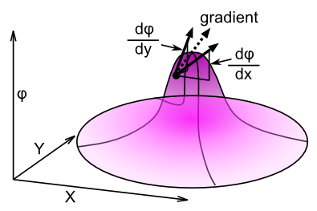

The basic equations of electromagnetism were developed in the 1800's, through the work of many people. James Clerk Maxwell put all this work together, with several important insights of his own, in a series of papers in 1861-2 that describe what are now known as Maxwell's equations, which fully characterize the behavior of the electromagnetic fields, in relation to electric charges. Maxwell conceived of these as propagating through the **luminiferous aether**, as we discussed in the [Introductory Chapter](ch01_intro.md). Although Maxwell's equations describe the same kind of wave propagation we explored in the previous [Waves Chapter](ch02_waves.md), they do so in a somewhat complex way, involving vector fields and various vector operators that can be difficult to understand. Therefore, we start with a formulation of the EM equations that will be immediately familiar from the previous chapter, using second-order wave equations. These second-order wave equations operate on the **electromagnetic potentials**, instead of the electric and magnetic vector fields, which are described by the standard Maxwell's equations. Although many people regard the vector fields as the primary physical reality underlying EM, there is solid physical evidence showing that the electromagnetic potentials are physically real, and exert measurable physical effects, for example the **Aharonov-Bohm** effect (described later). Thus, in addition to being mathematically simpler, the potential-based formulation seems to be physically necessary. It is the formulation that we use in the remainder of the book. Nevertheless, there remain several important sources of controversy and confusion over this choice, which will be introduced as we go through.

There are two electromagnetic potentials, the **electrical scalar potential**, which is variously written as $\Phi$ (capital Greek "Phi") or $V$ or $A_0$, and the **magnetic vector potential**, typically written as: $\vec{A} = (A_x, A_y, A_z)$. Most readers should be familiar with the notion of the electrical potential $V$, in terms of the voltage of a battery or an electrical outlet -- therefore, we'll focus on it first. Then we'll cover the more difficult vector potential, which underlies the magnetic field. After exploring each of these and obtaining a solid understanding of their behavior, we relate these potential wave equations back to the original Maxwell equations, and cover various important issues with our potential-based formulation of EM. We then introduce the powerful **four-vector space-time notation**, which will be used in the remainder of the book.

What should not get lost in all this discussion is the bare amazing fact that all of EM can be captured in the simple second-order wave equation (with appropriate source terms from electrical charge and current) -- this is the only equation we need to simulate the propagation of the EM fields over space and time. This wave equation naturally produces the **inverse square law** of the electrical force, and it does so through strictly local wave propagation mechanisms, avoiding the apparent action-at-a-distance that the calculational tool of the usual Coulomb version of this force law, where you literally compute the force as a function of the distance between two charges. Furthermore, the wave equation provides the framework for many aspects of special relativity, such as the constant speed of light in a vacuum, and the four-vector notation enables us to know immediately whether something is **manifestly covariant** -- which means, obviously compatible with the principles of special relativity (i.e., invariant with respect to the Lorentz transformation). Thus, we see that a huge swath of fundamental physics falls right out of the basic wave equation, which in turn reflects the simplest form of cellular-automaton neighborhood interaction that does anything interesting.

# The Electrical Scalar Potential

**Figure 3.1:** The gradient, which is a vector consisting of the local slope along each of the different dimensions (two-dimensional case shown here).  The electric field $\vec{E}$ is the gradient of the electrical scalar potential field $A_0$.

An important issue with the electrical scalar potential is that it is always just a relative quantity -- the potential is a measure of the voltage difference between two locations, and it varies depending on which two locations you happen to choose. Thus, people feel uncomfortable thinking of it as a physically real entity, because that would seem to imply that there is some kind of objective physical value for the potential at all locations in space, transforming it from a purely relative thing into something that must live in an absolute scale. But there doesn't seem to be any objective way to fix this scale, because all that we can measure are these relative values, and the corresponding electric field, neither of which determine what the absolute potential values should be. This situation is known as **gauge freedom**, and we'll see that it becomes an increasingly important concept as we proceed further. We'll see that it is actually not a problem in our simulation models, because the electric charges directly determine the resulting potential values. This is another example of an important discrepancy between a mathematical problem that really doesn't seem to correspond to an actual physical problem. The gauge freedom is more apparent than real in this case, all things considered.

In the absence of any charges (i.e., in empty space), the electrical scalar potential (we use the $A_0$ symbol, to be consistent with the $\vec{A}$ vector potential) obeys the standard second-order wave equation:

- **electrical scalar potential, no charges:** $\frac{\partial^2 {A_0}}{\partial t^2} = c^2 \nabla^2 A_0 $

This means that you already understand exactly how this potential will behave, based on the explorations in the [Waves Chapter](ch02_waves.md). It will propagate at the speed of light (*c*), exhibit spreading over time due to the nature of the 3D Laplacian, etc.

To include the effects of **electrical charge**, we can extend the equation to include a simple additive factor that is proportional to the local charge density, written by convention as the Greek letter "rho" $\rho$:

- $\frac{\partial^2 {A_0}}{\partial t^2} {{=}} c^2 \nabla^2 A_0 + \frac{1}{\epsilon_0} \rho $

we'll explain the $\epsilon_0$ (Greek epsilon) constant, known as the **permittivity of free space**, in more detail later. For now, it is just a constant that determines the impact of charge on the electric field. Remembering that the left-hand-side of this wave equation represents the acceleration of the electrical potential, this equation just says that in addition to the local curvature of the field driving acceleration as in the standard wave equation, electrical charge will impart an additional acceleration. It should be clear how our discrete cellular-automaton based wave equation can be augmented to include this extra charge force -- you literally just add this term into the acceleration, which then increments the velocity, which then increments the electrical potential state value.

In the discrete space-time analog cellular automaton framework, the equations for the scalar potential are:

- $\ddot A_0^{t+1} = \frac{3}{13}\sum\_{j \in N\_{26}} k_j ({A_0}\_j - {A_0}\_i) + \frac{1}{\epsilon_0} \rho $

which is then integrated into a first-order term (velocity):

- $\dot A_0^{t+1} = \dot A_0^t + \ddot A_0^{t+1} $

and finally the state variable is updated:

- $A_0^{t+1} = A_0^t + \dot A_0^{t+1} $

This wave equation fully characterizes the behavior of the electrical field -- *we don't need anything else to numerically simulate it, and account for all known behavior of the field itself.* Thus, from a physical perspective, we can imagine that only this electrical potential field exists, and things like light waves are just wave propagation over this field. However, to understand how this electrical field influences charged "particles" such as the electron, we do need to extract the electric field vector, which represents the force exerted by the electric field. We can think of this physically as reflecting the force impact of the electrical potential field, derived entirely from the potential, and not as a separate physical entity. Electrical forces ensue from the slope of change (i.e., the **gradient**, as introduced in the waves chapter and pictured in ) of the electrical scalar potential across space, plus the rate of change of the magnetic vector field, which we'll discuss later.

Loosely speaking, if you have more potential in one place than another, there is a pressure to flow "downhill" along this gradient to equalize the potential. Mathematically speaking, this can be expressed as:

- $\vec{E} {{=}} - \vec{\nabla} A_0 - \frac{\partial \vec{A}}{\partial t}$

In words, the electrical field is the spatial gradient of the scalar potential (plus the temporal derivative of the magnetic vector potential $\vec{A}$). Recall the definition of the gradient operator $\vec{\nabla}$ from before: it computes the slope or amount of change in a scalar field along each of the three axes, yielding a vector of three values ().

To actually compute this vector quantity in our discrete 3D framework, we need a discrete gradient operator that is basically just the first-order version of the discrete Laplacian operator that we introduced in the [Waves Chapter](ch02_waves.md). It is described in detail in this subsection: [Discrete Gradient](#discrete_gradient).

## 1/r Potential Dropoff = 1/r^2 Force Field

One of the first things people learn about the electric field is the **Coulomb force law**, which states that the electrical force between two charged entities is an **inverse square law** as a function of the distance between the two:

- **Coulomb force law:** $F = \frac{q_1 q_2}{r^2} $

How does this derive from the second order wave equation and the charge acceleration? It turns out that the wave equation naturally produces a 1/r dropoff in the electrical potential, only in the 3D form of the wave equation (Whittaker, 1903). We can see this in the simulation exploration in the next section. This 1/r dropoff in the potential is then translated into an inverse square function $\frac{1}{r^2}$ in the process of computing the gradient force field from the scalar potential field.

The fact that this critical inverse-square behavior emerges naturally from the wave equation is just another in a long series of amazing features of this equation.

## Exploration of the Electrical Potential

You can now explore how charge drives the electrical potential, the 1/r falloff of the scalar potential, and how the electrical force field is computed from the gradient of the scalar potential field. Open the [EM](WELDBook/Sims/EM/EM "wikilink") simulation and follow the directions under the scalar electrical field section.

# The Magnetic Vector Potential

Magnetism is a bit more complex than the electrical field. Instead of a single scalar potential field, it requires a vector potential field, and each of the three components of this vector potential field propagates according to the basic second-order wave equation, with the driving source being the **current** vector $\vec{J}$:

- $\frac{\partial^2 \vec{A}}{\partial t^2} {{=}} c^2 \nabla^2 \vec{A} + \mu_0 \vec{J} $

Interestingly, the wave equation operates separately on each term. Therefore, the wave equation operating on the vector $\vec{A}$ is the same thing as having three separate wave equations operating in parallel on each of the components of the vector:

- $\frac{\partial^2 A_x}{\partial t^2} = c^2 \nabla^2 A_x + \mu_0 J_x $
- $\frac{\partial^2 A_y}{\partial t^2} = c^2 \nabla^2 A_y + \mu_0 J_y $
- $\frac{\partial^2 A_z}{\partial t^2} = c^2 \nabla^2 A_z + \mu_0 J_z $

The computation of the vector potential terms $\vec{A}$ similarly just follow the standard wave equations with an additional source term from the current vector $\vec{J}$. For the $x$ component of $\vec{A}$, the acceleration term is:

- $\ddot A_x^{t+1} = \frac{3}{13} \sum\_{j \in N\_{26}} k_j ({A_x}\_j - {A_x}\_i) + \mu_0 J_x $

and similar equations hold for the $y$ and $z$ components.

As with the electric potential field, we can capture all of the known physics of the magnetic field propagation and how it is driven from the motion of charge (i.e., current) over time, using the above wave equation. Thus, we imagine that this vector potential is all that exists physically. In addition, as with the electric field, the force exerted by the magnetic field must be computed from this potential. This is where things get a little bit more complicated, because this relationship is not a simple gradient, but rather the **curl** ($\vec{\nabla} \times$) of the magnetic vector potential: $\vec{B} {{=}} \vec{\nabla} \times \vec{A} $

Intuitively, curl indicates the extent to which the arrows in a local region are spinning around. Formally, curl is defined as:

- **curl:** $\vec{\nabla} \times \vec{B} \equiv \left( \left\[\frac{\partial {B_z}}{\partial {y}} - \frac{\partial {B_y}}{\partial {z}} \right], \left[\frac{\partial {B_x}}{\partial {z}} - \frac{\partial {B_z}}{\partial {x}} \right], \left[\frac{\partial {B_y}}{\partial {x}} - \frac{\partial {B_x}}{\partial {y}} \right] \right)$

So, the $x$ (first) component of the curl is the crossed spatial gradient of the other two dimensions ($z$ by $y$ and $y$ by $z$), and likewise for the remaining factors. Intuitively, each component measures how much the field is spinning around that dimension.

Here is how to compute the curl in the discrete space-time cellular-automaton framework: [Discrete Curl](#discrete_curl) -- it is very similar to the way that the discrete gradient is computed, just with additional subtraction terms.

## Exploration of the Magnetic Potential

Open the [EM](em_sim.md) simulation and follow the directions under the vector magnetic field section.

# Maxwell's Equations

Now that you understand how the electromagnetic potential fields propagate over time, and are driven by charge and the motion of charge (current), in terms of the familiar second-order wave equation, we relate these equations to the four Maxwell's equations that are covered in most standard electromagnetism courses, and frankly are much more complicated and difficult to understand than the potential formulation.

Maxwell's equations are all in terms of the electric force vector field $\vec{E}$ and magnetic force vector field $\vec{B}$:

- $\vec{E} = (E_x, E_y, E_z) $
- $\vec{B} = (B_x, B_y, B_z)$

Maxwell's four equations (in SI metric standard units) are:

|                                      |                                                                                                                                   |
|--------------------------------------|-----------------------------------------------------------------------------------------------------------------------------------|
| **i. Gauss's law:**                  | $\vec{\nabla} \cdot \vec{E} = \frac{1}{\epsilon_0} \rho $                                             |
| **ii. Gauss's law for magnetism:**   | $\vec{\nabla} \cdot \vec{B} = 0 $                                                                     |
| **iii. Faraday's law of induction:** | $\vec{\nabla} \times \vec{E} = - \frac{\partial \vec{B}}{\partial t} $                                |
| **iv. Ampère's law:**                | $\vec{\nabla} \times \vec{B} = \mu_0 \vec{J} + \mu_0 \epsilon_0 \frac{\partial \vec{E}}{\partial t} $ |

where again $\rho$ is charge per unit volume (density) in a given location, and $\vec{J}$ is the charge current density (where the charge is moving).

The constants $\epsilon_0$ and $\mu_0$ are the **permittivity of free space** and **permeability of free space**, respectively. They are related to the speed of light as follows:

- $\mu_0 \epsilon_0 = \frac{1}{c^2}$
- $c = \frac{1}{\sqrt{\mu_0 \epsilon_0}} $

The first, Gauss's law, basically says that charge is the source of the electric field -- this is equivalent to the $\rho$ factor that we added to the standard wave equation for the electrical potential above. Instead of that being one part of the overall wave equation, it is pulled out separately in Maxwell's equations, in terms of the **divergence operator**. Loosely speaking, the divergence operator $\vec{\nabla} \cdot$ indicates how much "new stuff" is coming out of a given region of space, as compared to simply passing this stuff along from your neighbors. A non-zero divergence indicates that new stuff is being generated in that region, whereas a 0 divergence means that region of space is just passing its arrows along from its neighbors. More formally, the divergence operator is defined as:

- **divergence:** $\vec{\nabla} \cdot \vec{E} \equiv \frac{\partial {E_x}}{\partial {x}} + \frac{\partial {E_y}}{\partial {y}} + \frac{\partial {E_z}}{\partial {z}} $

which is just summing up the spatial gradient along each of the three spatial dimensions. If you work through specific examples of vector fields under this operator, you can prove the above generalizations to yourself.

Given what you now know about divergence, you should realize that the second law means that there are no sources for the magnetic field: its divergence is always 0. Therefore, each region of space is just passing the magnetic arrows along, without adding to them. If so, then how do they ever get created in the first place?

This is the job of the fourth law (Ampère's law, with Maxwell's extension to it), which states that the source of the magnetic field is the charge current density $\vec{J}$, which we saw previously in the magnetic vector potential wave equation above.

However, Ampère's law also includes the rate of change of the electrical field ($\frac{\partial \vec{E}}{\partial t}$). Thus, moving charge and moving electrical fields create magnetism, but they do so not in a divergence-like way, but rather in terms of the {\em curl}, $\vec{\nabla} \times$ (Figure~\ref{fig.curl}). Intuitively, curl indicates the extent to which the arrows in a local region are spinning around.

The third law (Faraday's law of induction) states that the electric field can also exhibit curl, in proportion to the rate of change in the magnetic field. These last two laws have a certain symmetry to them, and indeed if you write Maxwell's equations for the empty space where there is no charge at all (i.e., $\rho = 0$ and $\vec{J} = (0,0,0)$), you get a nicely symmetric set of equations:

- **i.** $\vec{\nabla} \cdot \vec{E} = 0 $
- **ii.** $\vec{\nabla} \cdot \vec{B} = 0 $
- **iii.** $\vec{\nabla} \times \vec{E} = - \frac{\partial \vec{B}}{\partial t} $
- **iv.** $\vec{\nabla} \times \vec{B} = \frac{1}{c^2} \frac{\partial \vec{E}}{\partial t} $

This shows that the wave propagation dynamics in Maxwell's equations are due to interactions between the E and B fields, whereas interestingly in the potential-based formulation, we have four entirely separate second-order wave equations. It is not immediately obvious how this produces the same thing, but if we do the appropriate math, we can see that it all works out. See [Maxwell-Potential Derivations](WELDBook/EM/Maxwell-Potential_Derivations "wikilink") for all the gory details.

# The Lorenz Gauge and Condition

There is one important wrinkle in the connection between Maxwell's equations and the simple wave equations operating on the potentials, which has to do with the **Lorenz Condition**, which is why the wave equation version is known as the **Lorenz gauge**. The wave equations only correspond to Maxwell's standard four equations if this condition is met:

- **Lorenz condition:** $\frac{1}{c^2} \frac{\partial A_0}{\partial t} + \vec{\nabla} \cdot \vec{A} = 0$

The question is, what does this expression mean, and what can we do to ensure that it is properly satisfied? This condition is known as the **continuity equation**, and it corresponds to a situation where the total quantity of something (in this case the total scalar and vector potential) is conserved over time. This makes sense intuitively, because the first term is the rate of change in the scalar potential, and the second term is the divergence or source of the vector potential field (recall that we saw this in the first of Maxwell's equations, where the divergence of the electric force is equal to the charge density) -- this says that any source of the vector potential must then translate into corresponding changes in the scalar potential. Thus, the sources are balanced out with temporal changes, producing a net balance of zero -- no change. It is important to appreciate that although there are no sources for the magnetic vector force $\vec{B}$, there *are* sources for the magnetic vector *potential* $\vec{A}$, namely the current density:

- **source of magnetic potential:** $\vec{\nabla} \cdot \vec{A} = \mu_0 \vec{J} $

Thus, to satisfy the Lorenz condition, we also need to ensure that wherever there are current sources, the electric scalar potential experiences a corresponding negative rate of change:

- $\frac{1}{c^2} \frac{\partial A_0}{\partial t} = -\mu_0 \vec{J} $

We will keep this condition in mind as we consider how the electron wave function generates both the electric and magnetic potential fields. Outside of the region where there are currents, this constraint is not relevant, and the simple second-order wave propagation can take place.

# Four Vector Space-Time Notation

The basic wave equation can also be expressed using a form of mathematical notation that was developed (initially by Minkowski) for dealing with Einstein's special relativity theory. This notation will become important in the latter parts of this paper, where certain equations are much more easily derived using it. We will revisit this notation then, but it might help to get a few repeated exposures to it, so we provide a brief introduction here.

Hopefully most readers are generally aware that weird things happen to both space and time in special relativity. For example, both time and space can contract or expand, depending on how fast you're moving. We mentioned some of these effects earlier, in the context of our discussion of relative reference frames. To represent these effects, it is useful to have a single entity that represents both the space and time coordinates of a given event. This entity is called a *four-vector* because it has four coordinates: one for time and three for space, so for the point $a$ in space-time, we have:

- ${a}^\mu = (t,x,y,z) = (a^t,a^x,a^y,a^z) = (a^0,a^1,a^2,a^3) $

(we're assuming natural units where $c=1$ here --- if it wasn't, you'd need to write $ct$ instead of just $t$). This form of writing the four-vector is called the **contravariant** form, and is indicated by the use of *superscripts* to denote the different elements. Thus the little $\mu$ (Greek "mu") superscript means that this is a contravariant vector, and further that $\mu$ goes from $0..3$ in counting out the different items in the vector, as shown.

The reason we care what the superscript version of the four-vector is called is because there is another version called **covariant**, which uses *subscripts*:

- ${a}\_\mu = (t,-x,-y,-z) = (a_t,-a_x,-a_y,-a_z) = (a_0,-a_1,-a_2,-a_3) $

(the entire scheme may seem somewhat diabolical, but it will pay off later!) The only difference is that the covariant form has minus signs on the spatial terms. This form is called covariant because one of the key features of special relativity is that, in some abstract sense, time = space. Let's write that out in an equation, just using $x$ to represent space (and $t$ for time):

- $t = x $
- $t - x = 0 $

This captures the essential reason for the covariant form: if time and space are equal (i.e., they *co-vary*, or are *covariant*), then they should have opposite signs (you could have just as easily written $x - t = 0$, and in fact some authors do that, just to be even more dastardly).

So what does any of this have to do with the wave equation? We're just two short steps away from that. First, we need the definition of multiplying two four-vectors:

- $a \cdot b \equiv {a}^\mu {b}\_\mu = {a}\_\mu {b}^\mu \equiv a^0 b_0 + a^1 b_1 + a^2 b_2 + a^3 b_3 = a^t b^t - a^x b^x - a^y b^y - a^z b^z = \sum^3_{\mu = 0} {a}\_\mu {b}^\mu $

We'll see some interesting properties of this multiplication rule later, but the main thing to notice is that it produces a time = space covariant result.

Next, we need the definition of a derivative of a four-vector. Just like four-vectors themselves, there are two versions, a covariant and a contravariant. The problem is, the superscript/subscript relationship is *flipped* for the derivatives! So, the *covariant derivative* doesn't have any minus signs:

- $\partial\_\mu \equiv \frac{\partial {}}{\partial ^\mu} \equiv \left(\frac{\partial {}}{\partial {a^0}},\frac{\partial {}}{\partial {a^1}},\frac{\partial {}}{\partial {a^2}},\frac{\partial {}}{\partial {a^3}}\right) $

- $\equiv \left(\frac{\partial {}}{\partial {t}}, \vec{\nabla} \right) $

where the $\vec{\nabla}$ symbol represents the spatial *gradient* operator :

- $\vec{\nabla} \equiv \left(\frac{\partial {}}{\partial {x}}, \frac{\partial {}}{\partial {y}}, \frac{\partial {}}{\partial {z}}\right) $

The *contravariant derivative* is the same deal, except it now has the minus signs:

- $\partial^\mu \equiv \frac{\partial {}}{\partial \_\mu} \left(\frac{\partial {}}{\partial {a^0}},-\frac{\partial {}}{\partial {a^1}},-\frac{\partial {}}{\partial {a^2}},- \frac{\partial {}}{\partial {a^3}}\right) $

- $\equiv \left(\frac{\partial {}}{\partial t}, -\vec{\nabla} \right) $

Now, finally, for the payoff. If you take the second-order derivatives of a four-vector, you combine the vector multiplication rules with the derivative equations to get the following:

- $\partial\_\mu \partial^\mu = \frac{\partial {}}{\partial t} \frac{\partial {}}{\partial t} - \frac{\partial {}}{\partial {x}} \frac{\partial {}}{\partial {x}} - \frac{\partial {}}{\partial {y}} \frac{\partial {}}{\partial {y}} - \frac{\partial {}}{\partial {z}} \frac{\partial {}}{\partial {z}} $

- $= \frac{\partial^2 {}}{\partial t^2} - \frac{\partial^2 {}}{\partial {x}^2} - \frac{\partial^2 {}}{\partial {y}^2} - \frac{\partial^2 {}}{\partial {z}^2} $

- $= \frac{\partial^2 {}}{\partial t^2} - \nabla^2 $

So we can now say that the basic wave equation is obtained by setting the second-order four-vector derivative to zero:

- $\partial\_\mu \partial^\mu s = 0 $
- $\left(\frac{\partial^2 {}}{\partial t^2} - \nabla^2 \right) s = 0 $
- $\frac{\partial^2 {s}}{\partial t^2} - \nabla^2 s = 0 $
- $\frac{\partial^2 {s}}{\partial t^2} = \nabla^2 s $

Although this is equivalent to our basic wave equation, this way of computing the math, with time and space included in the same overall derivatives, will simplify calculations later. For example, we'll see later that all of Maxwell's equations for the electromagnetic field can be expressed as:

- $\partial\_\mu \partial^\mu {A}^\mu = - {k}^\mu {J}^\mu $

Notice that here the second-order derivative has a "source" term (instead of being $=0$), which acts like a driving force on the waves --- it represents the charge and currents that drive the electromagnetic field. But we're getting ahead of ourselves now..

Finally, we introduce just two more items of terminology. First, sometimes we'll need to convert a contravariant four-vector into a covariant four-vector, and we can do this using something called the **metric tensor**, which has two equivalent forms (they differ for general relativity, but not for special relativity):

- $g\_{\mu\nu} = g^{\mu\nu} = (1, -1, -1, -1) $

(this is actually supposed to be a big matrix with these values on the diagonal, and everything else 0, but this is much simpler and suits our present purposes). So, to convert you just multiply (we arbitrarily choose $g^{\mu\nu}$ here):

- ${a}^\mu = g^{\mu\nu} {a}\_\mu $
- ${a}\_\mu = g^{\mu\nu} {a}^\mu $

Finally, as if we needed an even simpler version of the wave equation (and one more symbol to memorize), the d'Alembertian $\Box$ (yep, a box shape):

- $\Box \equiv \frac{\partial^2 {}}{\partial t^2} - \nabla^2 = \partial\_\mu \partial^\mu $

allows you to write the wave equation in the simplest possible way, as:

- $\Box s = 0 $

## Lorentz Invariance of the Wave Equation

The four-vector notation allows us to write all of EM using a single equation, in terms of the **four potential:**

- ${A}^\mu = (A_0, \vec{A}) = (A_0, A_x, A_y, A_z) $

In this four-vector notation, the wave equation arises as the double-application of the four-derivative operator:

- $\partial\_\mu \partial^\mu = \frac{\partial^2 {}}{\partial t^2} - \nabla^2 $

Therefore, we can write:

- $\partial\_\mu \partial^\mu {A}^\mu = {k}^\mu {J}^\mu $

where ${J}^\mu = (J_0, J_x, J_y, J_z)$, and $J_0 = \rho$, and ${k}^\mu = \left( \frac{1}{\epsilon_0}, \mu_0, \mu_0, \mu_0 \right)$.

This extreme level of simplicity accurately expresses the fundamental point that the electromagnetic force can be described using only the basic wave equation (as we had promised earlier), plus the source driving terms. The charge density $\rho$ and current density $\vec{J}$ provide an external driving force on the electromagnetic field equations (and are thus the sources of the fields). Interestingly, this potential formalism just requires four variables, which is intriguingly convenient for the four-vector space-time framework.

One immediate payoff from the above mathematical detour into space-time coordinates and special relativity is that it provides a preliminary indication that the wave equation obeys the fundamental constraints of special relativity. Indeed, our model holds that the wave equation embodies special relativity. Specifically, the wave equation has the covariant form where time = space, and, equivalently, time and space are represented with opposite signs:

- $\frac{\partial^2 {s}}{\partial t^2} = \nabla^2 s $
- $\frac{\partial^2 {s}}{\partial t^2} - \nabla^2 s = 0 $

As we'll see later when we revisit [special relativity](#special_relativity) in more detail, this covariant form means that *the wave equation works the same in any reference frame*. In other words, it is *invariant* with respect to Lorentz transformations, which are the conversion operations that take you from one reference frame to another. Therefore, if reality happens to be a wave equation operating within one specific reference frame (the reference frame of our grid of cells), this wave equation will automatically appear the same to all observers regardless of their relative velocities with respect to this underlying grid.

In other words, just because our CA model happened to produce the wave equation (based on more "bottom up" considerations of simplicity of underlying mechanisms) we also get special relativity for free in the bargain! Again, we'll explore this in more detail later, but take it as a promising sign for now.

## The Lorenz Condition in Four-Vector Notation

Finally, it is useful to express the Lorenz condition in four-vector terminology:

- $\partial\_\mu {A}^\mu = 0 $

because:

- $\partial\_\mu {A}^\mu = 0 $
- $\frac{\partial {A^0}}{\partial t} + \vec{\nabla} \cdot \vec{A} = 0 $
- $\frac{\partial {A^0}}{\partial t} = -\vec{\nabla} \cdot \vec{A} $

As noted above, this represents a continuity equation, and when this continuity equation holds, the total amount of the four-vector quantity ${A}^\mu$ is conserved over time: it can move around to different locations, but the total amount of it integrated across all of space never changes over time. The four-vector notation provides a single unified quantity that is conserved. Therefore, the Lorenz condition is effectively just saying that the system must conserve the potential values, which is true of the wave equations, except where there are source terms, so that is where we need to focus on the Lorenz condition.

# SubTopics

## Discrete Gradient

To compute the vector gradient in our discrete space-time cellular automaton, we need to introduce a new fundamental computation over the neighbors (all the previous equations have all just involved a single neighborhood computation for the Laplacian $\nabla^2$). This is one sense in which the model starts getting a bit more complex (it turns out that this computation will also be needed later for coupling with the electromagnetic field as well). First, in a single spatial dimension for state variable $s$, we saw before (equation~\ref{eq.diff_avg}) that the differential can be approximated as:

- $\frac{\partial {s}}{\partial {x}} \approx \frac{1}{2 \epsilon} (s\_{i+1} - s\_{i-1}) $

`\begin{figure}`
` \centering\includegraphics[height=1.5in]{fig.space_cubes_grad_noleg.id}`  
` \caption{\small Computation of the spatial gradient using all 18`  
`   neighbors that have a non-zero projection along a given axis (in this`  
`   case, looking at the x axis).  The two face points (+,- along the axis)`  
`   have a full projection along the axis, and thus enter with a weight of 1.`  
`   The 8 edge points each have a \frac{1}{\sqrt{2}} projection of their`  
`   overall distance along the axis, and thus contribute with that overall`  
`   weighting.  Similarly, the 8 corners have a \frac{1}{\sqrt{3}} projection`  
`   weighting.  In computing the weighted average, the sum of all neighbor`  
`   differences is divided by the sum of the weighting terms.}`  
` \label{fig.grad}`
`\end{figure}`

In three dimensions, the computation can be made more accurate and robust by including more of the neighbors, just as we did for the computation of $\nabla^2$. The most relevant neighbors are the 18 that have some projection along an axis, as illustrated in Figure~\ref{fig.grad}. These can be organized into 9 rays that project through the central point, so that the above approximation can be extended to:

- $\frac{1}{(2 + \frac{8}{\sqrt{2}} + \frac{8}{\sqrt{3}})} \sum\_{j \in N\_{9}} k_j (\varphi\_{j+} - \varphi\_{j-}) $

Where the neighborhood $N\_{9}$ contains pairs of points $j+$ and $j-$ that are opposite ends of the 9 rays through the central point, and the distance weighting factors $k_j$ are:

- **faces:** $k_j = \pm 1 $
- **edges:** $k_j = \pm \frac{1}{\sqrt{2}} $
- **corners:** $k_j = \pm \frac{1}{\sqrt{3}} $</text>

## Maxwell Potential Derivations

In this subsection, we derive the second-order wave equations operating on the electrical scalar potential and the magnetic vector potential.

For reference, here are Maxwell's equations:

And these are the relationships between the potentials and the force vector fields:

- **magnetic force from vector potential:** $\vec{B} {{=}} \vec{\nabla} \times \vec{A} $
- **electric force from scalar potential:** $\vec{E} {{=}} - \vec{\nabla} A_0 $

Equation ii is automatically satisfied by the fact that the magnetic field vector is the curl of the magnetic vector potential, because the divergence of the curl is always 0. Similarly, equation i is just the basic source equation that is easily incorporated into the second-order wave equation as we saw in the main chapter. Thus, the key challenge to explain is how the iii and iv equations correspond to simple wave equations on the potentials.

We start by inserting the definition for $\vec{B}$ into equation (iii), to get:

- $\vec{\nabla} \times \vec{E} = - \frac{\partial \vec{B}}{\partial t} $
- $\vec{\nabla} \times \vec{E} = - \frac{\partial}{\partial t}\left(\vec{\nabla} \times \vec{A}\right) $
- $\vec{\nabla} \times \vec{E} = - \vec{\nabla} \times \frac{\partial \vec{A}}{\partial t} $
- $\vec{\nabla} \times \vec{E} + -\vec{\nabla} \times \frac{\partial \vec{A}}{\partial t} = 0 $
- $\vec{\nabla} \times \left(\vec{E} + \frac{\partial \vec{A}}{\partial t} \right) = 0 $

Because this quantity in the parentheses has zero curl according to this equation, it means that it can be written in terms of a gradient of a scalar potential (gradients of scalar fields can't have curl; for example, a ball rolling down a surface can only roll, not spin):

- $\vec{E} + \frac{\partial \vec{A}}{\partial t} = - \vec{\nabla}{A_0} $

Therefore, we can just re-arrange these terms to get a definition of the electric vector field in terms of the scalar field:

- $\vec{E} = - \vec{\nabla} A_0 - \frac{\partial \vec{A}}{\partial t} $

This definition agrees with the simple gradient equation given earlier, but it also adds the first temporal derivative of the vector potential as a contributor to the electrical field. To remove this extra term, we need to remove one extra degree of freedom from our system, by making the following definition:

- $\frac{\partial A_0}{\partial t} = - c^2 \vec{\nabla} \cdot \vec{A}$

This is known as the **Lorenz gauge** or condition (not Lorentz, as some incorrectly state), which is also covered in the main chapter.

Now we use this within equation i and iv. For equation (i), we get:

- $\vec{\nabla} \cdot \vec{E} = \frac{1}{\epsilon_0} \rho $
- $\vec{\nabla} \cdot \left( \vec{\nabla} A_0 + \frac{\partial \vec{A}}{\partial t} \right) = - \frac{1}{\epsilon_0} \rho $
- $\nabla^2 A_0 + \vec{\nabla} \cdot \frac{\partial \vec{A}}{\partial t} = - \frac{1}{\epsilon_0} \rho $

and for equation (iv), we get:

- $\vec{\nabla} \times \vec{B} = \mu_0 \vec{J} + \mu_0 \epsilon_0 \frac{\partial \vec{E}}{\partial t} $
- $\vec{\nabla} \times \left( \vec{\nabla} \times \vec{A} \right) = \mu_0 \vec{J} + \mu_0 \epsilon_0 \frac{\partial}{\partial t} \left( -\vec{\nabla} A_0 - \frac{\partial \vec{A}}{\partial t} \right) $
- $\left( \nabla^2 \vec{A} - \frac{1}{c^2} \frac{\partial^2 \vec{A}}{\partial t^2} \right) - \vec{\nabla} \left( \vec{\nabla} \cdot \vec{A} + \frac{1}{c^2} \frac{\partial {A_0}}{\partial t} \right) = -\mu_0\vec{J} $
- $\Box \vec{A} - \vec{\nabla} \left( \vec{\nabla} \cdot \vec{A} + \frac{1}{c^2} \frac{\partial {A_0}}{\partial t} \right) = -\mu_0 \vec{J} $

So, perhaps you can see that now we are getting somewhat closer to a wave equation. We now have the $\nabla^2$ terms showing up in both equations, and in the latter we have a $\frac{\partial^2 {}}{\partial t^2}$ term, such that we get the classic wave equation signature, as indicated by the last line where we substituted in the d'Alembertian operator $\Box = \frac{\partial^2 {}}{\partial t^2} - \nabla^2$, which encapsulates the wave equation dynamics of second-order time minus second-order space differentials.

But these equations are still quite messy, and certainly are not purely wave equations. Furthermore, there is still some extra degree of freedom in these potentials in terms of their implications for the observable $\vec{E}$ and $\vec{B}$ fields. For example, you can add any kind of constant numerical offset to the entire electrical potential $A_0$, and this will not change the behavior of the system, because the observable electrical force is defined only in terms of the gradient or slope of this potential field, not its absolute magnitude.

In more formal parlance, it is said that one can choose different {\em gauges} for these potentials, and this choice will affect the form of the equations. In the Lorenz gauge mentioned earlier, this extra degree of freedom is removed by defining:

- $\frac{\partial {A_0}}{\partial t} = - c^2 \vec{\nabla} \cdot \vec{A}$

For later convenience, this also means that:

- $\vec{\nabla} \cdot \vec{A} = - \frac{1}{c^2}\frac{\partial {A_0}}{\partial t} $

When you take this latter form and plug it into the above two Maxwell equations, you end up canceling some of the nasty bits out, and you get a very nice form of standard wave equations. For equation (i), we get:

- $\nabla^2 A_0 + \vec{\nabla} \cdot \frac{\partial {\vec{A}}{\partial t}} = - \frac{1}{\epsilon_0} \rho $
- $\nabla^2 A_0 + \frac{\partial {}}{\partial t}\left(\vec{\nabla} \cdot \vec{A}\right) = - \frac{1}{\epsilon_0} \rho $
- $\nabla^2 A_0 - \frac{\partial {}}{\partial t}\left(\frac{1}{c^2}\frac{\partial {A_0}}{\partial t}\right) = - \frac{1}{\epsilon_0} \rho $
- $\nabla^2 A_0 - \frac{1}{c^2} \frac{\partial^2 {A_0}}{\partial t^2} = - \frac{1}{\epsilon_0} \rho $
- $\frac{\partial^2 {A_0}}{\partial t^2} = c^2 \nabla^2 A_0 + \frac{1}{\epsilon_0} \rho $

(where the boxes indicate the location of the substitution). The result is clearly a basic wave equation with an additional \`\`driving'' term of $\frac{1}{\epsilon_0} \rho$.

For equation (iv), you get:

- $\left( \nabla^2 \vec{A} - \frac{1}{c^2} \frac{\partial^2 \vec{A}}{\partial t^2} \right) - \vec{\nabla} \left( \vec{\nabla} \cdot \vec{A} + \frac{1}{c^2} \frac{\partial {A_0}}{\partial t} \right) = -\mu_0\vec{J} $
- $\left( \nabla^2 \vec{A} - \frac{1}{c^2} \frac{\partial^2 \vec{A}}{\partial t^2} \right) - \vec{\nabla} \left( \vec{\nabla} \cdot \vec{A} - \frac{1}{c^2}c^2 \vec{\nabla} \cdot \vec{A} \right) = -\mu_0\vec{J} $
- $\left( \nabla^2 \vec{A} - \frac{1}{c^2} \frac{\partial^2 \vec{A}}{\partial t^2} \right) - \vec{\nabla} \left( \vec{\nabla} \cdot \vec{A} - \vec{\nabla} \cdot \vec{A} \right) = -\mu_0\vec{J} $
- $\nabla^2 \vec{A} - \frac{1}{c^2} \frac{\partial^2 \vec{A}}{\partial t^2} = -\mu_0\vec{J} $
- $\frac{\partial^2 \vec{A}}{\partial t^2} = c^2 \nabla^2 \vec{A} + \mu_0\vec{J} $

Again, somewhat miraculously, a wave equation emerges, again with a driving term.

