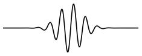
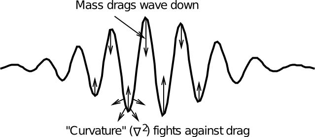
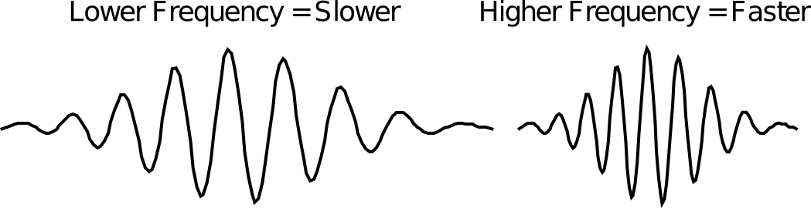
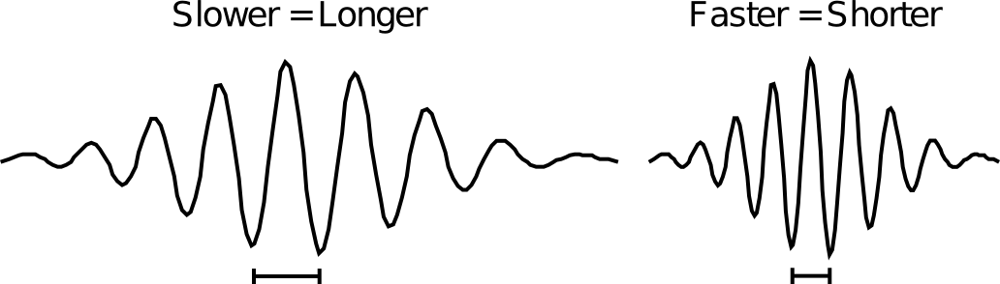
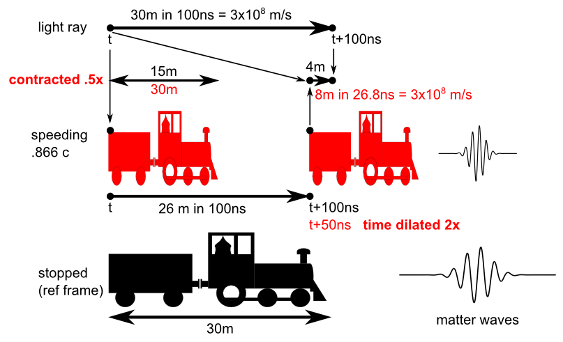
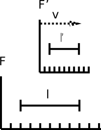
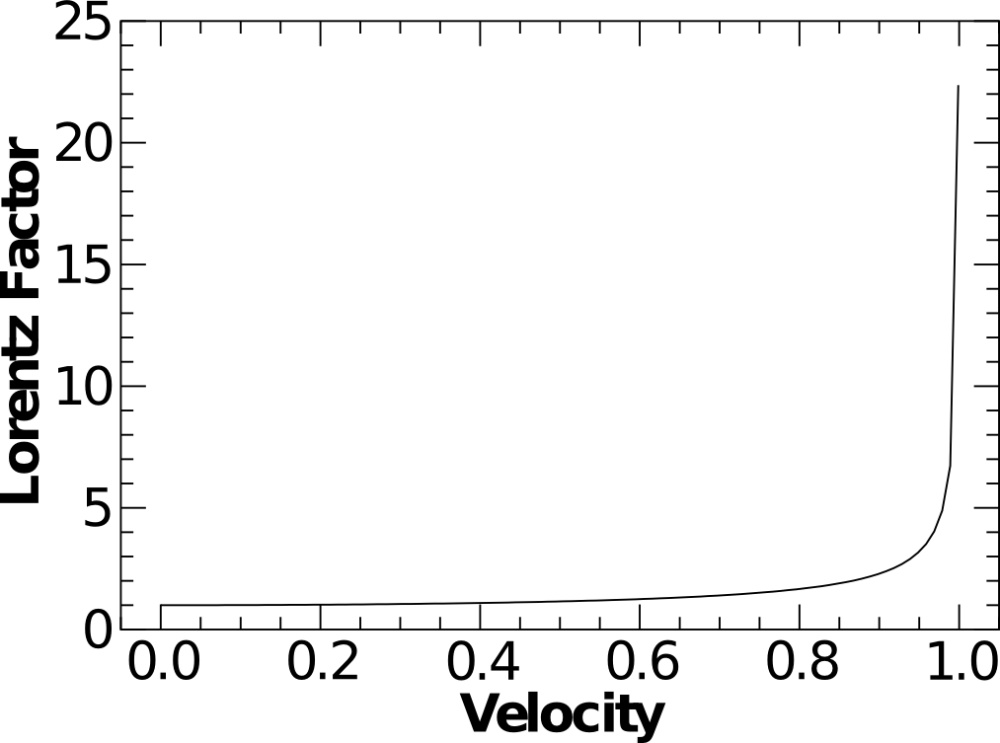
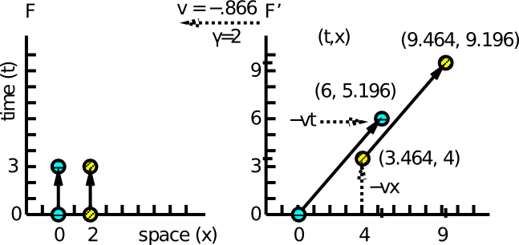
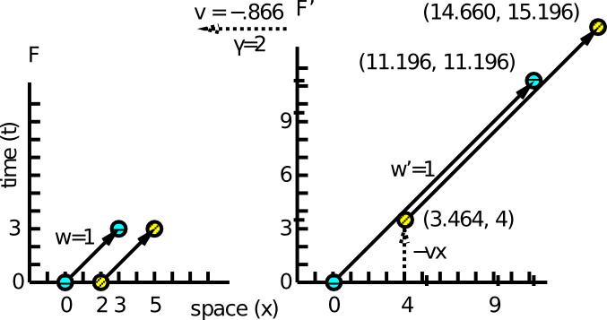
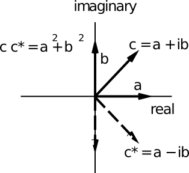

Historically, matter has typically been conceived of as something hard and solid: a particle of some form or another. Here, we see that we can produce many of the known properties of matter using a very simple extension of the simple second-order wave equation that we've explored in the prior chapters. The simplicity and elegance of this matter wave in explaining a very wide range of physical phenomena, including Newtonian and relativistic equations of motion, the Lorentz transformations of special relativity, and the quantum mechanical relationship between wave frequency and velocity (momentum), provides a compelling overall framework for thinking of matter in terms of waves. This then provides the core idea behind the WELD framework.

In this chapter, we take the first fundamental step in developing a matter wave equation, which results in the **Klein-Gordon** equation, that operates on a scalar wave field just like the simple second-order wave equation. Although this basic equation contains so many fundamental properties, it also has some important limitations in terms of capturing the full range of behavior of a "particle" such as an electron. First, it does not produce a **conserved charge density** value over time -- charge will not remain strictly constant over time under this equation. Second, it fails to capture the important property of **spin**, which we will see plays an important role in the behavior of an electron. These limitations can be addressed in a couple of extensions to the Klein-Gordon equation, which result in the **Dirac equation**, as developed in the [next chapter](ch05_dirac.md).

# Problems with Particles

First, let's consider for a moment the possibility that, within our cellular automaton system, matter is composed in some way of particles. How natural or easy is it to get that to work? It turns out, it is not very natural or easy at all, for much the same reason that purely binary or discrete states are not particularly natural in the CA system. Specifically, the most obvious way of introducing a particle in this system is to imagine that it is a discrete binary state value in a cubic cell. For all locations where there are no particles, this state value is 0, and where there are particles, it is 1. The problem is, how do these particles move? They can only make discrete jumps to one of the 26 neighboring cells. How can they exhibit trajectories of motion that are not along one of these 26 directions? How can they take on different velocities? They would have to wait in one spot for a while, then make a discrete jump, etc, with the ratio of waiting to jumping corresponding to velocity. But what provides the "memory" for how long to wait before jumping, and what direction to jump to? In more technical terms, what provides the momentum representation for such a particle?

Another important problem with the particle model is that it introduces complications for force fields very near the particle itself. Both the electromagnetic and gravitational forces follow a $1/r^2$ law, which means that the strength of these forces in the cells immediately adjacent to a discrete particle would be very strong, especially for the much stronger electromagnetic force. This is problematic because such a strong level of force corresponds to a very high energy density, which can end up producing unexpected physics. For example, high energies can spontaneously create new massive particles. A wave-like distributed particle model would avoid such problems, by distributing the source of such forces over a much wider area, and greatly reducing the charge and mass density per unit cube.

Some of these problems may be surmountable, but the level of complexity and mechanism required to do it is daunting. For example, I have implemented a system for solving the particle motion problem, but it is truly baroque in its complexity and implausibility. Again, we cannot place strong a priori constraints on what happens at the most fundamental level, so it could be that particles of this sort exist. But perhaps we should pursue the wave alternative first, to see if something more natural emerges. Indeed, we'll see in a moment that a single modification to the basic wave equation produces a surprisingly comprehensive description of matter (while still falling short of describing actual physics). The resulting model is so simple, elegant, and consistent with known physics that we do not hesitate to completely abandon the discrete particle model, with all of its difficulties and complexity.

# Klein-Gordon Waves

**Figure 4.1:** A wave packet, which is a spatially localized wave disturbance that propagates through space as a coherent entity.  The two values shown here are the state value and the first derivative --- the relationship between these two determines which direction the wave travels. This is our model for a particle.  Mathematically, it can be constructed by multiplying a Gaussian function (normal bell-shaped distribution curve) times a sine wave.

**Figure 4.2:** The additional mass term $-m_0^2 \varphi$ in the Klein-Gordon (KG) wave equation "drags down" the wave in proportion to the height of the waves (i.e., amplitude away from zero, either positive or negative).  This fights against the curvature of the wave, computed by $\nabla^2$.  Higher frequency waves have higher curvature, and thus move faster than lower frequency waves.

In beginning to explore the wave model of matter, we need to first establish a few basic concepts of what it would even mean for a particle to be described by a wave. The main idea is that a particle corresponds to a {\em wave packet}, which is a spatially localized wave disturbance . It can act like a particle in that it is somewhat spatially localized, and moves as a coherent entity. If you zoomed out very far, and blurred your eyes, you could imagine that a wave packet would look like a tiny point particle. Nevertheless, it fundamentally acts like a wave, in the sense that it is actually made of oscillations, and obeys a wave equation. As to what exactly the wave material is and what it means for observations, we'll postpone for later. At this point, we'll content ourselves with this level of description, and just start developing some new twists on the basic wave equation; we'll return to the thorny interpretational issues (e.g., wave-particle duality, probabilistic interpretation of the wave, etc), once we have a better sense of how these new waves behave.

Recall that the wave equation can be written as a second-order differential equation:

- **standard wave equation:** $\frac{\partial^2 {\varphi}}{\partial t^2} = c^2 \nabla^2 \varphi $

What if we add a single new term to this equation, where we subtract away some *mass* ($m_0$, a constant) from the Laplacian ($\nabla^2 \varphi$) curvature driving force term ():

- $\frac{\partial^2 {\varphi}}{\partial t^2} = c^2 \left( \nabla^2 \varphi - \frac{m_0^2}{\hbar^2} \varphi \right) $

or, in somewhat simpler notation that we'll use more frequently:

- $\frac{\partial^2 {\varphi}}{\partial t^2} {{=}} c^2 \left(\nabla^2 - \frac{m_0^2}{\hbar^2} \right) \varphi $

where "hbar" $\hbar = \frac{h}{2\pi}$ and $h$ is Planck's constant. As we elaborate below, the most natural interpretation of Planck's constant here is as a simple scaling term on the impact of mass on the matter wave dynamics -- for this reason, we strongly argue that anything having to do with this constant reflects an interaction with matter waves, and for example it makes no sense to use *h* in characterizing the behavior of light waves, because they have no mass and as we saw in the previous chapter, there is no evidence of any such constant in the fundamental EM wave equations. Thus, as we discussed in the [Introduction](ch01_intro.md), Einstein's creation of the photon with energy $E = h \nu$ is really just a calculational tool for representing the interaction between EM waves and matter in atomic systems, and it is the matter waves that impart the *h* constant, not the EM "photon".

As noted, this new equation is called the **Klein-Gordon (KG)** equation, named after Oskar Klein and Walter Gordon, who published the first papers on it (Klein, 1926; Gordon, 1927; see Kragh, 1984 for a detailed history of this equation, which was actually discovered by many individuals, including Schrödinger). This equation captures a surprising number of important phenomena, as we detail next.

First, we'll introduce some variations on how to write this equation, which are all obviously identical to the KG equation given above, but highlight different features of it, as we'll see more later. Here's one such variation:

- $\frac{\partial^2 {\varphi}}{\partial t^2} - c^2 \nabla^2\varphi = -\frac{c^2 m_0^2}{\hbar^2} \varphi $

and another:

- $\left(\frac{\partial^2 {}}{\partial t^2} - c^2 \nabla^2 + \frac{c^2 m_0^2}{\hbar^2}\right) \varphi = 0 $

These last two forms are useful for relating to the four-vector version of the wave equation, where we saw that:

- $\partial\_\mu \partial^\mu = \frac{\partial^2}{\partial t^2} - c^2 \nabla^2 $

so that the equation can be written:

- $\partial\_\mu \partial^\mu \varphi = - \frac{c^2 m_0^2}{\hbar^2} \varphi $

or:

- $\left(\partial\_\mu \partial^\mu + \frac{c^2 m_0^2}{\hbar^2}\right) \varphi = 0 $

To actually implement this KG equation in our cellular automaton model, we make one modification to the acceleration term, to subtract off the mass:

- **Discrete Klein-Gordon equation:** $\ddot \varphi_i^{t+1} = c^2 \frac{3}{13}\sum\_{j \in N\_{26}} k_j (\varphi_j - \varphi_i) - \frac{c^2 m_0^2}{\hbar^2} \varphi_i $

## Variable Speeds: Momentum from Frequency

**Figure 4.3** Relationship between frequency and speed in the Klein-Gordon (KG) wave function, which derives from competition between mass drag and overall curvature of the wave, as computed by $\nabla^2$.  Higher frequency waves have more curvature and thus move faster.

One of the most important features of this KG equation is that waves now travel at *variable speeds*, instead of always moving at exactly the same speed (the speed of light). This speed now depends on the relationship between the curvature ($\nabla^2 \varphi$) and the squared-mass value $\frac{m_0^2}{\hbar^2} \varphi$. In essence, the mass "drags down" the wave propagation force conveyed by the local curvature, $\nabla^2 \varphi$. Therefore, to get the wave to move faster, you need more curvature, which is to say, a higher frequency wave, because higher frequency waves have more waves per unit length, and this means overall greater "curvature" (Figure 4.3).

This relationship between frequency $f$ of a wave and the momentum (velocity \* mass) of the particle that it describes is captured in one of the most basic equations of quantum physics:

- $p = \frac{h}{c} f $

where $p$ is the momentum, and $h$ is Planck's constant. This can also be written in terms of the wavelength $\lambda$, which is the inverse of the frequency:

- $f = \frac{c}{\lambda} $
- $\lambda = \frac{c}{f} $
- $\lambda f = c $

so that momentum is inversely proportional to the length of the waves:

- $p = \frac{h}{\lambda} $

Although it might be tempting to compute the velocity from the momentum expression given above (e.g., $p = m v$ so $v = \frac{p}{m}$), this is not accurate due to the effects of special relativity as we discuss in greater detail below. Instead, the appropriate equation that relates the momentum and the velocity is:

- **relativistic momentum-velocity relationship:** $p = \gamma m_0 v $

where $\gamma$ is the Lorentz factor as described here: [Special Relativity](#special_relativity). When we make all the necessary substitutions and do a bit of algebra, we end up with this expression for the velocity of the "particle" as a function of wavelength, rest mass, and the relevant constants:

- **velocity as function of wavelength, relativistically correct:** $v = \frac{h c}{\sqrt{c^2 m_0^2 \lambda^2 + h^2}}$

See [Velocity Derivation](#velocity_derivation) for all the algebraic steps in this derivation. In the exploration below we'll confirm this equation experimentally. The complexity of this equation for velocity versus the much simpler expressions for momentum indicate why momentum and not velocity is the natural quantity to deal with in relativistic wave functions.

Also, as we will explore in greater detail later, the momentum can be computed directly from the wave function in terms of the first-order spatial derivative or gradient:

- **essence of momentum operator:** $\vec{p} \propto \vec{\nabla} \varphi $

where this spatial gradient is again going to be greater overall as the wave frequency increases, as suggested by the quantum mechanical relationships above.

Again, the main point for now is just that introducing the mass term makes the relative curvature or frequency of the wave matter in determining the overall velocity or momentum of the wave packet that describes a particle. Without this mass term, all waves travel at the speed of light.

## Newtonian Mechanics: F = ma

We can intuitively see that this very simple modification to the wave equation captures all of classical (Newtonian) mechanics for a "particle" characterized by a wave according to this equation. In the absence of any external forces, the wave will propagate along at a constant velocity (Newton's first law of inertia), because the frequency of the wave does not decrease (and it would not change its overall direction of propagation). If a force is applied to this system, it will change the frequency of the oscillation of the wave, and thus result in a change in momentum, in accord with Newton's second law:

- $F = \frac{\partial \vec{p}}{\partial t} = m \frac{\partial \vec{v}}{\partial t} = m \vec{a} $

After a few more developments, we can make this relationship much more formally accurate and precise, by considering the overall energy and momentum relationships computed by the KG wave equation. We will see that Schrödinger's equation, which is the primary wave equation for basic quantum physics, captures classical Newtonian physics, and that the KG equation is a version of Schrödinger's equation that also takes into account special relativity, which is important when particles are moving very fast (i.e., relatively close to the speed of light).

Anticipating these results, and relying on intuition for now, we see that with one tiny addition, we now have an equation that can describe the motion of a massive particle through space (e.g., as a wave packet), in agreement with all the known physical laws (i.e., quantum physics and special relativity, which reduce in certain cases to the more familiar Newtonian mechanics).

## What is the Mass?

The value $m_0$ in the KG equation is the **rest mass** of the particle that it describes (the 0 subscript indicates "rest"). It is a fixed, constant value for a given type of particle, and thus we can easily imagine that it is just built into the equations for the state variables that characterize that type of particle.

For an electron, this mass is $9.1x10^{-31}$ kg, which is an extremely tiny weight. In the typical units that we use in our numerical models, the rest mass of the electron has the value of 3.0.

The value of $m_0$ also defines the **Compton wavelength** of a given particle, which is the wavelength of a particle at rest, due strictly to the rest mass. The formula for the Compton wavelength $\lambda_C$ is:

- $\lambda_C = \frac{h}{m_0 c} $

One other thing about the rest mass --- we can consider what happens when you set the rest mass of our particle to zero. You should see that we immediately recover the basic wave equation from before. Thus, it is immediately obvious that "particles" with a zero rest mass must move at the speed of light. This is a basic postulate of special relativity. Note also that it is impossible for a massive particle to travel at the speed of light, because it would have to have an infinitely high frequency, and this is not possible (even in a continuous spatial model).

## Smooth, Continuous Motion

As a continuous-valued second-order wave equation, the KG equation still has all of the advantages discussed earlier about making the underlying grid disappear. Furthermore, it easily and naturally allows us to describe continuously variable rates of speed, in terms of continuous variation in the frequency or wavelength of wave oscillation. Particles described by such an equation can also travel in any direction, because of the essentially perfect spatial symmetry of wave propagation exhibited by this equation.

In contrast, models with a discrete particle suffer from all manner of complexity in overcoming such problems. Thus, by describing a particle exclusively using this wave equation, we avoid many difficulties, and it remains to be seen if we encounter any other problems.

# Exploration of Klein-Gordon Waves

Now we explore the above properties of the Klein-Gordon wave equation, to get a concrete sense of how it works, before turning to a more extended discussion of how the KG wave equation explains the stretchy properties of matter implied by the Lorentz transformation and special relativity.

## Initial Conditions

Creating a moving wave packet that moves with a given velocity is a bit more complicated than for the simple wave equation, because we have more constraints to take into account.

# Special Relativity

**Figure 4.4:** Intuitive explanation of Lorentz contraction of space that occurs as something moves faster, in terms of the relationship between wave frequency and speed in the Klein-Gordon wave equation. Because faster movement is associated with higher frequency and shorter wavelength, the system contracts in the direction of motion as it speeds up.  Thus, any measurements made in the faster system will have their basic constituents, including yard sticks and everything else, shrunk in this way.  This is one of the main effects of special relativity.

**Figure 4.5:** The Lorentz Transformation, a central property of special relativity, which causes length in the direction of motion to shrink and time to expand (dilate) as a function of relative speed, in just such a way as to preserve the observed speed of light regardless of how fast one is going.  The matter wave equation exhibits exactly this behavior, which completely masks any fixed matrix in which such waves might be implemented.  In this example, a speeding light ray is observed at a given time t by an observer in a train speeding along at 86.6% of the speed of light $(c \approx 3.0x10^8)$, and by "us" sitting in a stopped train (on a siding presumably).  All the measurements in black are what we observe in this stopped reference frame, while those in red are what the speeding train guy observes.  If we wait 100 nanoseconds (ns) ($1x10^{-7}$ seconds -- 100 times slower than the clock rate on a 1Ghz computer chip), then this light ray will have moved 30 meters.  However, from our stopped perspective, the speeding train will be partially keeping up with the light ray, so that it will appear to have traveled only 4m relative to the moving train.  Thus, in this stopped reference frame, where 100ns have passed for this light to appear to have traveled 4m, we might naively assume that someone on the speeding train would measure the speed of light as only $4x10^{7} m/s$ -- oops!  But the Lorentz transformations of length and time exactly compensate.  The length of the train in the direction of motion shrinks in half, so that people on the train measure the 4m in the stopped reference frame as 8m in the moving reference frame -- twice as long.  Furthermore, time moves more slowly for the speeding train, such that the 100ns in our reference frame is measured as only 50ns in the speeding train reference frame (at a static reference point in the speeding train, which is the very back of the coal tender in this example).  The measurement of time is very strange in special relativity, because what is observed as occurring at the same time (simultaneity) across different reference frames depends on both time ''and location''.  Thus, when the light ray is measured at 8m ahead of the back of the coal tender, this registers as only 26.8ns of elapsed time!  If you divide this 8m by that amount of time, it comes out to exactly the same speed of light as in the stopped frame.  The time transformation equation is: $t' = \gamma (t-vx/c^2)$ and the position transformation is: $x' = \gamma (x-vt)$, where t' and x' are as measured on the speeding train and t, x are on the stopped one, and $\gamma = 1/\sqrt{1-v^2/c^2}$.

As we noted before, the wave equation automatically satisfies special relativity. This is still true of the KG equation, which is why it is known as the relativistic version of Schrödinger's equation. Indeed, because the KG equation describes a massive particle, it opens up the much more interesting set of issues with special relativity having to do with time and space contracting and expanding.

Apparently Einstein was motivated to come up with special relativity in part by thinking about what it would be like to catch up with a beam of light. Turns out you can't: light always moves at the same speed away from you, no matter how fast you are going. Thus, the waves described by the basic wave equation are always speeding along at the same speed, and are relativistic in a fairly straightforward but also somewhat uninteresting way: they just cruise around at the same speed of light, and not much else can be said for them.

In contrast, things that have a non-zero rest mass are subject to three major effects as their velocities increase (all of these are as measured relative to a static observer watching such a thing whiz by --- in our model, we can conveniently use the underlying grid reference frame):

- They shrink along the direction of travel (Lorentz contraction).
- Time slows down (time dilation).
- Apparent (relativistic) mass increases.

Almost miraculously, all of these effects can be derived directly from the basic KG equation. Intuitively, the contraction of space along the direction of travel occurs because the length of a given thing is measured in terms of the wavelengths of the underlying particles that compose it. As these things move with greater velocity, their frequency increases and their wavelengths decrease, and this results in a shorter overall length (as viewed from an outside observer) (). Similarly, the increase in apparent mass comes from the increased difficulty in further accelerating the system. Mass is measured in terms of the inertia of a system: its resistance to further acceleration. It happens that the amount of force required to increase the frequency of a given wave packet further is proportional to its existing frequency, so that it becomes harder and harder to accelerate something as it moves faster and faster. This is manifest as an increase in the apparent mass of the particle. The increase in apparent mass of the particle also has the effect of causing the apparent time to slow down: time is fundamentally measured as a rate of change, which depends on accelerations, which are affected by the increase in apparent mass.

The very stretchiness and malleability of space and time postulated by special relativity is a very strong argument in favor of waves over particles. Waves are inherently stretchy and malleable (as just invoked above to explain the key features of special relativity), whereas particles as hard discrete points just don't seem to fit with this picture. What would it mean for a point particle to contract along its direction of travel?

One of the main puzzles that people often have with special relativity is understanding how light can appear to move at the same fixed speed, when an observer is screaming along at nearly the speed of light. You would think that you would catch up to a photon (as in Einstein's motivating thought experiment), and even if you couldn't see it actually standing still, it sure should seem to move more slowly relative to a speeding observer than to someone sitting still. The trick is, as an observer speeds up, the time dilation and space contraction effects conspire to alter the perception of the relative motion of other things, as illustrated in . The wavelength and velocity of the moving light wave never actually change (they are always the same relative to the underlying reference frame of the grid), but relative to the moving observer, they appear to be much faster. This is because the observer's rulers have shrunk, and their clocks have slowed down, so that the same light wave appears to be moving much faster to them. In contrast, a static observer watching the moving observer chasing after the light beam will perceive the two as having a smaller relative velocity difference. These changes occur in exactly the right way to make the light wave appear to travel at the speed of light to the moving observer (which in fact it is).

See [Special Relativity](#special_relativity) for a more detailed treatment, including all the relevant mathematics.

# Energy and Momentum Operators and the Hamiltonian

Using what we have just reviewed about special relativity, plus the notion of **conservation of energy** -- i.e., that the **total energy** of the system is strictly conserved over time, we can actually derive the KG from first principles. In keeping with physicist's penchant for assigning people's names to concepts that would otherwise be very easy to understand if just spelled out, the total energy of the system is also called the *Hamiltonian*' ($H$), and standard Newtonian physics can all be derived from the appropriate Hamiltonian (which is what W. R. Hamilton did). This motif of using the total energy of the system to derive basic physical laws seems to work quite well in many cases, and is thus the primary way that such laws are derived for different definitions of the total energy. Essentially, the physical laws are latent in any given definition of total energy, and really just amount again to specifying the dynamics by which energy gets moved around in different ways, without ever gaining or losing any total energy.

After we derive the KG equations from a relativistic total energy Hamiltonian here, we will then derive the Schrödinger equation from a different Hamiltonian at the end of this chapter, and then we'll extend the Hamiltonian to include spin and coupling to the EM field in the next chapter where we derive the [Dirac equation](ch05_dirac.md) (which is just a more complicated version of the KG equation). You will see that the total energy equation and the corresponding wave equation are very directly related mathematically, and thus this overall approach of using the total energy to derive the wave equation is a very powerful tool that is important to understand if you want to really understand what these wave equations are doing.

You should be familiar with our computation of the total energy associated with a simple wave, which we calculated in the [Waves Chapter](ch02_waves.md). There we saw that for each cell element in our wave matrix, the total energy was the sum of the **kinetic** and **potential** energy, where kinetic energy is a function of how fast the state value is moving, and potential energy is a function of how much stress or tension there was between the state and its neighbors (i.e., the curvature of the space).

Now, we're going to try to formulate the total energy associated with *the "particle" represented by the entire wave function*, instead of thinking in terms of each individual cell within the wave state. We'll see that we can compute the resulting total particle energy using local cell-level calculations, but the motivations and logic are different. There are still kinetic and potential contributions to this overall particle energy, but it is the overall velocity (actually momentum, which is just velocity times mass) of the particle, not the individual cell state, that we are concerned with in computing the kinetic energy.

As discussed in the [Special Relativity](#special_relativity) section, the relativistic total energy of a particle moving with momentum $\vec{p}$ and having a rest mass $m_0$ is given by the following equation:

- **total relativistic energy:** $E^2 = \vec{p}^2 c^2 + (m_0 c^2)^2 $
- $E = \sqrt{\vec{p}^2 c^2 + (m_0 c^2)^2} $

The fact that these two components of energy, momentum and rest mass, add together only when squared, ended up causing a remarkable amount of grief and confusion about the meaning of the KG and Dirac equations, as we'll see later. Turns out that taking the square root of a sum is not a very friendly mathematical operation. We are able to largely avoid these problems in our overall approach, however, in part by just using the squared energy instead of the raw energy. If the energy is conserved, so is its square!

To do anything with this total energy equation, we need to be able to compute the momentum and the energy values from our wave states. We have already indicated that the momentum (velocity) of the wave is proportional to the amount of curvature in the wave state -- more curve = faster velocity. This can be formalized with the appropriate constants in the following **momentum operator** (the little hat $\hat{}$ indicates that this is an operator to be applied to a wave state) which operates over each cell in the entire wave state to produce the associated momentum of the particle:

- $\hat{p} = -i \hbar \vec{\nabla} $

We highlight this because we'll keep using it again and again as we work our way up to the Dirac equation. Do not be alarmed by the presence of the $-i$ *imaginary number* at the start of this equation -- we'll get rid of it soon enough. See [Complex_Numbers](#complex_numbers) for more information if you want to brush up on your knowledge of these seemingly strange numbers at this point -- you'll need to really understand them in detail to understand the Schrödinger equation later in this chapter. They really are very simple once you get past all the imaginary business and recognize their actual practical application.

The total energy operator for the wave state is computed in terms of the overall rate of change across all the wave cells, consistent with the notion that energy is a function of the velocity (kinetic energy) of the cell states:

- $\hat{E} = i \hbar \frac{\partial }{\partial t} $

again we see the imaginary number and $\hbar$ constants here.

To see how this all fits together, we now just simply substitute in these operators in place of the momentum and energy terms in the above energy equation (squared version), and have them operate on the wave state values. The imaginary numbers turn into 1's and -1's in the process of the squaring, and thus very kindly disappear:

- $E^2 = \vec{p}^2 c^2 + (m_0 c^2)^2 $
- $-\hbar^2 \frac{\partial^2 {\phi}}{\partial t^2} = \left (-\hbar^2 \nabla^2 c^2 + (m_0 c^2)^2 \right) \phi $
- $\frac{\partial^2 {\phi}}{\partial t^2} = \left( c^2 \nabla^2 - \frac{(m_0 c^2)^2}{\hbar^2} \right) \phi $
- $\frac{\partial^2 {\phi}}{\partial t^2} = c^2 \left(\nabla^2 - \frac{m_0^2 c^2}{\hbar^2}\right) \phi $

And amazingly, at the end, we recover exactly the KG equation!

This means that the propagation of the particle defined by a KG wave function will conserve the total relativistic energy over time, simply by virtue of following the simple local wave dynamics. This means that a KG wave-particle will obey the physics of special relativity in every way, as we discussed earlier. And in the case when the wave velocity is low compared to the speed of light, then the system will behave according to the laws of Newtonian physics, because special relativity reduces to standard Newtonian physics in this case.

TODO: compute total energy of waves as d/dt?

## Four-Vector Version

Before continuing, we explore the ultra-compact version of the above derivations that is possible using the four-vector space-time coordinate system introduced earlier. In this system, the {\em four-momentum} operator is defined as:

- ${\hat{p}^\mu} = i \hbar \partial^\mu $
- $= i \hbar \left(\frac{\partial {}}{\partial {ct}},-\frac{\partial {}}{\partial {x}},-\frac{\partial {}}{\partial {y}},- \frac{\partial {}}{\partial {z}}\right) $
- $= i \hbar \left(\frac{\partial {}}{\partial {ct}}, -\vec{\nabla} \right) $
- $= \left(\frac{\hat{E}}{c}, \hat{p}\right) $

As indicated, it should be clear that the first (time) component of this is the energy operator given above, while the spatial components are the momentum operator (equation~\ref{eq.ep_operators}):

- $\hat{E} = i \hbar \frac{\partial}{\partial t} $
- $\hat{p} = -i \hbar \vec{\nabla} $

If you then square this momentum operator (using the standard covariant, contravariant four-vector definition of multiplying vectors), you get:

- ${\hat{p}^\mu} {\hat{p}\_\mu} = \frac{\hat{E}^2}{c^2} - \hat{p}^2 $

Now this is quite interesting, because it can be directly related to the relativistic energy-momentum equation:

- $E^2 = \vec{p}^2 c^2 + (m_0 c^2)^2 $
- $\frac{E^2}{c^2} = \vec{p}^2 + m_0^2 c^2 $
- $\frac{E^2}{c^2} - \vec{p}^2 = m_0^2 c^2 $

So we can now put these two equations together, to get:

- ${\hat{p}^\mu} {\hat{p}\_\mu} = m_0^2 c^2 $

Now, we also know that the wave equation arises from the second-order derivatives of a four-vector:

- $\partial\_\mu \partial^\mu = \frac{1}{c^2}\frac{\partial^2 {}}{\partial t^2} - \nabla^2 $

and this four-momentum operator is essentially just a first-order derivative with some additional constants (including the $i$ term, which, when squared produces a $-1$), so when we apply these operators to our wave variable $\phi$, we get:

- ${\hat{p}^\mu} {\hat{p}\_\mu} \phi = m_0^2 c^2 \phi $
- $i^2 \hbar^2 \partial\_\mu \partial^\mu \phi = m_0^2 c^2 \phi $
- $- \hbar^2 \left(\frac{1}{c^2}\frac{\partial^2}{\partial t^2} - \nabla^2\right) \phi = m_0^2 c^2 \phi $
- $\frac{\partial^2 {\phi}}{\partial t^2} = c^2 \left(\nabla^2 - \frac{m_0^2c^2}{\hbar^2}\right) \phi $

Which is right back to our KG wave equation.

In summary, the core of the KG wave equation, and of special relativity, and much of quantum mechanics, can all be reduced to this one simple equation:

- $\hat{p}^\mu \hat{p}\_\mu \phi {{=}} m_0^2 c^2 \phi $

This is in some sense the most fundamental equation of the universe, subsuming the more popular $E = m c^2$ and, as we'll see, providing the basis for further extensions to the KG equation.

# Schrödinger's Equation vs Klein-Gordon

The Klein-Gordon equation that we've been exploring is typically introduced as a strange and problematic alternative to the Schrödinger wave equation, which provides the cornerstone of standard quantum physics. As we saw, the KG equation is derived from the relativistic total energy, whereas we'll see here that Schrödinger's equation can be derived from *Newtonian* total energy, and thus is clearly not accurate for anything moving very fast (a significant fraction of the speed of light), or where new particles are created out of raw energy. The fact that it holds such strong sway in the field can be attributed to its strict conservation properties -- as normally interpreted, the Schrödinger equation conserves the total probability value, as it propagates through space. In contrast, the KG equation does not have such a strict conservation behavior.

Furthermore, the Schrödinger equation is a first-order wave equation, which has many advantages from an analytical perspective, even as it makes it very difficult for many people to understand, due to its reliance on [Complex Numbers](#complex_numbers). In general, wave-like behavior can either be described by a second-order equation involving normal scalar variables (as we've been doing), or it can be described by a first-order equation involving complex numbers, exemplified by the Schrödinger equation. In the first-order version, you have two variables for every one variable in the second-order one --- we'll see later that this fact allows us to use only four variables to represent an electron using a second-order wave equation, whereas the standard first-order Dirac equation requires eight. The general intuition is that a first-order wave equation involves motion as rotation among its complex variables, in addition to motion through space, whereas the second-order equation just has motion through space. This will be clearer as we examine Schrödinger's equation more closely.

Before we do so, you should review [Complex Numbers](#complex_numbers) if you are not completely familiar with them. Complex numbers are important for understanding Schrödinger's equation (as described thereafter), and for subsequent developments of the KG equation, which requires complex numbers to represent a conserved charge value.

Using the total energy (Hamiltonian) approach, we can derive Schrödinger's equation, using the very same energy and momentum operators that we used in the derivation of the KG equation above. To remind, these operators are:

- **momentum operator:** $\hat{p} = -i \hbar \vec{\nabla} $
- **energy operator:** $\hat{E} = i \hbar \frac{\partial }{\partial t} $
- gradient operator: $\vec{\nabla} = \left(\frac{\partial {}}{\partial {x}}, \frac{\partial {}}{\partial {y}}, \frac{\partial}{\partial {z}}\right)$

Next, we need to define the total energy Hamiltonian. Instead of the relativistic total energy, we use the classical Newtonian expression for the kinetic energy of a particle, in terms of its velocity $\vec{v}$, just as we did in the simple wave energy calculation in the [Waves Chapter](ch02_waves.md):

- $K = \frac{1}{2} m_0 \vec{v}^2 = \frac{1}{2 m_0} \vec{p}^2$

The second form uses the Newtonian relationship of momentum to velocity (just $\vec{p} = m_0 \vec{v}$) -- because we have a momentum operator, we need to use this momentum form.

We also include a potential energy term that is a function of any kind of electrical or other force potential that the particle experiences. We won't deal much with such forces at this point, so we just call this potential energy $V$ for now, and focus on the kinetic energy. The total energy or Hamiltonian in abstract terms is just the kinetic energy $K$ plus this potential energy:

- $E = K + V$
- $E = \frac{1}{2 m_0} \vec{p}^2 + V $

We can now just apply our momentum and energy operators to these expressions, and the result is in fact:

- **Schrödinger's equation:** $i \hbar \frac{\partial {\phi}}{\partial t} = -\frac{\hbar^2}{2 m_0} \nabla^2 \phi + V \phi $

The net result is that we can conclude that Schrödinger's equation provides an accurate description of the flow of energy and momentum over time of a "particle" described by a wave, such that it obeys classical Newtonian physical laws.

Omitting various constants (factors of $h$) and any external force potential, Schrödinger's equation is:

- $i \frac{\partial {\phi}}{\partial t} = - \frac{1}{2m_0} \nabla^2 \phi $

where $m_0$ is again the rest mass of the particle in question. This is clearly very similar to the basic second-order KG wave equation:

- $\frac{\partial^2 {\varphi}}{\partial t^2} = c^2 \nabla^2 \varphi - \frac{m_0^2}{\hbar^2} \varphi $

except that the temporal derivative is first-order, and mass enters in a different way. Nevertheless, the driving force is still the overall curvature of the wave, computed by $\nabla^2 \varphi$. As we noted above, the multiplication by the $i$ term causes things to rotate --- this rotation is key for making the first-order equation behave like a wave.

To see this effect more explicitly, we can write out Schrödinger's equation in terms of the two underlying scalar values:

- $i \frac{\partial {\varphi_a + i \varphi_b}}{\partial t} = - \frac{1}{2m_0} \nabla^2 (\varphi_a + i \varphi_b) $
- $-\frac{\partial {\varphi_b}}{\partial t} + \frac{\partial {i \varphi_a}}{\partial t} = -\frac{1}{2m_0} \nabla^2 \varphi_a - i \nabla^2 \varphi_b $

where $\varphi_a$ indicates a scalar state variable that is the $a$ component of $\phi$, and $\varphi_b$ is the $b$ component of $\phi$. Note that the derivatives operate separately on each of the two variables. At this point, we now can just separate all the terms that involve an $i$ from those that do not, to get update equations for each of the two variables. For the real-valued components (without the $i$):

- $-\frac{\partial {\varphi_b}}{\partial t} = - \frac{1}{2m_0} \nabla^2 \varphi_a $
- $\frac{\partial {\varphi_b}}{\partial t} = \frac{1}{2m_0} \nabla^2 \varphi_a $

and for the imaginary components (dropping the $i$ now, because we no longer need it to keep the variables separated):

- $\frac{\partial {\varphi_a}}{\partial t} = - \frac{1}{2m_0} \nabla^2 \varphi_b $

In a discrete-space and time CA-like implementation, these equations would be written:

- $\dot {\varphi_a}\_i^{t+1} = - \frac{3}{26 m_0} \sum\_{j \in N\_{26}} k_j ({\varphi_b}\_j^t - {\varphi_b}\_i^t) $
- ${\varphi_a}\_i^{t+1} = {\varphi_a}\_i^t + \dot {\varphi_a}\_i^{t+1} $

and:

- $\dot {\varphi_b}\_i^{t+1} = \frac{3}{26 m_0}\sum\_{j \in N\_{26}} k_j ({\varphi_a}\_j^t - {\varphi_a}\_i^t) $
- ${\varphi_b}\_i^{t+1} = {\varphi_b}\_i^t + \dot {\varphi_b}\_i^{t+1} $

So, in the end, Schrödinger's equation really just boils down to two very simple differential equations. Interestingly, these equations are *coupled*, in the sense that it is the curvature of $\varphi_a$ that drives the change in $\varphi_b$, and vice-versa. This is the rotational aspect of the equation mentioned earlier, which is caused by the presence of the $i$ in the equation.

When you actually implement Schrödinger's equation on a computer using the update rules given above, the resulting system is numerically unstable. In other words, the resulting numbers quickly blow up to infinity. This is not due to any kind of numerical roundoff error from limited precision floating point numbers on the computer, but rather due to the way that changes in state values reverberate back and forth across the two scalar values. However, it is possible to overcome it relatively simply by just alternating the update: on one time step you compute one value, and on the next you update the other. This is what is done for illustrative purposes in the computer explorations.

The basic phenomenology of Schrödinger's equation is that wave packets propagate through space, with a speed that is proportional to $\nabla^2 \phi$, which in turn is proportional to the frequency of the wave. In other words, it describes exactly the same behavior as the KG equation, where particle speed is proportional to frequency.

One critical property of Schrödinger's equation (which our current scalar KG equation does not have) is that it preserves the overall magnitude of the $\phi$ state values across all of space, for all time. This is to say, if you compute the sum of $\phi \phi^\*$ for each point in space, this sum will remain the same across time under the Schrödinger equation. This conserved value is interpreted as a probability in standard quantum mechanics. For example, we can initialize the state with a localized wave packet (Figure 4.1) to represent the initial probability for the location and velocity of a particle (velocity being a function of the frequency of the wave packet). If we then apply the Schrödinger equation repeatedly, we can interpret the resulting $\phi \phi^\*$ values as the probability of the particle having moved to the corresponding location.

In other words, the wave packet defines a kind of "cloud of probability" for finding a discrete particle within its midst. However, these probabilities have different meanings in different scenarios, and it is notoriously difficult to come up with a intuitively sensible interpretation of what these probability clouds mean. We return to these issues later.

TODO: say more about conjugate thing and conserved probability.

% todo: demos of schrodinger..

# Summary

To summarize our progress so far, we have seen that in the domain of forces, the electromagnetic field can be understood in terms of four wave equations operating in parallel, driven by the charge density and charge current density. In the domain of matter, the Klein-Gordon wave equation allows us to describe particles having the following properties:

- Motion at continuously variable speeds, in all directions (without asymmetries caused by the underlying grid matrix).
- Newtonian (classical) physics (law of inertia, law of force) (in the limit of small velocities relative to the speed of light). This means that our model can explain virtually all of the intuitive everyday phenomena of physics (e.g., billiard balls and cars moving and everything that doesn't require gravity to explain).
- Many aspects of quantum mechanics (e.g., momentum proportional to wave frequency), by virtue of the KG equation being the relativistic version of Schrödinger's equation.
- Special relativity (Lorentz contraction, time dilation, mass inflation), which can be understood mechanistically in terms of the properties of KG waves as they move at increasingly faster speeds (higher frequency = shorter wavelength = space contraction, etc), and abstractly in terms of the KG equation satisfying the relativistic energy Hamiltonian.

Again, we see that an astounding swath of fundamental physics emerges from an exceedingly simple system, which is very nearly the simplest version of a continuous cellular automaton that does anything interesting at all. We simply added one additional term to the basic wave equation (the "mass drag" term), and from that follows so many central features of our reality. Again, one is left with the strong feeling that there must be something to this: the ratio of important stuff explained to assumptions made is exceedingly high.

This ratio is critical. You can think of it as "bang for the buck", and scientists are extremely frugal shoppers, in these terms. Assumptions are costly, and the fewer of them you can make to explain the same amount of stuff, the better. Here, we have made an extremely small set of basic, strongly-motivated assumptions, and wound up with almost every major feature of known physics! The most important missing part is gravitation, but we'll get to that later.

Interestingly, this is somewhat of a high-water mark in this respect, in that the subsequent developments of our model will largely result in increases in complexity that produce apparently relatively minor additional explanatory benefit. However, there is good reason to believe that many of the complex and beautiful phenomena of our universe could not exist without these extra degrees of complexity: the basic EM wave and KG equations do a huge amount, and are a very solid foundation, but they fall short of capturing important things like charge, and the interaction between charges via the electromagnetic field. As they say, the devil is in the details, and our current model is just a bit to smooth and simple to provide sufficiently complex dynamics to support beings like us, to sit here and ponder it all. In any case, the other thing scientists care a lot about is actually explaining the known data, and without these extra additions, the model simply does not.

Another important milestone that we've reached here is the contemplation of what it would require to have discrete particles in our system. They just do not work. In contrast to our wave equations, particles introduce massive amounts of complexity without adding much of any unexpected benefits. Therefore, we are entirely prepared at this point to discard the notion of a discrete particle entirely. The implications of such a move will reverberate throughout the rest of the paper.

Overall, it is interesting to compare our strong enthusiasm for the KG equation with its almost total neglect in the physics literature, which instead has been dominated by Schrödinger's equation and the Dirac equation that we'll encounter later. We like the KG equation because it is extremely simple and elegant from the perspective of our cellular automaton model, and its second-order nature both emerges naturally out of this framework, and solves a number of important problems (e.g., symmetric propagation in all directions, which does not occur in a first-order wave equation in the CA framework). In contrast, the rest of physics likes Schrödinger's equation because it is more analytically tractable as a first-order equation. It is linear, and it also automatically produces a positive-valued conserved probability density, which fits perfectly with the standard probabilistic interpretation of quantum physics. The fact that it violates special relativity is often overlooked, and anyway the Dirac equation solves that problem, while staying within a first-order framework (but at the cost of introducing 8 state variables interacting in a fairly complex way). Thus, the overall difference is one of "mechanism" vs. "analysis," where standard physics is strongly weighted toward analysis. Nevertheless, we'll see that with appropriate further developments, a version of the KG equation can provide a correct explanation of all the phenomena covered by the Dirac equation.

# External Resources

- <http://physics-quest.org/> -- Hans de Vries book on Relativistic Quantum Field Theory -- lots of nice further depth on KG equation etc.</text>

# Sub Topics

## Special Relativity

**Figure 4.6:** Illustration of Lorentz transformation between a static reference frame F (which is the same reference frame as the page, for example), and a frame F' moving at velocity $v$ relative to F.  Both frames contain a rigid rod, which when F' was at rest relative to F were the same length $l$, as indicated by the ruler marks.  These rods now appear to be of different lengths in the two frames --- from the perspective of F, the rod in F' appears to have shrunk to a shorter length $l'$.  Interestingly, from the perspective of an observer moving along with the F' reference frame, its rod appears to be of length $l$ (same as when it was stationary), and the other rod in F appears to have shrunk.

**Figure 4.7:** The amount of shrinkage as a function of velocity $v$ is determined by the Lorentz factor $\gamma$, which is plotted here (in natural units where the speed of light $c = 1$).  Not much happens until you get very close to the speed of light (e.g., above 90% or .9).

**Figure 4.8:** Lorentz coordinate transformations, plotted in one spatial coordinate (x) and time (vertical axis).  In the resting frame F, two points (think of them as marbles) just sit motionless, and thus form vertical trajectories through increasing time.  When these are transformed into a reference frame F' (aligned at point (t{{=}}0,x{{=}}0) with F) moving to the left at $v {{=}} -.866$ (Lorentz factor $\gamma {{=}} 2$), several interesting features of the Lorentz transformation are evident.  If we follow the marble that was originally located at (0,x) as it sits in frame F for 3 time steps, we see that it appears to move to the right in frame F', in the opposite direction of F' motion.  Furthermore, because of the Lorentz factor, the 3 seconds in frame F amount to 6 seconds in F', and the distance it should travel due to the relative motion, computed in frame F ($-vt {{=}} .866 \times 3 {{=}} 2.598$) corresponds to 5.196 in frame F'. The second marble reveals a critical and somewhat counter-intuitive effect, where two events that are {\em simultaneous} in frame F (i.e., t{{=}}0 for both of these), occur at ''different times'' in frame F'. Specifically the second marble sitting at rest at x{{=}}2 at t{{=}}0 is not &quot;encountered&quot; by the moving frame F' until 3.464 time seconds later (in F' time units), due to it being offset in space from the first marble.  It takes the frame F' $(-vx {{=}} .866 * 2 {{=}} 1.732)$ time units to get to this second point (in the units of the F frame), and when this gets subject to the time dilation effect, you end up with the 3.464.  From this starting point for the second marble, the same time and space increments as for the first marble occur for the subsequent point 3 time units later.

**Figure 4.9** An alternative situation to Figure 4.8, where the points in frame F are now moving at the speed of light (indicated by their slopes being 1; they are now photons instead of marbles).  The Lorentz conversions preserve these slopes, so that the speeds are still 1 in the F' frame.  Thus, the speed of light is always the same to all observers.

This subtopic provides a thorough treatment of **special relativity**, including the math needed to transform between different reference frames. We never actually have to use this in our numerical simulations, because all of our wave equations are automatically consistent with special relativity (i.e., they are **manifestly covariant**). But it is important to understand how all this works in any case.

The mathematics of special relativity involves the computation of relative distance and time measurements in different reference frames that are moving relative to each other (). As and illustrates a rigid rod of the same length $l$ can appear shortened if it is moving along at a high velocity $v$ relative to a static reference frame F (i.e., not moving relative to this page of paper). We denote the moving rod's reference frame F'.

The factor for transforming between reference frames is the **Lorentz factor** gamma:

- **Lorentz factor:** $\gamma = \frac{1}{\sqrt{1 - \frac{v^2}{c^2}}} $

The shape of this function is shown in . Because the velocity enters into this function as a squared term, the function has a parabolic shape, such that not much happens until the velocity gets very close to the speed of light.

For the situation illustrated in , the moving rod in frame F' appears shortened in the static frame F by a factor of $\frac{1}{\gamma}$:

- $l' = \frac{l}{\gamma} $

Similarly, the duration of a given fixed interval $t$ (e.g., a second) in the moving reference frame F' appears longer from the perspective of F by the same factor:

- $t' = \gamma t $

It is important to keep in mind that in these equations, the $l'$ and $t'$ refer to what something in the moving F' reference frame looks like to someone in the static frame, F, relative to these same quantities as measured in the static frame ($l$ and $t$). But this assumes that we have previously established in a common reference frame that the rod in F' actually has the same length as the one in F (and the second similarly has the same duration).

An alternative (and more conventional, but sometimes more confusing) way of using the prime notation is to directly convert between coordinate systems of the two reference frames, where the primed and unprimed cases both refer to *the exact same event* from the two different perspectives. In this case $l'$ would refer to how an observer {\em in F'} would measure the rod length, whereas $l$ refers to what someone in F would measure *for the very same rod that is moving in F'*, not for the "standard length" of the rod when both reference frames where static. In this case, things are exactly flipped, and we would say that $l'$ is the original rod length (say 1 meter), because it is in the F' reference frame that the rod is not moving, whereas in the F reference frame, the rod has shrunk to a shorter apparent length $l$ (say .5 meters, if $v=.866$). Similarly, the second measured in F' ($t'$) corresponds to a longer time interval $t$ in F (e.g., 2 seconds). It is definitely complicated to keep track of all this moving back and forth between reference frames!

In this way of doing things, in frame F, we designate an event as occurring at space-time location $(t,x,y,z)$ (this is a **four-vector** or **space-time coordinate** in Minkowski space, which we introduced at the end of the [EM Chapter](ch03_em.md). In frame F', this same event has coordinates $(t',x',y',z')$, where the two coordinate systems are aligned such that the origin (0,0,0,0) is the same in both. As before, we specify that the relative velocity $v$ between the two frames is entirely along the $x$ axis, for simplicity. We can compute these F' coordinates directly from our F coordinates, using Lorentz transformations (again in natural units where $c=1$, and $v$ goes between 0 and 1):

- $t' = \gamma (t - vx) $
- $x' = \gamma (x - vt) $
- $y' = y $
- $z' = z $

shows where these formulas come from, and demonstrates their concrete application. The $-vx$ term in the transformation of time, and the $-vt$ term in the transformation of the $x$ coordinate, are critical and possibly counter-intuitive factors in these equations. As the figure explains, the $-vt$ is more sensible, as it simply reflects the relative motion of the reference frame over time. The $-vx$ term is somewhat less intuitive, but it reflects the fact that two events separated by some spatial distance will not be experienced as simultaneous in a moving reference frame! Instead, the spatial separation turns into a temporal separation due to the relative motion of the frame.

One can use these equations to compute the transformed velocity of an object moving at velocity $w$ along the x axis in frame F as it would appear to an observer in frame F'. We can compute this by taking velocity as distance over time, and noting that in time $t$ in frame F, the object will travel a distance $x = wt$. Thus, we need to compute the transformed velocity as distance over time in the F' frame, as:

- $w' = \frac{x'}{t'} $
- $= \frac{\gamma (x - v t)}{\gamma (t - v x)} $
- $= \frac{\gamma (wt - v t)}{\gamma (t - v w t)} $
- $= \frac{\gamma t (w - v)}{\gamma t (1 - v w)} $
- $= \frac{w - v}{1 - wv} $

(the intermediate steps are included to make everything as clear as possible, tracking the substitution of $x$ with $wt$).

Interestingly, if both velocities $w$ and $v$ are small (relative to the speed of light, $c=1$), then the denominator is close to 1, and you get the more intuitive result that the relative velocities just add (or subtract, as the case may be). This is known as the **Galilean transformation**, which holds for non-relativistic speeds, and is intuitive to most people. However, as either of these speeds increase, the denominator starts to get smaller, and the relative velocities do not add linearly. Here are several illustrative examples of how this equation works:

|          |         |           |                         |
|----------|---------|-----------|-------------------------|
| w = 0    | w' = -v |           | only relative motion    |
| w = v    | w' = 0  |           | same speed              |
| w = .2   | v = .1  | w' = .102 | slightly faster than .1 |
| w = -.1  | v = .1  | w' = .199 | slightly slower than .2 |
| w = .9   | v = .1  | w' = .87  | much faster than .8     |
| w = -.9  | v = .1  | w' = .99  | much slower than 1.1    |
| w = 1.0  | v = .1  | w' = 1.0  | speed of light is same  |
| w = -1.0 | v = .1  | w' = 1.0  | speed of light is same  |

One other important point to be made about special relativity is that there is an invariant calculation that can be made on the coordinates measured in any given reference frame, which will yield the same result as in any other reference frame. This is a kind of distance metric between two points $(t_1, x_1, y_1, z_1)$ and $(t_2, x_2, y_2, z_2)$ (both of which must be measured in the same reference frame):

- $ds^2 = (t_1 - t_2)^2 - (x_1 - x_2)^2 - (y_1 - y_2)^2 - (z_1 - z_2)^2 $

You can try this out on the coordinates in for the same points in the different reference frames: you'll get the same results for either (with small differences due to round-off errors). Interestingly, when you try it for the second case with the photons moving at the speed of light, you see that this value is always 0. Thus, in effect, the distance in space is equal to the distance in time. If we just have motion in one spatial dimension (e.g., $x$), this is clear:

- $(t_1 - t_2)^2 - (x_1 - x_2)^2 = 0 $
- $(t_1 - t_2)^2 = (x_1 - x_2)^2 $

This is exactly the same time = space relationship that we discussed earlier for the basic wave equation. Perhaps now the fundamental importance of this for relativity is clearer.

This distance metric also tells you in what way two events are separated. If the distance metric is positive, then the two points are separated by time, and if it is negative, they are separated by space.

Interestingly, the Lorentz transformations can be derived directly from this distance metric, and this distance metric can in turn be derived from the principle that the speed of light is a constant in any reference frame. Therefore, all of these effects are really just different manifestations of the same basic set of constraints, which are captured directly and automatically in the wave equations.

One additional property of special relativity has to do with the relationship between energy and momentum. If an object is at rest, its only energy is that associated with its rest mass, according to the famous equation:

- $E_0 = m_0 c^2 $

As the object moves faster, it gains energy in proportion to the Lorentz factor $\gamma$:

- $E = \gamma m_0 c^2 $

Furthermore, the relativistic momentum of this object is just the Lorentz factor times the standard Newtonian definition of momentum for motion at velocity $\vec{v}$:

- $\vec{p} = \gamma m_0 \vec{v} $

These two variables can be related in the relativistic energy-momentum equation:

- $E^2 = \vec{p}^2 c^2 + (m_0 c^2)^2 $
- $E = \sqrt{\vec{p}^2 c^2 + (m_0 c^2)^2} $

which is different way of expressing the energy of the system. It is very sensible, in that the two main contributors to energy are the momentum (i.e., kinetic energy) and the rest energy. If you set $c=1$, it is even simpler:

- $E^2 = \vec{p}^2+ m_0^2 $
- $E = \sqrt{\vec{p}^2+ m_0^2} $

You can think of the rest energy and momentum as two legs of a right triangle, such that the total energy is the hypotenuse, according to the pythagorean theorem.

In the limit of a slow velocity (relative to the speed of light), this expression approaches the Newtonian expression for kinetic energy (plus the rest mass energy):

- $E \approx \frac{1}{2}m_0 \vec{v}^2 + m_0 c^2 $

Interestingly, the Klein-Gordon equation can be derived directly from this equation!

Finally, we note that the warping of space and time that produces gravitational effects according to general relativity enters into our model in a very different way, as described later. Thus, in our model, special and general relativity result from two very different mechanisms.

## Relativistic Momentum and Velocity

This page shows all the mathematical steps needed to go from the relativistic relationship between momentum and velocity, to an expression for the velocity as a function of the wavelength $\lambda$, rest mass $m_0$, and the other standard constants (c, h). The $\gamma$ is the Lorentz factor used throughout [Special Relativity](#special_relativity).

- $p = \gamma m_0 v$ (starting equation)
- $v = \frac{1}{\gamma m_0} p$ (flip to solve for v)
- $v = \frac{\sqrt{1 - \frac{v^2}{c^2}}} {m_0} \frac{h}{\lambda}$ (substitute definition of p in terms of wavelength)
- $v^2 = \frac{(1 - \frac{v^2}{c^2})h^2} {m_0^2 \lambda^2}$ (square everything)
- $v^2 = \frac{h^2} {m_0^2 \lambda^2} - \frac{v^2 h^2} {c^2 m_0^2 \lambda^2}$ (separate terms)
- $v^2 + \frac{v^2 h^2} {c^2 m_0^2 \lambda^2} = \frac{h^2} {m_0^2 \lambda^2}$ (consolidate v's on lhs)
- $\frac{v^2 c^2 m_0^2 \lambda^2 + v^2 h^2} {c^2 m_0^2 \lambda^2} = \frac{h^2} {m_0^2 \lambda^2}$ (more consolidation)
- $\frac{v^2 c^2 m_0^2 \lambda^2 + v^2 h^2} {c^2} = h^2$ (eliminate redundant denominators)
- $\frac{v^2 (c^2 m_0^2 \lambda^2 + h^2)} {c^2} = h^2$ (pull out v term uniquely)
- $v^2 = \frac{h^2 c^2}{c^2 m_0^2 \lambda^2 + h^2}$ (multiply by inverse of v factor to move to other side)
- $v = \frac{h c}{\sqrt{c^2 m_0^2 \lambda^2 + h^2}}$ (final expression -- take square root)

## Complex Numbers

**Figure:** Complex numbers are just a way of representing two real values with one number, where these two values are aligned along two separate orthogonal dimensions.  The imaginary number $i$, where $i^2 = -1$, is what keeps these two values orthogonal --- the first value $a$ is along the real axis, and the second value $b$ is along the imaginary axis. The complex conjugate, $c^*$, is simply subtracting the imaginary part instead of adding it (i.e., it represents a reflection along the imaginary dimension).  Multiplying $c c^* $ gives the squared magnitude of the vector, which is a single real-valued scalar number.  It is the (squared) length of the hypotenuse of the vector.

We now introduce the symbol $\phi$ (another variant of the Greek symbol "phi", like $\varphi$) to represent a complex-valued state variable:

- $\phi = a + i b $
- $= \varphi_a + i \varphi_b $

So, $\phi$ is composed of two separate real-valued numbers, designated $a$ and $b$ (or $\varphi_a$ and $\varphi_b$, to indicate that they are scalar state variables). A complex number is really just a way of representing two separate real valued numbers, aligned along orthogonal dimensions, in an efficient and compact manner (. It is essential to appreciate that, despite the presence of the imaginary number $i$ (where $i^2 = -1$ or $i = \sqrt{-1}$), *all you ever really have is two real-valued numbers*. There is nothing "imaginary" or mysterious or spooky about the second number in a complex number: all the $i$ does is keep these two values separate from each other. In the end, we will deconstruct all of our complex numbers into their real-valued components, and write purely real-valued expressions that determine their update rules. These expressions will be more complicated than the ones using complex numbers, but they are required for actually implementing the equations on the computer, and they also provide a more explicit and obvious indication of exactly what drives each value.

Here's a few interesting facts about complex numbers:

To do algebra on them, you just have to remember to *keep the real-values sorted separately from the imaginary ones*, but otherwise treat them just like a pair of numbers:

- $y = a + ib $
- $z = c + id $
- $y + z = (a + c) + i(b + d) $
- $y z = a c + i a d + i b c - b d $
- $= (ac - bd) + i (ad + bc) $

Notice that this multiplication rule is the same as $(a + b)(c + d) = ac + ad + bc + bd$, where you just multiply everything through, except that you end up with these $i$ terms crossing over, and when you multiply $ib$ and $id$, you end up with $i^2bd$, at which point the $i^2$ disappears into a $-1$ (i.e., it crosses over from the imaginary world into the real one).

As you should expect from , adding two complex numbers is like adding two vectors, and multiplication is just like multiplying vectors. Complex numbers really are just a compact way of writing vectors!

Multiplication by $i$: If you multiply a complex number by $i$, then you basically switch the real and imaginary parts: the real moves to the imaginary position, and the imaginary becomes real:

- $i(a + ib) = ia - b = -b + ia $

Geometrically, this is equivalent to rotating a vector by 90 degrees! If you do this four times, you'll end up back where you started (as you would expect by doing a 360).

The complex conjugate of a complex number is just that number with imaginary dimension inverted:

- $y^\* = a - i b $

The primary use of such a thing is to find the magnitude of a complex number (i.e., the length of the vector that it represents), as:

- $y y^\* = (a + i b)(a - i b) $
- $= a^2 - iab + iab + b^2 $
- $= a^2 + b^2 $

This should be recognizable as simply the pythagorean theorem for the squared length of the hypotenuse of a right triangle ($a^2 + b^2 = c^2$). Again, complex numbers have no mystery: they just represent a two-valued vector.

